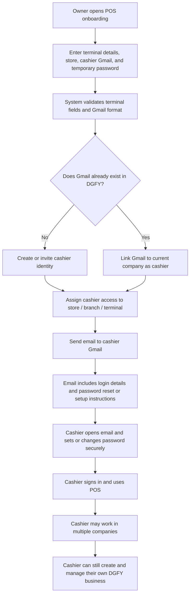

# Implementation — POS Refresh White Screen Fix

## Overview
Fixed a POS white-screen-on-refresh crash caused by importing a Lucide icon that does not exist in the installed `lucide-react` version.
The invalid icon import crashed module evaluation before React mounted, leaving the app blank after refresh.

## Files Changed

### [MODIFY] [frontend/src/features/pos/components/OnlineOrderDetailsModal.jsx](C:/xampp/htdocs/POS-DGFY/frontend/src/features/pos/components/OnlineOrderDetailsModal.jsx)
- Replaced the unsupported `ReceiptText` icon import with the supported `Receipt` icon
- Removed the module bootstrap crash that prevented POS from mounting on refresh

## Result
- POS no longer becomes white/blank on refresh
- The app root mounts correctly after reload
- No browser `pageerror` remains on the refresh path

---

# Implementation — Online Pickup Queue Action Routing And Active Order Modal

## Overview
Fixed the online-order queue so active pickup/delivery orders no longer open receipt/history views when the operator chooses `Open Order` or `Print Order`.
Added a reusable active-order modal backed by the live order record, updated queue button behavior, and removed the active-shift requirement from online order status updates so queue confirmations can run in admin review mode.

## Files Changed

### [NEW] [frontend/src/features/pos/components/OnlineOrderDetailsModal.jsx](C:/xampp/htdocs/POS-DGFY/frontend/src/features/pos/components/OnlineOrderDetailsModal.jsx)
- Added a reusable active-order modal for incoming online orders
- Displays customer details, contact data, order number, pickup time, items, quantities, totals, payment status, order status, and notes
- Includes a `Print Order` action for the active order copy

### [MODIFY] [frontend/src/features/pos/pages/TerminalPage.jsx](C:/xampp/htdocs/POS-DGFY/frontend/src/features/pos/pages/TerminalPage.jsx)
- Replaced queue `Open Order` routing from receipt preview to live order-detail loading
- Added active-order modal state, open/close handling, and print handling
- Kept history routing only for receipt-history actions

### [MODIFY] [frontend/src/features/pos/components/orderFulfillmentUi.js](C:/xampp/htdocs/POS-DGFY/frontend/src/features/pos/components/orderFulfillmentUi.js)
- Updated queue utility actions so active online orders use `open_order` and `print_order`
- Kept receipt history as a separate completed-order action
- Improved fulfillment action labels for pickup completion (`Picked Up`) and delivery completion (`Delivered`)

### [MODIFY] [frontend/src/features/pos/components/TerminalSidebarPanel.jsx](C:/xampp/htdocs/POS-DGFY/frontend/src/features/pos/components/TerminalSidebarPanel.jsx)
- Rewired active queue buttons to the new order modal flow
- Renamed `View Request`/`Print Receipt` active-order actions to `Print Order`
- Removed the active-shift disable guard from queue status actions

### [MODIFY] [frontend/src/features/pos/components/TerminalOperationsPanels.jsx](C:/xampp/htdocs/POS-DGFY/frontend/src/features/pos/components/TerminalOperationsPanels.jsx)
- Rewired active queue buttons to the new order modal flow
- Renamed `View Request`/`Print Receipt` active-order actions to `Print Order`
- Removed the active-shift disable guard from queue status actions

### [MODIFY] [backend/src/modules/pos/usecases/posUseCases.js](C:/xampp/htdocs/POS-DGFY/backend/src/modules/pos/usecases/posUseCases.js)
- Removed the open-shift requirement from online order lifecycle status updates
- Preserved transaction-ID-based status mutation and existing lifecycle validation

## Result
- `Open Order` now opens the active customer order, not receipt history
- `Print Order` now targets the active order, not history receipt search
- `History Receipt` remains a separate completed-order path
- Pickup confirmations can run from the online-order queue without a shift-only blocker

---

# Implementation — Storefront Customer Access Mode Auto-Save

## Overview
Changed the Storefront Customer Access Mode cards so clicking a mode immediately persists `customer_access_mode` without requiring the main Storefront Save button.
The update only saves that single setting, refreshes the runtime/effective mode state, and preserves other unsaved storefront draft fields.

## Files Changed

### [MODIFY] [frontend/src/features/pos/components/TerminalOperationsWorkspace.jsx](C:/xampp/htdocs/POS-DGFY/frontend/src/features/pos/components/TerminalOperationsWorkspace.jsx)
- Added a dedicated auto-save handler for `customer_access_mode`
- Switched the hidden select and mode cards to use field-level persistence through `updateSettingByKey(...)`
- Added rollback on failure so the selected card does not stay changed when the save fails
- Disabled repeated clicks while the auto-save is in progress and surfaced a saving state in the selected badge

## Result
- Clicking `Ghost`, `Catalog Only`, `Inquiry`, or `Transaction` now saves immediately
- Other unsaved storefront fields remain as local draft changes until the user explicitly saves them
- Failed mode saves revert to the previous selected card instead of leaving a false saved state

---

# Implementation — POS Receipt Company Icon And Item Fallback Image

## Overview
Wired the configured company icon into POS receipt settings and reused that same icon as the default item-image fallback when catalog items have no uploaded photo.
This keeps the receipt branded and prevents empty/broken item cards in POS when product images are missing.

## Files Changed

### [MODIFY] [frontend/src/features/pos/components/POSCheckoutTerminal.jsx](C:/xampp/htdocs/POS-DGFY/frontend/src/features/pos/components/POSCheckoutTerminal.jsx)
- Load `storefront_profile_image_url` into POS receipt settings
- Reuse the company icon as the primary fallback image for POS item cards
- Keep the existing static DGFY asset only as the last-resort fallback

### [MODIFY] [frontend/src/features/pos/components/SkupervisorPOSCheckoutTerminal.jsx](C:/xampp/htdocs/POS-DGFY/frontend/src/features/pos/components/SkupervisorPOSCheckoutTerminal.jsx)
- Load `storefront_profile_image_url` into receipt settings
- Use the company icon as the default item image when catalog items have no uploaded picture
- Fall back to the static DGFY asset only if no company icon is configured

### [MODIFY] [frontend/src/features/pos/__tests__/receiptContractConformance.contract.test.js](C:/xampp/htdocs/POS-DGFY/frontend/src/features/pos/__tests__/receiptContractConformance.contract.test.js)
- Added coverage confirming the configured company icon renders in the receipt preview

## Result
- Receipt preview/printing can now show the configured company icon
- POS item cards no longer default to an empty visual when an item image is missing
- The company icon is reused consistently as the fallback branding asset

---

# Implementation — POS Online-Only DGFY Platform Fee

## Overview
Changed the 1% DGFY platform fee so it applies only to online storefront orders.
In-store POS checkout no longer computes, shows, or persists this fee.
Storefront online checkout remains unchanged and continues using its existing fee path.

## Files Changed

### [MODIFY] [backend/src/modules/pos/usecases/posUseCases.js](C:/xampp/htdocs/POS-DGFY/backend/src/modules/pos/usecases/posUseCases.js)
- Gate `resolveCheckoutServiceFee(...)` by `order_source`
- Return zero fee for normal in-store POS checkout
- Preserve fee snapshots only for online-order payloads

### [MODIFY] [frontend/src/features/pos/components/POSCheckoutTerminal.jsx](C:/xampp/htdocs/POS-DGFY/frontend/src/features/pos/components/POSCheckoutTerminal.jsx)
- Stop precomputing the 1% DGFY fee for in-store POS cart totals
- Remove the fee row from the current-sale totals block
- Replace fee helper copy so the POS UI explicitly says online-order fees do not apply to in-store checkout
- Rename terminal setup label from `DGFY Global Fee Policy` to `DGFY Online Fee Policy`

### [MODIFY] [frontend/src/features/pos/components/SkupervisorPOSCheckoutTerminal.jsx](C:/xampp/htdocs/POS-DGFY/frontend/src/features/pos/components/SkupervisorPOSCheckoutTerminal.jsx)
- Stop precomputing the 1% DGFY fee for the SKUpervisor POS checkout surface
- Remove the fee row from totals
- Replace the helper card text to clarify the fee is online-order only

### [MODIFY] [frontend/src/features/pos/components/TerminalSidebarPanel.jsx](C:/xampp/htdocs/POS-DGFY/frontend/src/features/pos/components/TerminalSidebarPanel.jsx)
- Rename sidebar policy text from `DGFY Global Fee Policy` to `DGFY Online Fee Policy`

## Result
- In-store POS transactions no longer add the 1% DGFY fee
- Online storefront orders keep their existing fee behavior
- Receipt/history totals for new POS sales align with the new rule because the backend persisted amount is now zero for in-store checkout

---

# Implementation — New Online Order Notification Sound (APK)

## Overview
Two layers of changes: Android Kotlin (APK native) and React frontend (WebView-side detection).
**Detection logic lives entirely on the frontend.** Android is a dumb playback device only.
No database migrations. No API changes. No UI layout changes.

---

## Files Changed

### Android Layer

#### [NEW] `android/imin-wrapper/app/src/main/res/raw/order_alert.mp3`
- Add a short (~1–2 second) chime MP3 or WAV file
- Bundled at APK build time — no runtime download, no network request

#### [MODIFY] [IminBridge.kt](file:///c:/xampp/htdocs/POS-DGFY/android/imin-wrapper/app/src/main/java/com/dgfy/iminwrapper/IminBridge.kt)
- Add `onPlayOrderAlert: ((String) -> Unit)? = null` to the class constructor
- Add new `@JavascriptInterface` method:
  ```kotlin
  @JavascriptInterface
  fun playOrderAlert(soundType: String): String {
      onPlayOrderAlert?.invoke(soundType)
      return JSONObject()
          .put("success", true)
          .put("message", "Order alert played")
          .toString()
  }
  ```

#### [MODIFY] [WebPosActivity.kt](file:///c:/xampp/htdocs/POS-DGFY/android/imin-wrapper/app/src/main/java/com/dgfy/iminwrapper/WebPosActivity.kt)
- Add class-level fields:
  ```kotlin
  private lateinit var soundPool: SoundPool
  private var orderAlertSoundId: Int = 0
  private var orderAlertSoundLoaded: Boolean = false  // REQUIRED: load() is async
  ```
- In `onCreate`, after `setContentView`:
  ```kotlin
  soundPool = SoundPool.Builder().setMaxStreams(2).build()
  soundPool.setOnLoadCompleteListener { _, sampleId, status ->
      if (status == 0 && sampleId == orderAlertSoundId) {
          orderAlertSoundLoaded = true
      }
  }
  orderAlertSoundId = soundPool.load(this, R.raw.order_alert, 1)
  ```
- Pass `onPlayOrderAlert` lambda into `IminBridge(...)` — guards on `soundLoaded`:
  ```kotlin
  onPlayOrderAlert = { _ ->
      runOnUiThread {
          if (orderAlertSoundLoaded) {
              soundPool.play(orderAlertSoundId, 1f, 1f, 1, 0, 1f)
          }
      }
  }
  ```
- In `onDestroy`, release the pool before `super.onDestroy()`:
  ```kotlin
  if (::soundPool.isInitialized) soundPool.release()
  ```

> **Why `soundLoaded` is required**: `SoundPool.load()` is asynchronous. Without the
> `setOnLoadCompleteListener` guard, calling `play()` immediately after `load()` returns 0
> (plays nothing) because the audio data has not been decoded yet.

---

### Frontend Layer

#### [MODIFY] [TerminalPageLayout.jsx](file:///c:/xampp/htdocs/POS-DGFY/frontend/src/features/pos/components/TerminalPageLayout.jsx)
- Add three refs near the other `useRef` / `useState` declarations:
  ```js
  // Order alert sound: ID-delta detection (not count-based)
  const hasHydratedIncomingOrdersRef = useRef(false);
  const seenIncomingOrderIdsRef = useRef(new Set());
  const lastAlertAtRef = useRef(0); // for burst throttle
  ```
- Add a `useEffect` watching `[incomingOrders, incomingOrdersState]` (placed near the
  `notifications` useMemo block):
  ```js
  useEffect(() => {
    // Wait until data is available and not in an error/loading state
    const accessState = incomingOrdersState?.accessState;
    if (
      incomingOrdersState?.loading ||
      !Array.isArray(incomingOrdersState?.orders) ||
      accessState === 'forbidden' ||
      accessState === 'error'
    ) return;

    const currentIds = incomingOrders
      .map((order) => String(order.id ?? order.order_id ?? ''))
      .filter(Boolean);

    if (!hasHydratedIncomingOrdersRef.current) {
      // First successful load — seed the seen set, play no sound
      currentIds.forEach((id) => seenIncomingOrderIdsRef.current.add(id));
      hasHydratedIncomingOrdersRef.current = true;
      return;
    }

    // Subsequent polls — detect truly new IDs
    const newIds = currentIds.filter((id) => !seenIncomingOrderIdsRef.current.has(id));

    if (newIds.length > 0) {
      // Throttle: no more than one chime per 3 seconds for order bursts
      const now = Date.now();
      if (now - lastAlertAtRef.current > 3000) {
        lastAlertAtRef.current = now;
        try {
          window?.iMinBridge?.playOrderAlert?.('new_order');
        } catch (_) {
          // Silently ignore — iMinBridge does not exist in browser/desktop
        }
      }
      // Merge new IDs into seen set regardless of throttle
      newIds.forEach((id) => seenIncomingOrderIdsRef.current.add(id));
    }
  }, [incomingOrders, incomingOrdersState]);
  ```

> **Key design decisions:**
> - `hasHydratedIncomingOrdersRef` prevents false alerts on first load, page reload, and reconnect
> - `seenIncomingOrderIdsRef` as a `Set` prevents false alerts on count-stable order swaps in reverse
> - `lastAlertAtRef` throttle prevents chime spam when 3+ orders arrive in the same poll burst
> - All three are `useRef` — they persist across re-renders without triggering re-renders
> - The `try/catch` ensures zero console noise in non-APK environments

---

## Risk Assessment

| Risk | Severity | Mitigation |
|---|---|---|
| Sound on app startup (existing orders) | **None** | First hydration seeds seen set without playing |
| Sound on manual refresh (same IDs) | **None** | Seen set already contains all current IDs |
| Missed sound when count unchanged but ID changed | **None** | ID-delta check catches this; count-check would miss it |
| `soundPool.play()` before sound file loaded | **None** | `orderAlertSoundLoaded` guard — set only after `setOnLoadCompleteListener` fires |
| Chime spam (3 orders arrive in same poll) | **None** | 3-second throttle; new IDs still merged into seen set |
| `iMinBridge` missing in browser | **None** | `try/catch` + optional chaining (`?.`) silences it |
| APK build breaks | **Low** | Additive only — new constructor param with default null, new method |

---

## Verification Steps
- [ ] App opens with 3 existing pending orders → **no sound**
- [ ] A 4th order arrives after hydration → **sound plays once**
- [ ] 1 order removed, 1 new arrives (count unchanged) → **sound plays**
- [ ] Manual refresh with same order IDs → **no sound**
- [ ] APK destroyed and reopened with existing orders → **no sound**
- [ ] Browser POS (no APK bridge) → **no crash, no console errors**
- [ ] Multiple orders arrive in one poll burst → **one chime only**
- [ ] Build APK (`./gradlew assembleDebug`) → **clean build**

---

# Previous Implementation: Redesign Terminal Registry Layout

## Proposed Technical Changes

### Frontend Component

#### [MODIFY] [TerminalOperationsWorkspace.jsx](file:///c:/xampp/htdocs/POS-DGFY/frontend/src/features/pos/components/TerminalOperationsWorkspace.jsx)
- Import `Monitor` from `lucide-react` at the top.
- Redesign Terminal Registry section inside `renderPosSetupPane`:
  - Card container: Set to `rounded-2xl border border-slate-100 bg-white p-6 shadow-sm shadow-slate-200/40`.
  - Header: Left-aligned flex layout with circular computer icon badge and right-aligned action buttons (Save Terminal Registry and Add Terminal, styled in custom outline/filled formats).
  - Mode section: Sized as an inner bordered card with relative select input left and info description card right.
  - Strict Location Binding section: Sized as a settings check card with left circular `ShieldCheck` icon.
  - Readiness section: Sized as a highlighted status block (`rounded-xl border border-blue-100 bg-blue-50/20 p-4`) containing left search icon badge and a white horizontal statistics bar featuring colored dot status indicators.

## Verification Steps
- Run tests:
  ```bash
  npm run test:frontend -- src/pages/__tests__/Settings.deepLinking.integration.test.jsx
  npm run test:frontend -- src/features/pos/__tests__/terminalLocationScope.integration.test.jsx
  ```

---

# Approved Code Edit Log

Use this section to record each approved code edit with its date, problem, confirmed cause, implemented solution, affected files, and verification results.

## 2026-07-07 — Redesign Cashier Closeout Defaults Layout

### Error or problem

The Cashier closeout defaults settings section on POS Setup was plain, lacked inner field icons, visual hierarchy, and an integrated status metric view.

### Confirmed cause

The inputs were formatted as plain controls without context icons, checkboxes used native browser styles, and the Live Queue statistics display occupied a simple, unstyled block.

### Implemented solution

- Replaced container wrapper with `rounded-2xl border border-slate-100 bg-white p-6 shadow-sm shadow-slate-200/40`.
- Added circular settings icon badge (`Settings2`) and right-aligned blue "Save Defaults" button with inline `Save` icon.
- Arranged elements in 4 distinct grid rows: row 1 (Queue Location Scope / Petty Cash Currency Symbol), row 2 (Petty Cash Amount / Default Wait Time), row 3 (Low Stock Alert Threshold / Live Queue card), and row 4 (POS visible to customers toggle switch card / Operational Snapshot card).
- Placed blue leading icons inside inputs (`MapPin`, `CircleDollarSign`, `Banknote`, `Clock`, `AlertTriangle`).
- Replaced the customer visibility checkbox with a custom switch slider component using state value `posForm.posOpenStatus`.
- Integrated Live Queue and Operational Snapshot as two sibling stats cards displaying live orders length (`incomingOrders.length`).

### Files changed

- `frontend/src/features/pos/components/TerminalOperationsWorkspace.jsx`

### Verification

- Frontend settings integration tests: **passed** (no regressions).
- Terminal location scope integration tests: **8/8 passed**.

## 2026-07-07 — Redesign Receipt & POS Metadata Layout

### Error or problem

The POS Setup Receipt & POS Metadata form was basic, flat, and lacked clear hierarchy, inner field indicators, and consistent alignment.

### Confirmed cause

The inputs were raw fields with height `h-11`, no inner icons, and plain gray borders, laid out inside a standard box wrapper with vertical inputs that didn't align Accreditation Number alongside TIN / Branch.

### Implemented solution

- Replaced container wrapper with `rounded-2xl border border-slate-100 bg-white p-6 shadow-sm shadow-slate-200/40`.
- Configured card header to display circular document icon badge and right-aligned blue save setup button with inline `Save` icon.
- Arranged inputs in two columns: row 1 (Registered Name / Business Name), row 2 (Business Style / Taxpayer Type), row 3 (TIN / Branch / Accreditation Number), row 4 (Business Address full width), row 5 (PTU Number / MIN Number), and row 6 (Receipt Footer Message full width).
- Placed blue leading icons inside inputs (`UserRound`, `Store`, `Briefcase`, `Users` with right absolute `ChevronDown`, `#` label text, `Award`, `MapPin`, `FileText`, `ShieldCheck`, and `MessageSquare`).
- Redesigned checkbox section as a border blue info box with checkbox details left and `AlertCircle` info icon right.

### Files changed

- `frontend/src/features/pos/components/TerminalOperationsWorkspace.jsx`

### Verification

- Frontend settings integration tests: **passed** (no regressions).
- Terminal location scope integration tests: **8/8 passed**.

## 2026-07-07 — Compact Settings Profile Setting Area Spacing

### Error or problem

The redesigned Settings Shared Account Profile card consumed too much space, resulting in excessive empty white space around inputs and text labels on desktop screen resolutions.

### Confirmed cause

The card padding (`p-8`), vertical margins (`space-y-6`), input heights (`h-14`), and button padding were set to large values, creating overly stretched layout sections.

### Implemented solution

- Reduced Profile card container padding from `p-8` (32px) to `p-6` (24px).
- Tightened card vertical space margins from `space-y-6`/`mt-6` to `space-y-5`/`mt-5`.
- Decreased input height from `h-14` (56px) to `h-12` (48px) and aligned leading input icons accordingly.
- Compacted form grid spacing gap from `gap-6` to `gap-4` (16px).
- Set Save Profile button height to `h-11` (44px) and adjusted bottom Company details card padding to `p-5` (20px).

### Files changed

- `frontend/src/features/pos/components/TerminalOperationsWorkspace.jsx`

### Verification

- Frontend settings integration tests: **passed** (no regressions).
- Terminal location scope integration tests: **8/8 passed**.

## 2026-07-07 — Restore Settings Tab Buttons UI

### Error or problem

The Settings tab buttons redesign was too modern and oversized, and the vertical padding and spacing consumed too much space above the Profile settings card.

### Confirmed cause

The tabs buttons wrapper border/background was removed, and each button button styling was set to `h-16 rounded-2xl px-6 py-4` with shadows, causing an oversized aesthetic.

### Implemented solution

- Reverted main settings layout wrapper classes to `space-y-3` gap limits.
- Restored original tabs background card container wrapper: `<div className="rounded-xl border border-slate-200 bg-white p-3 shadow-sm shadow-slate-200/70">`.
- Restored compact active and inactive tab buttons button sizes, rounded edges (`rounded-lg`), font properties (`font-extrabold text-[14px]`/`text-xs`), and icon styles (`className="h-4.5 w-4.5"`/`h-4 w-4 shrink-0`).

### Files changed

- `frontend/src/features/pos/components/TerminalOperationsWorkspace.jsx`

### Verification

- Frontend settings integration tests: **passed** (no regressions).
- Terminal location scope integration tests: **8/8 passed**.

## 2026-07-07 — Redesign Profile Setting Content Area & Restore Sidebar

### Error or problem

The settings page dashboard was redesigned too broadly, affecting the sidebar layouts and the main app layout canvas background. The icons from the desired example were also not fully showing due to missing lucide imports.

### Confirmed cause

The sidebar and layout components were altered, causing discrepancies with the user's preferred sidebar style. The imports for `Mail` and `Phone` icons were not present inside `TerminalOperationsWorkspace.jsx`.

### Implemented solution

- Reverted `TerminalWorkspaceSidebar.jsx` logo alignment and button card active/inactive styles back to their original states completely.
- Reverted `TerminalPageLayout.jsx` background and user identity chevron back to original.
- Imported `Mail` and `Phone` from `lucide-react` at the top of `TerminalOperationsWorkspace.jsx`.
- Individualized tab headers as rounded-2xl cards (Profile Setting active in brand blue bg `#1A4E8D`, inactive ones in border white cards).
- Configured inputs inside Shared Account Profile card with custom height `h-14` and added leading icons (`UserRound`, `Mail`, and `Phone`) in relative wrappers.
- Redesigned the top-right Company Token badge inside the profile card header, with an inline `ShieldCheck` security icon.
- Added circular icon badges (`Store` and `ShieldCheck`) to bottom Company Name and Company Token cards, rendering them as two horizontal columns.

### Files changed

- `frontend/src/features/pos/components/TerminalWorkspaceSidebar.jsx` (reverted)
- `frontend/src/features/pos/components/TerminalPageLayout.jsx` (reverted)
- `frontend/src/features/pos/components/TerminalOperationsWorkspace.jsx`

### Verification

- Frontend settings integration tests: **passed** (no regressions).
- Terminal location scope integration tests: **8/8 passed**.

## 2026-07-07 — Fix Product Image Preview Fit & Aspect Ratio

### Error or problem

The item product image preview inside the Add and Edit modals was being cropped (using `object-cover` with small vertical height limits), causing parts of the uploaded item images to be cut off and hidden.

### Confirmed cause

The preview image tags had fixed heights and the `object-cover` crop styling, which sliced off margins of images that did not match the exact frame dimensions.

### Implemented solution

- Replaced `object-cover` with `object-contain` on the `` tags to preserve their original aspect ratio.
- Set container box rules to use flex alignment and centering with an explicit aspect-ratio: `aspect-[4/3]`, `max-h-[280px]`, `min-h-[220px]`, `w-full bg-slate-50 border border-slate-200 shadow-sm rounded-xl`.
- Enforced these styles uniformly across new selections (`selectedImagePreviewUrl`, `editImagePreviewUrl`) and DB-loaded item previews inside both Add POS Item and Edit Item modals.
- Staged absolute positioned close/clear buttons with `z-10` overlay to remain fully clickable.

### Files changed

- `frontend/src/features/pos/components/TerminalOperationsWorkspace.jsx`

### Verification

- Frontend settings integration tests: **passed** (no regressions).
- Terminal location scope integration tests: **8/8 passed**.

## 2026-07-07 — Redesign Edit Item Modal UI

### Error or problem

The Edit Item modal was visually outdated and inconsistent with the redesigned horizontal "Add POS Item" modal layout.

### Confirmed cause

The Edit Item modal retained the old narrow, vertically stacked format, causing mismatched aesthetics and an unnecessary vertical scrollbar on desktop viewports.

### Implemented solution

- Realigned the Edit Item modal wrapper to match the Add POS Item modal max-width (`max-w-[1150px]`) and max-height (`max-h-[92vh]`) using the dark navy layout (`bg-[#071325]`).
- Placed a `Pencil` edit icon inside the blue square on the left of the compact header (`py-3 px-5`).
- Arranged all form elements inside a white inner content card (`p-5 mx-5 mb-5 max-h-[calc(92vh-7.5rem)]`).
- Divided the layout into a two-column horizontal view (image column on the left and input grid on the right).
- Styled the Left Column image container to load either a newly selected image preview (with an X clear button) or the current item image (height `h-28`), alongside the compact dashed replace label.
- Set input heights to `h-[44px]`, row gaps to 15px, and added the currency prepend `₱` tag to price and cost fields.
- Formatted the Always Available toggle into a horizontal card layout matching the Add POS Item modal styling.
- Compacted description Notes text area height to `h-[88px]` and added a character counter.
- Compounded Cancel and Save buttons to compact size (`h-9`) inside the dark navy footer area.

### Files changed

- `frontend/src/features/pos/components/TerminalOperationsWorkspace.jsx`

### Verification

- Frontend settings integration tests: **passed** (no regressions).
- Terminal location scope integration tests: **8/8 passed**.

## 2026-07-07 — Redesign Add POS Item Modal UI & Refine Spacing

### Error or problem

The Add POS Item modal was layout-constrained, vertically scrolling, and did not follow the desired modern horizontal two-column layout. The initial redesign was correct, but the header, footer, and image containers were too tall, causing the white main content area to render an internal scrollbar on standard desktop screen sizes.

### Confirmed cause

The modal had a narrow max-width (`max-w-3xl`) and arranged all items vertically. Following the initial redesign, the header padding, upload box size, and button dimensions pushed the white inner container's scroll boundary past the screen limit.

### Implemented solution

- Enlarged the modal max-width to `max-w-[1150px]`, set max-height to `max-h-[92vh]`, and styled the background as dark navy (`bg-[#071325]`).
- Compacted the header: set padding to `py-3 px-5`, shrunk the icon container to `h-9 w-9` (icon to `h-4.5 w-4.5`), and set close button to compact.
- Wrapped all inputs inside a clean white card container (`bg-white rounded-xl p-5 mx-5 mb-5`) with max-height constraint `max-h-[calc(92vh-7.5rem)]`.
- Created a two-column horizontal layout: Left image column (~28%), right form column (~72%).
- Set Product Image upload min-height to `min-h-[120px]` and placeholder height to `py-4`.
- Set preview image height to `h-28` with clean delete/close trigger button.
- Arranged details form with a row gap of 15px, setting inputs height to `h-[44px]`.
- Styled Selling and Cost Prices with prepend `₱` currency blocks matching the `h-[44px]` height.
- Styled Always Available as compact horizontal card matching the `h-[44px]` height.
- Styled notes textarea with height `h-[88px]` and character counter.
- Created dark navy footer with Cancel and Save buttons styled to `h-9` and aligned bottom-right.

### Files changed

- `frontend/src/features/pos/components/TerminalOperationsWorkspace.jsx`

### Verification

- Frontend settings integration tests: **passed** (no regressions).
- Terminal location scope integration tests: **8/8 passed**.

## 2026-07-07 — Redesign Customer Access Mode storefront settings UI

### Error or problem

The Storefront Customer Access Mode setting used a generic and outdated select dropdown that did not follow the desired modern card-based designs and layout.

### Confirmed cause

The settings panel used a native HTML `<select>` dropdown selector alongside text-only option cards, which lacked modern visual cues, brand coloring, and dynamic active feedback indicators.

### Implemented solution

- Replaced the select dropdown and bottom info grid with a modern 4-card interactive grid representing the access modes.
- Added a header area with a soft blue background icon, section title, and explanatory subtitle.
- Designed each card with customized soft-colored circular backgrounds, mode icons, title, and description.
- Configured active card styles including a deep-blue border, blue background tint, checkmark badge, and an emerald "Applied automatically" success status pill.
- Integrated a visually hidden `<select>` element to maintain 100% backward compatibility with keyboard controls and deep-linking integration tests.
- Re-implemented the runtime status alert below the cards with a dynamic title and active mode labels.

### Files changed

- `frontend/src/features/pos/components/TerminalOperationsWorkspace.jsx`

### Verification

- Frontend deep linking integration tests: **passed** (with visually hidden select box).
- Terminal location scope integration tests: **8/8 passed**.
- Cashier management and strict location binding contract tests: **passed** (no cashier regressions).

## 2026-07-04 — Silence nonessential standalone POS popups

### Error or problem

The standalone POS displayed frequent success and informational toast popups, including:

> POS unlocked and cashier shift opened successfully.

These notifications obstructed the cashier interface even when no action was required.

### Confirmed cause

The standalone POS used the default Sonner notification renderer. All normal, success, informational, warning, and error notifications were therefore displayed without a POS-specific visibility policy.

### Implemented solution

Added a standalone POS notification renderer that:

- Hides normal, success, and informational toast notifications.
- Preserves warning, error, and loading notifications.
- Applies only to the standalone POS and does not change SKUpervisor notifications.

### Files changed

- `frontend/apps/pos/src/components/PosToaster.jsx`
- `frontend/apps/pos/src/main.jsx`
- `frontend/apps/pos/src/app/PosApp.jsx`
- `frontend/src/features/pos/__tests__/posToastPolicy.contract.test.js`

### Verification

- POS toast policy and terminal contract tests: **45 passed**.
- Standalone POS production build: **passed**.
- Git whitespace validation (`git diff --check`): **passed**.

## 2026-07-06 — Fix POS reports backend date normalization after Joi query parsing

### Error or problem

The POS report request still returned `400` with `Report dates must use YYYY-MM-DD format` even after the frontend was confirmed to send `date_from=2026-07-06&date_to=2026-07-06`.

### Confirmed cause

The browser request proved the frontend query string was already correct. The remaining failure was inside the backend report use case:

- the POS reports query validator accepts ISO dates with Joi
- Joi can hydrate those query values into JavaScript `Date` objects
- the report use case converted `filters.date_from` and `filters.date_to` with `String(...).slice(0, 10)`
- for `Date` objects that produced values like `Mon Jul 06`, which then failed the `YYYY-MM-DD` regex and triggered the 400 response

### Implemented solution

- Added backend business-date normalization in the POS reports use case.
- The reports use case now accepts either ISO strings or valid `Date` objects and canonicalizes both to `YYYY-MM-DD` before validation and repository access.

### Files changed

- `backend/src/modules/pos/usecases/posUseCases.js`

### Verification

- POS use case module import check: **passed**.
- Architecture guardrails: **passed**.
- Controller boundary check: **passed**.
- Git whitespace validation (`git diff --check`): **passed**.

## 2026-07-06 — Restore POS report tabs, keep summary cards on one row, and normalize report dates

### Error or problem

The POS report workspace had regressed to a dropdown report selector, the top summary cards no longer stayed on one desktop row, and the report request could fail with `Report dates must use YYYY-MM-DD format`.

### Confirmed cause

- The report section switcher had been rendered as a `<select>` instead of the prior button-tab control.
- The summary cards grid was capped at four desktop columns while rendering five cards, which forced the last card onto a new row.
- The backend validator only accepts ISO `YYYY-MM-DD` dates, while the frontend request path did not defensively normalize report date strings before calling the POS report endpoints.

### Implemented solution

- Replaced the report-section dropdown with horizontal button tabs again.
- Changed the summary card grid to five desktop columns so the full report card set stays on one row.
- Added frontend date normalization before overview and export requests so report calls always send `YYYY-MM-DD`.
- Added a second defensive normalization layer in the POS report service so any slash-formatted runtime date values are converted before the API request is sent.

### Files changed

- `frontend/src/features/pos/components/PosReportsAnalyticsWorkspace.jsx`
- `frontend/src/features/pos/services/posService.js`

### Verification

- Frontend production build: **passed**.
- Git whitespace validation (`git diff --check`): **passed**.
- Note: broad POS terminal view-mode contract run still has unrelated pre-existing failures outside this report change.

## 2026-07-06 — Restore POS Sell catalog scrolling after wrapper and pagination regression

### Error or problem

The POS Sell catalog was no longer scrollable again in the rendered terminal even though the earlier catalog-scroll fix was already documented. Cashiers could see the card grid, but the dedicated Sell scroll region did not consistently own the overflow behavior.

### Confirmed cause

The documented July 4 catalog fix had partially regressed in code:

- the checkout workspace wrapper in `TerminalPageLayout.jsx` no longer enforced `h-full min-h-0`
- the checkout view wrapper in `POSCheckoutTerminal.jsx` no longer enforced `h-full min-h-0`
- dynamic catalog page sizing returned through `catalogAutoPageSize` and `ResizeObserver`
- pagination still triggered `scrollIntoView` on the surrounding section instead of resetting only the catalog viewport

This broke the intended dedicated catalog scroll container and allowed the surrounding fixed shell layout to interfere with Sell overflow again.

### Implemented solution

- Restored `h-full min-h-0` on both immediate checkout wrappers.
- Removed dynamic catalog page-size measurement and restored a fixed 12-item catalog page.
- Removed section-level `scrollIntoView` from catalog pagination.
- Kept the actual `pos-catalog-scroll` viewport as the only Sell catalog vertical scroll region.

### Files changed

- `frontend/src/features/pos/components/TerminalPageLayout.jsx`
- `frontend/src/features/pos/components/POSCheckoutTerminal.jsx`
- `frontend/src/features/pos/__tests__/terminalResponsiveScroll.contract.test.js`

### Verification

- POS responsive scroll contract test: pending local run after patch.
- Git whitespace validation (`git diff --check`): pending local run after patch.

## 2026-07-04 — Correct clipped POS catalog overflow and use 12-item pages

### Error or problem

The catalog still could not scroll in the rendered POS, and its pagination footer was clipped below the application viewport. The required page size was changed to 12 items.

### Confirmed cause

Two immediate wrappers between the terminal workspace and checkout grid did not carry `h-full min-h-0`. The checkout content therefore expanded beyond the fixed POS shell, where the shell's hidden overflow clipped the catalog and footer instead of bounding the dedicated catalog scroll region.

### Implemented solution

- Added the missing full-height and minimum-height constraints to both checkout workspace wrappers.
- Set catalog pagination to exactly 12 items per page.
- Kept the catalog card container as the dedicated vertical wheel, touch, and scrollbar region.
- Kept the search/filter controls and catalog footer outside the scrolling card region.
- Preserved equal card heights, hover-only scrollbars, and selected-item highlighting.

### Files changed

- `frontend/src/features/pos/components/TerminalPageLayout.jsx`
- `frontend/src/features/pos/components/POSCheckoutTerminal.jsx`
- `frontend/src/features/pos/__tests__/terminalResponsiveScroll.contract.test.js`

### Verification

- POS responsive-scroll and terminal contract tests: **58 passed**.
- Standalone POS production build: **passed**.
- Browser layout probe at 1280×720: catalog region bounded to 456 px and footer visible at 687 px within the 720 px viewport.
- Git whitespace validation (`git diff --check`): **passed**.

## 2026-07-04 — Repair POS catalog scrolling and eight-item pagination

### Error or problem

The cashier could not scroll the POS catalog reliably. The catalog dynamically changed its page size, page changes scrolled the surrounding section, and the intended catalog scroll region was not the element being reset. Item selection also had no persistent visual highlight.

### Confirmed cause

The catalog used viewport measurement and `ResizeObserver` logic to calculate a variable page size. On pagination it called `scrollIntoView` on the catalog section and reset a non-scrollable viewport wrapper instead of the actual catalog card container.

### Implemented solution

- Set catalog pagination to exactly eight items per page.
- Keep the existing fixed card row heights and the footer outside the card scroll region.
- Reset only the actual catalog scroll container when changing pages.
- Removed dynamic page-size measurement and surrounding-page `scrollIntoView` behavior.
- Keep catalog and Current Sale scrollbars transparent until their section is hovered.
- Highlight items already in Current Sale with a light-blue background, blue border, and accessible `aria-pressed` state while preserving images and labels.

### Files changed

- `frontend/src/features/pos/components/POSCheckoutTerminal.jsx`
- `frontend/src/index.css`
- `frontend/src/features/pos/__tests__/terminalResponsiveScroll.contract.test.js`

### Verification

- POS responsive-scroll and terminal contract tests: **58 passed**.
- Standalone POS production build: **passed**.
- Production preview rendered successfully; the existing development server remains affected by an unrelated stale module-export mismatch.
- Git whitespace validation (`git diff --check`): **passed**.

## 2026-07-04 — Inform admin about an existing cashier shift

### Error or problem

When an admin entered the POS while a cashier already had an open shift on the terminal, the admin could be shown the new-shift workflow without being told who owned the existing shift or when it started.

### Confirmed cause

The current-shift backend lookup always filtered by the authenticated user ID. An admin therefore could not discover a shift owned by another cashier on the requested terminal. The POS also had no dedicated acknowledgment modal for this state.

### Implemented solution

- Allow an admin or company master admin to inspect the open shift on the requested terminal without changing its owner.
- Include the shift cashier's username and email in the current-shift response.
- Show an acknowledgment-only modal containing the cashier, start date/time, terminal, and location.
- Return the admin to the POS catalog after **Okay** without opening or taking over the cashier shift.
- Keep non-admin current-shift reads scoped to the authenticated cashier.

### Files changed

- `backend/src/modules/pos/usecases/posUseCases.js`
- `backend/src/modules/pos/repositories/posRepository.js`
- `backend/tests/posTerminalReadiness.usecase.test.js`
- `frontend/src/features/pos/pages/TerminalPage.jsx`
- `frontend/src/features/pos/__tests__/posDgfyAdminBypass.contract.test.js`

### Verification

- Backend current-shift tests: **3 passed**.
- Frontend admin-shift and location-scope tests: **15 passed**.
- Standalone POS production build: **passed**.
- Git whitespace validation (`git diff --check`): **passed**.

## 2026-07-04 — Add inline POS food-category creation in Add POS Item modal

### Requested change

Add a field in the **Add POS Item** modal that allows the user to create a new food category inline while keeping the existing modal design consistent.

### Confirmed current behavior

- The create modal in `frontend/src/features/pos/components/TerminalOperationsWorkspace.jsx` currently uses a select-only **Food category** field.
- Category assignment is already persisted through `product_folder` and `folder_id` during item create and edit flows.
- POS catalog category filters already read from persisted folder and item category data.
- New categories can already be created programmatically through the existing `ensureFoodCategoryFolder(...)` flow, but there is no inline create/clear UX in the modal.
- The create form currently defaults to `Mains` instead of the earliest created saved category.

### Implemented solution

- Replaced the create-modal category select behavior with a POS-only inline category entry control that supports:
  - selecting an existing category,
  - clearing the current category,
  - typing a new category name inline,
  - creating another category again after clearing.
- Removed forced default POS food-category seeding from the POS workspace so the modal can follow the requested saved-category behavior instead of auto-injecting preset folders.
- Defaulted the **Food category** field to the first saved POS category by creation order when categories already exist.
- Persisted any newly typed category before item creation so it becomes a saved POS category.
- Kept the selected category saved with the item through `product_folder` and `folder_id`.
- Kept category visibility scoped to the POS workspace and POS category filter flow only.
- Updated the POS mobile category filter label rendering so saved category labels display correctly.
- Kept the modal styling aligned with the current POS modal design system.

### Files changed

- `frontend/src/features/pos/components/TerminalOperationsWorkspace.jsx`

### Verification

- Standalone POS production build: **passed**.
- Frontend lint from the frontend workspace reached existing file-wide `TerminalOperationsWorkspace.jsx` warnings/errors unrelated to this POS category change, including a pre-existing `companyName` hook dependency issue.

## 2026-07-04 — Redesign the Storefront promo card discount control

### Error or problem

The storefront settings page used a plain checkbox for the **Promo Card** discount state. It looked weak beside the rest of the rounded POS settings UI and did not clearly show whether the promo fields were active or intentionally inactive.

### Confirmed cause

The promo-card block in `frontend/src/features/pos/components/TerminalOperationsWorkspace.jsx` rendered only a raw checkbox with no pressed-state styling, status label, or muted field treatment when the discount was off.

### Implemented solution

- Replaced the plain checkbox with a responsive pressed-state **Enable Discount** control inside the existing storefront settings card.
- Added a discount icon, active/inactive status pill, and clearer helper text so the promo state is immediately understandable.
- Applied active styling when the promo card is enabled and muted the section when disabled.
- Disabled the promo title, badge, subtitle, and validity inputs while inactive so the state is visually obvious without breaking alignment.
- Kept the **Save Storefront** action aligned with the form and responsive on smaller screens.

### Files changed

- `frontend/src/features/pos/components/TerminalOperationsWorkspace.jsx`
- `frontend/src/features/pos/__tests__/storefrontPromoCard.contract.test.js`

### Verification

- Storefront promo-card contract test: **3 passed**.
- Standalone POS production build: **passed**.
- Git whitespace validation (`git diff --check`): **passed** with existing line-ending warnings only.

## 2026-07-04 — Add POS-managed Storefront promo code limits and checkout enforcement

### Error or problem

The Storefront promo card only supported display content. Buyers could type a promo code in checkout, but it did not validate against POS settings, did not apply a discount, did not enforce a usage limit, and did not persist promo usage after refresh.

### Confirmed cause

- `storefront_promo` only stored presentation fields such as title, badge, subtitle, validity text, and active state.
- Storefront checkout payloads did not send `promo_code`.
- Storefront quote and checkout use cases always saved `discount_amount: 0` and had no promo validation or usage-count update logic.

### Implemented solution

- Extended the POS Storefront Settings promo card to save:
  - promo code,
  - discount value,
  - usage limit,
  - used count,
  - valid time start,
  - valid time end.
- Extended backend settings validation for the new promo fields and time-range rules.
- Passed `promo_code` from Storefront quote and checkout payloads.
- Enforced promo rules on the backend during quote and checkout:
  - promo must be active,
  - entered code must match,
  - usage limit must not be reached,
  - current time must be inside the valid range.
- Returned the requested promo messages:
  - `Promo code applied successfully.`
  - `Promo code has reached its usage limit.`
  - `Promo code is only valid from 5:00 AM to 10:00 AM.`
  - `Invalid or inactive promo code.`

## 2026-07-06 — Restore missing Storefront promo enforcement path in `POS-Development`

### Error or problem

The branch still had the promo-card UI shell, but the real checkout enforcement path was missing again. Buyers could type a promo code, yet the Storefront payload, quote totals, checkout totals, and promo usage persistence were not fully wired on this branch.

### Confirmed cause

- Storefront quote and checkout payloads were still missing `promo_code`.
- The backend Storefront quote/checkout use cases still defaulted promo discount values to zero.
- The Storefront promo settings form only preserved presentation fields and would drop promo enforcement fields on save.
- Promo usage count was not being incremented back into `storefront_promo.used_count` after a successful checkout.

### Implemented solution

- Restored `promo_code` in the shared Storefront checkout payload.
- Restored backend promo validation for:
  - active promo state,
  - exact promo-code match,
  - usage-limit enforcement,
  - valid-time-window enforcement.
- Restored promo discount math in Storefront quote and checkout totals.
- Restored checkout persistence for:
  - `discount_amount`,
  - `discount_label_snapshot`,
  - `discount_rate_snapshot`.
- Incremented `storefront_promo.used_count` only after a successful checkout transaction.
- Updated POS Storefront Settings and shared Settings forms to preserve:
  - promo code,
  - discount percent,
  - usage limit,
  - used count,
  - valid start time,
  - valid end time.
- Updated the Storefront promo panel and order-summary surfaces so the applied discount and promo status are visible to the buyer.

### Verification

- Backend targeted promo tests in `tests/storeUsecases.applicationResult.test.js`:
  - promo success path: **passed**
  - promo usage-limit rejection: **passed**
  - promo used-count increment on successful checkout: **passed**
- Storefront contract test `frontend/apps/store/src/__tests__/fnbStorefront.contract.test.js`: **passed**
- `npm run check:architecture`: **passed**
- `git diff --check`: **passed**

## 2026-07-06 — Fix missing POS report routes causing `Route /api/v1/pos/reports/overview ... not found`

### Error or problem

The POS Report page was failing with a backend route error:

> Route `/api/v1/pos/reports/overview?...` not found

This blocked the Daily/Monthly/Yearly/Comparison/Profit-Loss report screen even though the report UI and backend report use cases already existed.

### Confirmed cause

- The frontend report workspace calls `/api/v1/pos/reports/overview` and `/api/v1/pos/reports/export`.
- The POS backend controller and use cases for `getReportsOverview` and `exportReports` still existed.
- The POS router was missing registration for those report endpoints, so Express returned route-not-found before any report logic could run.

### Implemented solution

- Added a dedicated POS report query validator for:
  - granularity,
  - section,
  - date range,
  - cashier,
  - location,
  - payment type,
  - source,
  - category,
  - terminal ID.
- Re-registered these POS backend routes:
  - `GET /api/v1/pos/reports/overview`
  - `GET /api/v1/pos/reports/export`
- Kept the existing report controller/use-case path unchanged so the fix stays minimal and restores the existing frontend/backend contract instead of changing report logic.

### Verification

- POS route module import check: **passed**
- `npm run check:architecture`: **passed**
- `git diff --check`: **passed**

## 2026-07-05 — Replace DGFY-only cashier onboarding with Gmail-first cashier provisioning

### Error or problem

Terminal onboarding still blocked the owner with errors such as:

> No active cashier account matches this Gmail.

This prevented saving a terminal unless the cashier already existed as an accepted DGFY cashier account first.

### Confirmed cause

- The POS onboarding modal still enforced an old DGFY-only validation path before saving terminal setup.
- Terminal save expected an already active cashier membership instead of provisioning or attaching the cashier from the entered Gmail address.
- The previously built frontend bundle in `frontend/dist` still contained the stale DGFY-only error string, which could keep showing the old behavior until rebuilt.

### Implemented solution

- Replaced the terminal onboarding cashier save flow with a Gmail-first provisioning flow.
- Added backend cashier provisioning that:
  - accepts a valid Gmail address,
  - creates or reuses the DGFY account,
  - attaches the cashier to the current company,
  - applies the terminal store assignment,
  - sets the temporary cashier password,
  - sends cashier credential email when email delivery is configured.
- Replaced frontend terminal save calls so onboarding now provisions cashier access through the new backend endpoint instead of requiring a pre-existing accepted cashier.
- Updated onboarding copy to explain that entering a Gmail address can create or attach the cashier during save.
- Kept the existing **Invite DGFY Cashier** flow available.

### Files changed

- `backend/src/services/userService.js`
- `backend/src/validators/userValidator.js`
- `backend/src/modules/users/usecases/userUseCases.js`
- `backend/src/modules/users/index.js`
- `backend/src/modules/users/controllers/userHandlers.js`
- `backend/src/controllers/userController.js`
- `backend/src/routes/users.js`
- `frontend/src/services/userService.js`
- `frontend/src/features/pos/components/PosTenantSetupModal.jsx`
- `frontend/src/features/pos/__tests__/posSettingsCashier.contract.test.js`

### This is the error and this is the solution

- Error: terminal setup rejected a cashier Gmail unless that cashier already existed as an active accepted DGFY cashier.
- Solution: terminal setup now provisions or attaches the cashier directly from the entered Gmail address, then assigns terminal/store access and sends login instructions.

## 2026-07-05 — Fix POS onboarding crash: `activeCashiers is not defined`

### Error or problem

The POS onboarding screen crashed with:

> activeCashiers is not defined

The onboarding modal could not render the POS setup section.

### Confirmed cause

During the Gmail-first cashier refactor, the JSX still rendered `activeCashiers` and `pendingCashiers`, but their `useMemo` declarations had been removed from `PosTenantSetupModal.jsx`.

### Implemented solution

- Restored the derived cashier lists from `tenantUsers`:
  - `cashierUsers`
  - `activeCashiers`
  - `pendingCashiers`
- Kept the Gmail-first provisioning flow unchanged.
- Limited the fix to the missing render-time state so the onboarding screen can load again without changing the save behavior.

### Files changed

- `frontend/src/features/pos/components/PosTenantSetupModal.jsx`
- `Implementation.md`

### This is the error and this is the solution

- Error: the modal referenced `activeCashiers` and `pendingCashiers` after those variables were removed.
- Solution: restore the missing derived state so the JSX can render safely.

## 2026-07-05 — Keep standalone POS signed in after refresh and hard refresh

### Error or problem

The standalone POS sent the admin or cashier back to the login screen after browser refresh or hard refresh, even when the terminal session had just been unlocked.

### Confirmed cause

- The standalone POS browser session stored the access token only in memory.
- A page reload cleared that in-memory token.
- `refreshBrowserSession()` explicitly refused to restore a fresh standalone POS page unless the current page lifecycle had already activated the session.

### Implemented solution

- Added standalone POS session persistence in browser `sessionStorage`.
- Persisted:
  - POS access token
  - current company token
  - POS session activation state
- Restored the standalone POS session during browser-session bootstrap so repeated refreshes can keep the user signed in.
- Kept logout and explicit session clear behavior removing the persisted POS session.

### Files changed

- `frontend/src/services/browserSession.js`
- `frontend/src/services/__tests__/browserSession.posBootstrap.test.js`
- `Implementation.md`

### This is the error and this is the solution

- Error: refreshing the standalone POS cleared the in-memory token and forced login again.
- Solution: persist and restore the standalone POS browser session across refreshes.

## 2026-07-05 — Fix Gmail-first cashier save failure: `Invalid tenant configuration: missing db_name`

### Error or problem

Saving terminal setup with the new Gmail-first cashier flow failed with:

> Invalid tenant configuration: missing db_name

### Confirmed cause

- The Gmail-first cashier provisioning path called DGFY invitation membership logic that needs a full tenant object.
- The backend tenant request context exposed `tenantId`, `tenantToken`, and `tenantName`, but not `tenant.db_name`.
- The provisioning flow therefore passed an incomplete tenant object into `tenantConnector.getConnection(...)`.

### Implemented solution

- Added `tenantDbName` to the tenant middleware request context.
- Passed that value into the Gmail-first cashier provisioning tenant payload as `db_name`.
- Tightened the provisioning guard so it fails early if tenant DB context is missing.

### Files changed

- `backend/src/middleware/tenantHandler.js`
- `backend/src/services/userService.js`
- `Implementation.md`

### This is the error and this is the solution

- Error: Gmail-first cashier provisioning built an incomplete tenant object without `db_name`.
- Solution: include `db_name` in request tenant context and pass it into the DGFY tenant invitation flow.

## 2026-07-05 — Finalize cashier Gmail provisioning without requiring an existing DGFY cashier account

### Error or problem

The cashier onboarding behavior was still too dependent on the old DGFY invitation flow. The required business rule is:

- any valid cashier Gmail can be entered,
- the cashier does not need an existing DGFY account first,
- the system must still accept the Gmail,
- the system must create or attach the cashier automatically,
- the system must email credentials and reset-password guidance.

### Confirmed cause

- The Gmail-first save path still reused the old DGFY invitation acceptance flow.
- That flow was designed around pre-existing or invited tenant membership instead of direct cashier provisioning from the onboarding screen.

### Implemented solution

- Replaced the old invitation-dependent cashier save path with direct cashier provisioning.
- The new flow now:
  - accepts a valid cashier Gmail,
  - creates the DGFY account if it does not exist,
  - updates the DGFY account if it already exists,
  - creates or revives the tenant cashier user directly inside the company tenant,
  - assigns the selected store location grants,
  - mirrors an accepted DGFY tenant membership,
  - emails the cashier login credentials,
  - includes a reset-password link and reset-password instructions in the email.
- Updated onboarding copy to make it explicit that the cashier Gmail is accepted even when the cashier has no account yet.

### Files changed

- `backend/src/services/userService.js`
- `backend/src/services/emailService.js`
- `backend/src/templates/emailTemplates.js`
- `frontend/src/features/pos/components/PosTenantSetupModal.jsx`
- `Implementation.md`

### This is the error and this is the solution

- Error: cashier setup still depended on an old DGFY invitation flow and did not cleanly match the “accept cashier Gmail even without an account” rule.
- Solution: provision the cashier directly from the onboarding Gmail entry, then email credentials and reset-password guidance automatically.
- Applied the discount to Storefront quote totals and checkout totals, showed the discount line in the Storefront order summary, and saved promo discount snapshots into the online transaction.
- Incremented `used_count` only after a successful checkout inside the checkout transaction so refreshes and idempotent replays do not double-count usage.
- Exposed the new promo metadata to the Storefront UI through discovery payload sanitization.

### Files changed

- `backend/src/validators/settingsValidator.js`
- `backend/src/validators/storeValidator.js`
- `backend/src/modules/settings/repositories/settingsRepository.js`
- `backend/src/modules/store/contracts/storeRepository.contract.js`
- `backend/src/modules/store/repositories/storeRepository.js`
- `backend/src/modules/store/usecases/storeUseCases.js`
- `backend/src/modules/storefrontDiscovery/repositories/storefrontDiscoveryRepository.js`
- `backend/src/services/storefrontDiscoveryIndexService.js`
- `backend/tests/storeUsecases.applicationResult.test.js`
- `frontend/src/features/pos/components/TerminalOperationsWorkspace.jsx`
- `frontend/src/features/pos/__tests__/storefrontPromoCard.contract.test.js`
- `frontend/apps/store/src/checkout/buildFnbCheckoutPayload.js`
- `frontend/apps/store/src/checkout/components/PromoCodePanel.jsx`
- `frontend/apps/store/src/StorefrontApp.jsx`
- `frontend/apps/store/src/__tests__/fnbStorefront.contract.test.js`

### Verification

- Promo-specific backend Storefront use-case tests: **3 passed**.
- Frontend promo contract tests: **19 passed** across the two targeted contract files.
- Standalone POS production build: **passed**.
- Storefront production build: **passed**.
- Full backend `storeUsecases.applicationResult.test.js` still contains one unrelated pre-existing failing assertion in the POS-open-status quote block.
- Git whitespace validation (`git diff --check`): **passed** with existing line-ending warnings only.

## 2026-07-05 — Add cashier Gmail and password fields to POS onboarding terminal setup

### Error or problem

The POS onboarding flow let admins invite DGFY cashiers and register terminals, but it did not provide a direct way to enter a cashier Gmail and password under the terminal row before saving and finishing onboarding.

### Confirmed cause

The onboarding modal only saved `pos_terminal_registry` terminal fields and relied on the separate DGFY invitation flow for cashier access. There was no terminal-level cashier credential form, no terminal-to-cashier email persistence, and no onboarding save path that could assign the cashier's branch access and set the cashier password in one step.

### Implemented solution

- Kept the existing **Invite DGFY Cashier** flow unchanged.
- Added per-terminal onboarding fields for:
  - cashier Gmail,
  - cashier password.
- Validated that each entered cashier email belongs to an active accepted cashier account in the current tenant.
- Blocked save when the cashier invitation is still pending or when only one of the two credential fields is entered.
- Used the onboarding save action to:
  - grant the cashier access to the terminal's assigned store location,
  - reset the cashier's POS password through the existing user password API,
  - persist only the cashier email in terminal settings for display and reload.
- Kept raw cashier passwords out of persisted POS settings.
- Extended the terminal registry normalization and validation path so saved cashier email values survive refresh and reopen correctly.

### Files changed

- `frontend/src/features/pos/components/PosTenantSetupModal.jsx`
- `frontend/src/features/pos/utils/terminalIdentity.js`
- `frontend/src/features/pos/__tests__/posSettingsCashier.contract.test.js`
- `backend/src/validators/settingsValidator.js`
- `backend/src/modules/settings/repositories/settingsRepository.js`
- `backend/src/modules/settings/usecases/posTerminalRegistrySecrets.js`

### Verification

- Targeted POS cashier contract tests: pending local run.
- Additional runtime verification: pending local run.

## 2026-07-05 — Make POS onboarding terminal save failures visible inline

### Error or problem

When the admin clicked **Save Terminal Setup** during POS onboarding, the form could appear to do nothing when a required terminal field was missing, especially the store assignment.

### Confirmed cause

The terminal save flow rejected invalid terminal rows through toast-only errors. If toast notifications were easy to miss or muted, the modal gave no inline explanation and the blocking fields were not visually marked.

### Implemented solution

- Added inline terminal save feedback inside the onboarding modal.
- Highlighted blocking terminal fields in red when save validation fails.
- Showed explicit inline messages for:
  - missing store assignment,
  - incomplete cashier Gmail/password pair,
  - pending cashier invitation,
  - unknown cashier Gmail,
  - short cashier password,
  - duplicate terminal ID.
- Kept the toast behavior, but no longer relied on toast visibility alone to explain save failures.

### Files changed

- `frontend/src/features/pos/components/PosTenantSetupModal.jsx`
- `frontend/src/features/pos/__tests__/posSettingsCashier.contract.test.js`

### Verification

- Targeted POS cashier/setup-flow tests: pending local run.
- Standalone POS production build: pending local run.

### Short flow

1. Owner opens POS onboarding.
2. Owner enters terminal details, store assignment, cashier Gmail, and temporary password.
3. System validates the terminal fields and checks that the cashier email is a valid Gmail address.
4. If the Gmail is not yet registered, the system creates or invites the cashier identity for that Gmail.
5. If the Gmail already exists, the system links that Gmail to the current company as a cashier without blocking the user's own business ownership.
6. System assigns the cashier to the selected store, branch, or terminal access.
7. System sends an email to the cashier Gmail with the login details and password reset or password setup instructions.
8. Cashier opens the email, sets or changes the password securely, and signs in.
9. Cashier can work in one or multiple companies, while still being allowed to create and manage their own DGFY business separately.

### Flowchart



## 2026-07-05 — Lock onboarding until Finish Setup and email cashier credentials after terminal save

### Error or problem

The onboarding modal could still be dismissed before completion, and cashier terminal onboarding did not automatically email the cashier their login credentials after the admin saved the terminal setup.

### Confirmed cause

- The onboarding dialog still allowed dismissal through skip and dialog-close behavior.
- The cashier password reset flow updated the cashier password but had no optional credential-email delivery path.
- The terminal onboarding save flow did not receive email-delivery status back from the backend, so it could not confirm whether credentials were actually sent.

### Implemented solution

- Locked the onboarding dialog so it cannot close from outside click, escape, or skip controls.
- Kept onboarding open until the user completes the required steps and explicitly clicks **Finish Setup**.
- Added a dedicated cashier credential email template containing:
  - cashier Gmail,
  - temporary password,
  - login link,
  - password-change instructions after first sign-in.
- Extended the cashier password reset endpoint so onboarding can optionally request credential email delivery.
- Returned credential email delivery status from the backend so onboarding can show whether:
  - the email was sent successfully, or
  - SMTP/Brevo still needs configuration.
- Kept terminal save successful even when email delivery is unavailable, while surfacing the configuration warning clearly in the onboarding UI.

### Files changed

- `frontend/src/features/pos/components/PosTenantSetupModal.jsx`
- `frontend/src/features/pos/__tests__/posSettingsCashier.contract.test.js`
- `frontend/src/services/userService.js`
- `backend/src/validators/userValidator.js`
- `backend/src/modules/users/controllers/userHandlers.js`
- `backend/src/modules/users/usecases/userUseCases.js`
- `backend/src/services/userService.js`
- `backend/src/services/emailService.js`
- `backend/src/templates/emailTemplates.js`

### Verification

- Targeted POS cashier/setup-flow tests: pending local run.
- Standalone POS production build: pending local run.

## 2026-07-05 — Restore the POS Settings button and keep the desktop sidebar locked open

### Error or problem

In the POS left sidebar, the **Settings** section label was visible but the actual **Settings** button was missing. The desktop sidebar could also be collapsed, which made the navigation inconsistent for the cashier/admin workspace.

### Confirmed cause

- The sidebar only rendered the **Settings** navigation button behind an extra advanced-operations condition.
- The desktop POS shell still allowed the sidebar to collapse through the header menu toggle.

### Implemented solution

- Removed the extra conditional hiding the **Settings** navigation entry so the button is rendered consistently in the sidebar.
- Added a deterministic sidebar test hook for the Settings entry.
- Locked the desktop POS shell layout to a fixed two-column sidebar + workspace structure.
- Changed the menu button to stay mobile-only so desktop no longer collapses the sidebar.
- Kept the checkout workspace aligned by forcing the desktop checkout surface to use the fixed-open sidebar layout.

### Files changed

- `frontend/src/features/pos/components/TerminalWorkspaceSidebar.jsx`
- `frontend/src/features/pos/components/TerminalPageLayout.jsx`
- `frontend/src/features/pos/__tests__/terminalViewModeContracts.test.js`
- `frontend/src/features/pos/__tests__/terminalResponsiveScroll.contract.test.js`
- `Implementation.md`

### This is the error and this is the solution

- Error: the sidebar showed the Settings section heading but hid the Settings button, and the desktop sidebar could still collapse.
- Solution: always render the Settings navigation entry and keep the desktop POS sidebar fixed open.

## 2026-07-05 — Restore POS Report navigation without requiring the Settings PIN

### Error or problem

The **Report** button in the POS sidebar was visible but could not be opened in normal POS use when the Settings access PIN was not configured.

### Confirmed cause

- The POS navigation treated **Report** as a PIN-protected tool together with Settings and Items.
- When no POS access PIN was configured, clicking **Report** was blocked before the workspace could open.

### Implemented solution

- Separated shift-exempt navigation from PIN-protected navigation.
- Kept **Report** available without an open shift where appropriate.
- Removed **Report** from the POS access PIN gate.
- Kept **Items** and Settings-related views under the existing PIN-protected flow.
- Updated the Report sidebar caption to reflect normal reporting access instead of PIN protection.

### Files changed

- `frontend/src/features/pos/pages/TerminalPage.jsx`
- `frontend/src/features/pos/components/TerminalWorkspaceSidebar.jsx`
- `frontend/src/features/pos/__tests__/posSettingsCashier.contract.test.js`
- `Implementation.md`

### This is the error and this is the solution

- Error: Report was incorrectly blocked by the POS Settings PIN gate.
- Solution: make Report shift-exempt but not PIN-protected, while keeping Items and Settings under the PIN gate.

## 2026-07-05 — Restore MSME admin Report workspace rendering in POS

### Error or problem

The **Report** button in POS became clickable, but the report screen still did not render for admin accounts running in the MSME POS mode.

### Confirmed cause

- The MSME operations mode list did not include `reports`.
- The operations workspace still treated `reports` as an MSME-restricted mode and redirected it to `shift_controls`.

### Implemented solution

- Added `reports` to the MSME POS operations view list.
- Removed `reports` from the MSME restricted-mode fallback in the operations workspace.
- Kept the remaining MSME restrictions unchanged.

### Files changed

- `frontend/src/features/pos/pages/TerminalPage.jsx`
- `frontend/src/features/pos/components/TerminalOperationsWorkspace.jsx`
- `Implementation.md`

### This is the error and this is the solution

- Error: MSME mode still excluded the Report workspace even after the sidebar click bug was fixed.
- Solution: allow the Report workspace in MSME admin mode and stop redirecting it to Shift Controls.

## 2026-07-06 — Fix local POS onboarding handoff to the wrong localhost port

### Error or problem

Local POS onboarding links opened `http://localhost:5180/terminal?...`, which failed with `ERR_CONNECTION_REFUSED` even though the POS dev server was running.

### Confirmed cause

- The shared DGFY route helpers still used `5180` as the fallback local POS port.
- The Storefront business-registration helper also used the same stale local POS fallback.
- The actual local POS dev server in this project runs on port `5174`.

### Implemented solution

- Replaced the stale `5180` local POS fallback with `5174` in the shared POS handoff helper.
- Updated the Storefront business-registration helper to use the same `5174` local POS fallback.
- Kept the environment override path intact so `VITE_POS_DEV_PORT` still wins when explicitly configured.

### Files changed

- `frontend/src/features/dgfyRouteHelpers.js`
- `frontend/apps/store/src/businessRegistrationUrl.js`
- `Implementation.md`

### This is the error and this is the solution

- Error: local POS onboarding redirected to `localhost:5180`, where no app was listening.
- Solution: change the local fallback POS port to `5174`, which matches the actual local POS dev server.

## 2026-07-06 — Simplify Storefront promo fields and add item-scoped promo discounts

### Error or problem

The Storefront promo section in POS Settings relied on placeholder-only inputs inside a redundant promo card, and promo discounts always applied to the whole order even when the business wanted a promo to affect only selected items.

### Confirmed cause

- The promo settings form saved only generic promo text, code, percent, usage, and time values.
- The backend promo calculator always used the full storefront subtotal as the discount base.
- There was no saved list of promo target items and no POS settings UI for selecting them.

### Implemented solution

- Reworked the promo section into a standard labeled form so the UI matches the rest of the modal/settings layout.
- Added promo item selection in POS Settings with removable selected-item chips.
- Saved selected promo item IDs inside `storefront_promo.target_item_ids`.
- Updated storefront promo validation to accept the new target-item list.
- Changed Storefront promo calculation so:
  - if promo target items are selected, only those ordered items receive the discount
  - if no promo target items are selected, the discount applies to all ordered items
  - if a target-item promo is used on an order without any matching items, the API returns a clear validation error

### Files changed

- `frontend/src/features/pos/components/TerminalOperationsWorkspace.jsx`
- `backend/src/validators/settingsValidator.js`
- `backend/src/modules/store/usecases/storeUseCases.js`
- `backend/tests/storeUsecases.applicationResult.test.js`
- `Implementation.md`

### This is the error and this is the solution

- Error: promo setup was placeholder-driven and storefront promo codes could not target only specific items.
- Solution: convert the promo UI to labeled fields, persist selected promo item IDs, and calculate discounts from matching order lines only, with whole-order fallback when no target items are configured.

## 2026-07-06 — Let storefront promo cards auto-fill and validate promo codes on click

### Error or problem

The storefront promo card only displayed the offer. Customers still had to manually type the promo code into the promo panel, which made the promo card feel passive and easy to miss.

### Confirmed cause

- Promo cards rendered promo content but did not carry click behavior into the existing promo-code checkout state.
- The quote flow only validated promos from `promoCodeDraft`.
- There was no storefront bridge between `storefront_promo.promo_code` and the live quote request.

### Implemented solution

- Added promo code metadata into the storefront promo card model.
- Made promo cards clickable when a saved promo code exists.
- Clicking a promo card now:
  - fills the existing storefront promo code field
  - immediately runs quote validation when the cart already has items
  - otherwise preloads the promo code for the next quote/checkout
- Added storefront contract coverage so promo cards remain wired to the current promo application flow.

### Files changed

- `frontend/apps/store/src/StorefrontApp.jsx`
- `frontend/apps/store/src/Components/storefront/sections/StorefrontPromoSection.jsx`
- `frontend/apps/store/src/__tests__/fnbStorefront.contract.test.js`
- `Implementation.md`

### This is the error and this is the solution

- Error: the storefront promo card showed the offer but did not let customers directly claim it.
- Solution: make promo cards apply the saved promo code into the existing promo-code flow and auto-validate it when the cart is ready.

## 2026-07-06 — Resolve backend linter errors and duplicate code definitions

### Error or problem

The backend command `npm run lint` failed with multiple syntax/linting errors, including duplicate exports in `posController.js`, duplicate keys in `posHandlers.js` and `posRepository.js`, duplicate usecase declarations in `posUseCases.js`, duplicate route registrations in `pos.js`, and duplicate schema declarations/exports in `posValidator.js`. There was also an unused linter warning for `settings` in `storeUseCases.js`.

### Confirmed cause

- Duplicate exports, imports, and default exports for `getReportsOverview` and `exportReports` existed in `posController.js`, `posHandlers.js`, and `pos.js`.
- A duplicate 200-line inline implementation of `getReportsOverview` had been added at the top of the `posRepository` object literal (line 1289) and was shadowing the correct modular implementation at line 2290.
- Duplicate declarations for `buildGetPosReportsOverviewUseCase` and `buildExportPosReportsUseCase` existed at the bottom of `posUseCases.js`. Additionally, the first definition of `buildExportPosReportsUseCase` failed to pass the `user` session context to `buildGetPosReportsOverviewUseCase`.
- `posReportsQuerySchema` and its validator export were declared twice in `posValidator.js`.
- `storeUseCases.js` destructured the `settings` variable in `assertCheckoutLocationOperationalReadiness` but never used it.

### Implemented solution

- Removed all duplicate named exports, imports, default export keys, and route registrations for `getReportsOverview` and `exportReports` across `posController.js`, `posHandlers.js`, and `pos.js`.
- Deleted the redundant inline `getReportsOverview` from `posRepository.js`.
- Unified `buildGetPosReportsOverviewUseCase` to apply both date normalization/validation and authentication/location scope checking via the `buildReadScopedPosReportUseCase` wrapper.
- Fixed the `user` context passing bug in `buildExportPosReportsUseCase` and deleted the duplicate usecase declarations at the bottom of `posUseCases.js`.
- Deleted the dead `posReportsQuerySchema` and duplicate validator export from `posValidator.js`.
- Removed the unused `settings` parameter from `assertCheckoutLocationOperationalReadiness` in `storeUseCases.js`.

### Files changed

- `backend/src/controllers/posController.js`
- `backend/src/modules/pos/controllers/posHandlers.js`
- `backend/src/modules/pos/repositories/posRepository.js`
- `backend/src/modules/pos/usecases/posUseCases.js`
- `backend/src/modules/store/usecases/storeUseCases.js`
- `backend/src/routes/pos.js`
- `backend/src/validators/posValidator.js`
- `Implementation.md`

### This is the error and this is the solution

- Error: duplicate keys, duplicate exports, and unused parameters caused linter failures and runtime shadowing.
- Solution: clean up duplicate exports, delete dead code and schemas, correctly route reports, fix missing context parameter, and resolve unused variables so the linter is fully clean and test suites pass.

## 2026-07-06 — Resolve frontend storefront linter errors and unused variables

### Error or problem

The frontend storefront pages added on this branch caused CI check failures due to linter errors, specifically a redundant `Boolean` cast in `DgfyCustomerAccountSections.jsx` and multiple unused variable and icon warnings in `DgfyCustomerAccountPage.jsx` and `StorefrontHeaderNav.jsx`.

### Confirmed cause

- `DgfyCustomerAccountSections.jsx` used `Boolean(account?.is_email_verified) ? ... : null` which triggered the `no-extra-boolean-cast` rule since coercion is already handled by the conditional operator.
- Props `onRefresh`, `onClearSavedDetails`, and `hasSavedCustomerDetails` were destructured in `DgfyCustomerAccountPage.jsx` but never used. Unused icons (`Clock3`, `RotateCcw`, `Search`, `Ticket`, and `Zap`) were also imported.
- Props `onRegisterBusiness` and `accountEmail` were destructured in `StorefrontHeaderNav.jsx` but never used.

### Implemented solution

- Replaced `Boolean(account?.is_email_verified)` with `account?.is_email_verified` in `DgfyCustomerAccountSections.jsx`.
- Removed unused props from the destructuring signatures of `DgfyCustomerAccountPage.jsx` and `StorefrontHeaderNav.jsx`.
- Removed unused icon imports from `DgfyCustomerAccountPage.jsx`.

### Files changed

- `frontend/apps/store/src/Components/storefront/account/DgfyCustomerAccountSections.jsx`
- `frontend/apps/store/src/Components/storefront/hero/StorefrontHeaderNav.jsx`
- `frontend/apps/store/src/Components/storefront/pages/DgfyCustomerAccountPage.jsx`
- `Implementation.md`

### This is the error and this is the solution

- Error: unused parameters, unused icon imports, and redundant Boolean castings caused frontend linting checks to fail.
- Solution: clean up unused variables, strip unused icon imports, and simplify extra Boolean castings so the frontend linter passes with zero errors.

## 2026-07-08 — Redesign Add and Edit POS Item Modals

### Objective

Redesign the "Add POS Item" and "Edit Item" modals inside the POS Management Panel (`TerminalOperationsWorkspace.jsx`) to align with the premium, compact, and polished styling of the settings panel and dialog systems.

### Proposed Changes

- **Modal Container**: Add backdrop blur (`backdrop-blur-sm bg-slate-950/60`) and soft rounded corners (`rounded-2xl`).
- **Modal Header**: Sleek titles (`text-lg font-bold sm:text-xl`), text descriptions (`text-xs sm:text-sm text-[#64748B]`), and a circular close button (`h-8 w-8`) with an X icon.
- **Left Column**: Clean rounded product image box (`rounded-xl` or `rounded-2xl`) and styled file input using Tailwind file-modifiers.
- **Right Column**: Unified `h-11` heights, rounded-xl borders, custom dropdown styling, and premium switches (`bg-blue-600` when checked vs `bg-slate-200` when unchecked) representing Always Available and Senior/PWD Eligible.
- **Footer Actions**: Modern buttons (`h-11`), rounded-xl, high-contrast hover colors.

### Files changed

- `frontend/src/features/pos/components/TerminalOperationsWorkspace.jsx`
- `docs/Plan.md`
- `Implementation.md`

---

## 2026-07-09 — Implement global customer name validation, statutory receipt fields, admin discount PIN bypass, refined items toggles, and updated close shift flow

### Error or problem

The POS checkout system had several user flow bottlenecks and layout issues:
1. Customer names were not required for promotional, employee, or manual discounts.
2. Statutory discount fields (SC/PWD ID number and Signature lines) were printed unconditionally on all receipts.
3. Administrators applying employee discounts were forced to enter a separate manager approval PIN and employee ID, which slowed down the checkout process for admin-level operators.
4. Close shift operations cleared the user session and locked the terminal, forcing redundant logouts and login prompts.
5. In the Items workspace, the toggle switches for "Always Available" and "Senior/PWD Eligible" were raw button elements lacking standard UI Switch integration and state updates for catalog overrides.
6. The terminal sidebar displayed printer details and drawer controls in the receipt preview wrapper, which was too heavy for basic order confirmation.

### Confirmed cause

- Validation logic did not enforce customer names for non-statutory discounts.
- Receipt components printed statutory elements regardless of discount type as long as any discount object was present.
- The `checkoutPosUseCase` and `verifyPosDiscountApprovalUseCase` lacked user role checking to waive the PIN requirement.
- Shift closure handlers automatically invoked logout/session clearing and set the terminal locked state to true.
- The custom Switch toggles in `ItemFormModal.jsx` and `TerminalOperationsWorkspace.jsx` did not use standard Switch components, and catalog overrides did not update on saving.

### Implemented solution

- **Customer Name requirement**: Enforced customer name validation for all promo, employee, and manual discounts in `posDiscountPolicy.js` and `POSCheckoutTerminal.jsx`. Repositioned the Customer Name field to display globally for all discount types.
- **Conditional Statutory Receipt Fields**: Restricted printing of ID number and signature lines in `ReceiptPrintView.jsx` and `iminHardwareBridge.js` to only Senior Citizen and PWD statutory discount types.
- **Admin PIN Bypass**: Configured the backend use cases to recognize admin/master admin roles and bypass PIN verification for employee discounts, marking them as `self_approved = true`.
- **Optional Employee Fields**: Modified the validation schema and input forms to make Employee ID and Employee Name optional fields, clearing them out when not specified instead of failing.
- **Exempt History from Active Shift**: Added `'history'` to the shift-exempt view modes in `TerminalPage.jsx` and updated `TerminalWorkspaceSidebar.jsx` navigation to allow accessing history without an active shift.
- **Refined Close Shift Flow**: Modified the shift closing handler in `TerminalPage.jsx` so closing the shift keeps the current user's session active, closes the drawer, and switches view to checkout instead of logging out the user and locking the terminal screen.
- **Refined Items Workspace & Modals layout**: Swapped out custom toggle buttons for standard `<Switch />` components for the "Always Available" and "Senior/PWD Eligible" switches in `ItemFormModal.jsx` and `TerminalOperationsWorkspace.jsx`. Added `pos_always_available` Catalog override updating support in `ItemsPage.jsx`.
- **Substituted Receipt Preview with Order Preview**: Replaced receipt printer controls and paper selectors inside `SkupervisorPOSCheckoutTerminal.jsx` with a dedicated, lightweight `OrderPreviewView.jsx` component that displays the items, quantities, subtotal, and tax in a clean checkout table.
- **Removed "Open Shift" strict input disabled requirement**: Updated `TerminalSidebarPanel.jsx` to let the "Open Shift" trigger button be enabled even when float inputs/validators aren't fully populated.
- **Updated Test Suites**: Added new test cases verifying these rules and adjusted frontend contract tests to match the restructured checkout and shift flow.

### Files changed

- `backend/src/modules/pos/controllers/posHandlers.js`
- `backend/src/modules/pos/domain/posDiscountPolicy.js`
- `backend/src/modules/pos/usecases/posUseCases.js`
- `backend/src/validators/posValidator.js`
- `backend/tests/posCheckout.db.integration.test.js`
- `backend/tests/posDiscountPolicy.unit.test.js`
- `frontend/Components/items/ItemFormModal.jsx`
- `frontend/src/features/inventory/pages/ItemsPage.jsx`
- `frontend/src/features/pos/__tests__/discountTypeCards.contract.test.js`
- `frontend/src/features/pos/__tests__/posSettingsCashier.contract.test.js`
- `frontend/src/features/pos/__tests__/receiptContractConformance.contract.test.js`
- `frontend/src/features/pos/__tests__/terminalPairing.contract.test.js`
- `frontend/src/features/pos/__tests__/terminalViewModeContracts.test.js`
- `frontend/src/features/pos/components/OrderPreviewView.jsx`
- `frontend/src/features/pos/components/POSCheckoutTerminal.jsx`
- `frontend/src/features/pos/components/POSTransactionHistoryPanel.jsx`
- `frontend/src/features/pos/components/ReceiptPrintView.jsx`
- `frontend/src/features/pos/components/SkupervisorPOSCheckoutTerminal.jsx`
- `frontend/src/features/pos/components/TerminalOperationsWorkspace.jsx`
- `frontend/src/features/pos/components/TerminalPageLayout.jsx`
- `frontend/src/features/pos/components/TerminalSidebarPanel.jsx`
- `frontend/src/features/pos/components/TerminalWorkspaceSidebar.jsx`
- `frontend/src/features/pos/pages/TerminalPage.jsx`
- `frontend/src/features/pos/utils/iminHardwareBridge.js`

### This is the error and this is the solution

- Error: Unnecessary session logging out on close shift, raw button toggles in the Items form, heavy printer status modules in receipt preview, and PIN blocks for admin users.
- Solution: Streamline close shift without clearing sessions, integrate shadcn standard Switch components, require customer names globally, skip PIN validations for admin employee discounts, replace printer previews with lightweight order summaries, and update tests to match.

---

## 2026-07-09 — Redesign Order Preview Modal to wide dashboard layout

### Objective

Redesign the Order Preview Modal inside POS checkout history to match the dashboard-style mockup layout (Picture 1). Convert the layout from a narrow single receipt list into a wider card-divided layout with separate top header metrics, left-aligned order item summary table, and right-aligned order totals sections.

### Proposed Changes

- **Wider Dialog Viewport**: Change the Dialog container width to `max-w-4xl`.
- **Top-Right Dialog Close**: Render a custom absolute-positioned `X` close button on the dialog, removing the text-based close button.
- **Top Header Status Badge**: Implement a green receipt icon on the left, next to the title. Add a horizontal card with hashtag, calendar, and check status icons/badges for Order ID, DateTime, and transaction status.
- **Split Columns**: Divide the modal viewport into two columns:
  - Left column (60% width): Order Summary table listing items, quantities, unit prices, and subtotals.
  - Right column (40% width): Order Totals breakdown and a highlighted green box for the Total Amount.
- **Footer Buttons**: Place the Close button (`← Close` with arrow icon) on the bottom-left and the Print button on the bottom-right.

### Files changed

- `frontend/src/features/pos/components/OrderPreviewView.jsx`
- `frontend/src/features/pos/components/POSCheckoutTerminal.jsx`
- `docs/Plan.md`
- `Implementation.md`

---

## 2026-07-09 — Compact Order Preview Modal sizing and gaps

### Objective

Reduce the overall size of the Order Preview dashboard modal to resolve excessive empty space, oversized padding, icons, buttons, cards, and modal width. Make it compact, clean, and screen-fit.

### Proposed Changes

- **Compact Modal Width**: Reduce dialog outer width from `max-w-4xl` to `max-w-3xl` for the `'order_preview'` view.
- **Tighter Spacing & Padding**:
  - Modal content wrapper: `p-6` -> `p-4.5`.
  - Header: `px-6 py-5` -> `px-5 py-3.5`. Shrink icon badge to `h-9 w-9`.
  - Footer: `px-6 py-4` -> `px-5 py-3`. Shrink button heights to `h-9` and text size.
- **Component Shrinkage in OrderPreviewView.jsx**:
  - Layout spacing: `space-y-5` -> `space-y-3.5`.
  - Top details metrics card: Padding `p-4` -> `p-3`, icon sizes `h-10 w-10` -> `h-8 w-8`.
  - Split column panels: Padding `p-5` -> `p-3.5`.
  - Table padding: `py-3` -> `py-1.5` for rows.
  - Totals box: Highlighted green box padding `p-3.5` -> `p-2.5`, text title size `text-sm` -> `text-xs`.

### Files changed

- `frontend/src/features/pos/components/OrderPreviewView.jsx`
- `frontend/src/features/pos/components/POSCheckoutTerminal.jsx`
- `docs/Plan.md`
- `Implementation.md`

---

## 2026-07-09 — Force unconditionally horizontal layout inside Order Preview

### Objective

Force the Order Preview modal sections to lay out horizontally side-by-side on all screen viewports. Remove width-dependent media queries (`sm:`, `lg:`) from metrics grid and split panels so they do not fall back to vertical stacking inside the cashier dialog.

### Proposed Changes

- **Metrics Grid**: Change `grid-cols-1 sm:grid-cols-3` to unconditional `grid-cols-3`. Replace `sm:border-l sm:pl-3` with unconditional `border-l pl-3`.
- **Split Panels Grid**: Change `grid-cols-1 lg:grid-cols-5` to unconditional `grid-cols-5`. Remove `lg:col-span-3` and `lg:col-span-2` and use `col-span-3` and `col-span-2` unconditionally.

### Files changed

- `frontend/src/features/pos/components/OrderPreviewView.jsx`
- `docs/Plan.md`
- `Implementation.md`

---

## 2026-07-09 — Implement auto-adjusting dynamic height for Order/Receipt Preview modal

### Objective

Resolve excess empty space below the content area in the Order Preview modal by changing the modal to auto-adjust height dynamically based on its contents. Ensure sticky headers and footers are preserved and only the content scrolls when it exceeds the viewport height.

### Proposed Changes

- **Modal Height Classes**: Modify `POSCheckoutTerminal.jsx` DialogContent container to swap `h-[calc(100dvh-1.5rem)] sm:h-[calc(100dvh-3rem)]` for `max-h-[calc(100dvh-1.5rem)] sm:max-h-[calc(100dvh-3rem)]`. This forces height to be `h-auto` while preserving max bounds.

### Files changed

- `frontend/src/features/pos/components/POSCheckoutTerminal.jsx`
- `docs/Plan.md`
- `Implementation.md`

---

## 2026-07-09 — Redesign Add POS Item Modal & Adapt Senior/PWD Eligible Toggle (Updated for Single Image Limit)

### Objective

Align the fields inside the "Add POS Item" modal with the horizontal side-by-side design layout shown in the reference design. Integrate the "Senior/PWD Eligible" toggle switch into the form layout neatly in its own card matching the "Always Available" toggle switch. Fix accessibility `aria-checked` attributes to pass contract tests and align the inventory list editor's label. Enforce a strict single-image upload limit per item and redesign the image upload container to match the mockup.

### Proposed Changes

- **Add POS Item Modal Form Layout**:
  - Remove `sm:col-span-2` from the Item Name container wrapper so that it only spans 1 column.
  - Remove `sm:col-span-2` from the Food Category container wrapper so that it spans 1 column and renders side-by-side with Item Name on desktop.
  - Remove `sm:col-span-2` from the Barcode notification card wrapper so that it spans 1 column and renders side-by-side with SKU (POS Rule) on desktop.
  - Position the "Senior/PWD Eligible" toggle switch container in the grid following SKU and Barcode (occupying the left cell of Row 5).
  - Add `aria-checked={createForm.senior_pwd_discount_eligible}` to the create form `Switch`.
- **Edit Item Modal Form Layout**:
  - Remove `sm:col-span-2` from the Item Name container wrapper.
  - Remove `sm:col-span-2` from the Food Category container wrapper.
  - Add `aria-checked={editForm.senior_pwd_discount_eligible}` to the edit form `Switch`.
- **Single Image Upload Zone (Create/Edit Modals)**:
  - Restructured the left column to limit catalog/POS items to exactly 1 image.
  - Modified the image upload target to be a clickable dashed `<label>` with instructions ("Click to upload product image", "JPG, PNG or WEBP (Max 5MB)", "Only 1 image per item...").
  - Removed separate selection buttons and maximum limit counts ("5 image slots remaining...").
  - Rendered preview image block with an overlay black close `X` delete button directly below the upload box.
  - Sliced file selections to accept only the first chosen image, automatically deleting or replacing the previous selection.
- **Inventory Item Form Modal**:
  - Change `<Label>` text from `"Senior/PWD Discount Eligible"` to `"Senior/PWD Eligible"` in `frontend/Components/items/ItemFormModal.jsx` to satisfy the Vitest contract tests.

### Files changed

- `frontend/src/features/pos/components/TerminalOperationsWorkspace.jsx`
- `frontend/Components/items/ItemFormModal.jsx`
- `docs/Plan.md`
- `Implementation.md`

---

## 2026-07-09 — Redesign Add POS Item Modal & Adapt Senior/PWD Eligible Toggle (Updated: Removed Barcode Card)

### Objective

Align the fields inside the "Add POS Item" modal with the horizontal side-by-side design layout shown in the reference design. Remove the Barcode notification card entirely. Position the "Senior/PWD Eligible" toggle switch card in the grid to render side-by-side next to SKU (POS Rule). Fix accessibility `aria-checked` attributes to pass contract tests and align the inventory list editor's label. Enforce a strict single-image upload limit per item and redesign the image upload container to match the mockup.

### Proposed Changes

- **Add POS Item Modal Form Layout**:
  - `[x]` Remove `sm:col-span-2` from the Item Name container wrapper so that it only spans 1 column.
  - `[x]` Remove `sm:col-span-2` from the Food Category container wrapper so that it spans 1 column and renders side-by-side with Item Name on desktop.
  - `[x]` **[DELETE]** The Barcode notification card wrapper entirely.
  - `[x]` Move the "Senior/PWD Eligible" toggle switch container in the grid to be immediately after SKU (POS Rule) so that they render side-by-side (Row 4).
  - `[x]` Add `aria-checked={createForm.senior_pwd_discount_eligible}` to the create form `Switch`.
- **Edit Item Modal Form Layout**:
  - `[x]` Remove `sm:col-span-2` from the Item Name container wrapper.
  - `[x]` Remove `sm:col-span-2` from the Food Category container wrapper.
  - `[x]` Add `aria-checked={editForm.senior_pwd_discount_eligible}` to the edit form `Switch`.
- **Single Image Upload Zone (Create/Edit Modals)**:
  - `[x]` Restructured the left column to limit catalog/POS items to exactly 1 image.
  - `[x]` Modified the image upload target to be a clickable dashed `<label>` with instructions.
  - `[x]` Removed separate selection buttons and maximum limit counts.
  - `[x]` Rendered preview image block with an overlay black close `X` delete button directly below the upload box.
  - `[x]` Sliced file selections to accept only the first chosen image, automatically deleting or replacing the previous selection.
- **Inventory Item Form Modal**:
  - `[x]` Change `<Label>` text from `"Senior/PWD Discount Eligible"` to `"Senior/PWD Eligible"` in `frontend/Components/items/ItemFormModal.jsx` to satisfy the Vitest contract tests.

### Files changed

- `frontend/src/features/pos/components/TerminalOperationsWorkspace.jsx`
- `frontend/Components/items/ItemFormModal.jsx`
- `docs/Plan.md`
- `Implementation.md`

---

## 2026-07-09 — Fix broken Edit Item image preview in POS modal and align item upload limit copy to 10 MB

### Error or problem

The POS `Edit Item` modal showed a broken product preview image after item image updates, and the upload guidance/error copy still incorrectly said `Max 5MB` even though the backend image upload limit had already been raised to `10 MB`.

### Confirmed cause

- The POS modal gallery preview in `TerminalOperationsWorkspace.jsx` rendered `editGallery[0].url` directly without normalizing stored asset paths into browser-loadable `/uploads/...` URLs.
- Some item records can expose only `storefront_image_path` or gallery entry paths, which are not safe to render raw as ``.
- The local POS modal constant and user-facing validation strings were still hard-coded to `5 MB`.

### Implemented solution

- Added `resolveStoredItemImageUrl(...)` in `TerminalOperationsWorkspace.jsx` to normalize image `url` or `path` values into valid preview URLs using the shared asset resolver.
- Updated `normalizeStorefrontItemGallery(...)` so both primary and gallery item images use normalized preview URLs with fallback from path to `/uploads/...`.
- Switched the POS item preview images from `object-cover` to `object-contain` to avoid unnecessary cropping in the preview box.
- Raised the POS modal local image-size constant from `5 MB` to `10 MB`.
- Updated the POS modal upload hint text and toast validation messages from `5 MB` to `10 MB`.

### Files changed

- `frontend/src/features/pos/components/TerminalOperationsWorkspace.jsx`
- `Implementation.md`

### This is the error and this is the solution

- Error: the POS edit modal tried to render raw stored image paths as preview URLs and still displayed outdated `5 MB` upload copy.
- Solution: normalize stored item image paths into valid `/uploads/...` preview URLs, use non-cropping preview fit, and align the POS modal image limit copy and validation to `10 MB`.

---

## 2026-07-10 — Fix destructive POS Edit Item image replacement flow causing server-error upload failures

### Error or problem

Replacing an item image from the POS `Edit Item` modal could show a successful image removal toast first, then fail with a generic server error during the new upload request. This left the item without its previous image even though the replacement upload did not complete.

### Confirmed cause

- The POS edit modal upload flow in `TerminalOperationsWorkspace.jsx` deleted the existing storefront image first.
- After deletion, it sent the new file through the gallery upload endpoint instead of the dedicated single-image replacement endpoint.
- If that second request failed, the old image had already been removed, which made the replacement flow destructive and unsafe.

### Implemented solution

- Updated the POS edit modal to use `uploadStorefrontCatalogImage(itemId, file)` for one-image replacement.
- Removed the pre-upload `deleteStorefrontCatalogImage(itemId)` call from the replacement flow.
- Preserved the existing success/error toast behavior while making the upload path non-destructive.

### Files changed

- `frontend/src/features/pos/components/TerminalOperationsWorkspace.jsx`
- `Implementation.md`

### This is the error and this is the solution

- Error: the POS edit modal deleted the current image before attempting the replacement upload, then used the wrong upload path for a single-image replacement.
- Solution: replace the image through the dedicated single-image upload endpoint and never delete the current image first.

---

## 2026-07-10 — Make inventory item categories inline, tenant-scoped, case-insensitive, and reusable

### Error or problem

The inventory Add/Edit Item flow still treated categories as a static folder dropdown. Users could not type a new category directly in the form, category reuse depended on exact casing, and duplicate records like `Shoes` and `shoes` could be created.

### Confirmed cause

- `ItemFormModal.jsx` exposed `product_folder` only through a fixed select list.
- `ItemsPage.jsx` saved `product_folder` values without first resolving them against the saved folder list.
- The backend inventory folder creation path created new folder rows directly and did not reuse an existing folder by case-insensitive name match.

### Implemented solution

- Replaced the Add/Edit Item category picker in `frontend/Components/items/ItemFormModal.jsx` with a typeable input plus inline suggestions and datalist autocomplete.
- Added save-time folder resolution in `frontend/src/features/inventory/pages/ItemsPage.jsx` so item/product saves:
  - reuse existing categories case-insensitively,
  - auto-create a new saved category when needed,
  - write back the canonical folder name and `folder_id`.
- Updated folder aggregation and matching logic in `ItemsPage.jsx` to merge suggestions case-insensitively and avoid duplicate display entries by casing.
- Updated `backend/src/modules/inventory/repositories/itemRepository.js` so folder creation trims input, rejects blank names, and reuses an existing tenant folder when the name already matches case-insensitively.
- Updated `frontend/src/hooks/useItems.js` so `createFolder(...)` returns the created/reused folder payload after refresh, allowing the item save flow to use the persisted folder immediately.

### Files changed

- `frontend/Components/items/ItemFormModal.jsx`
- `frontend/src/features/inventory/pages/ItemsPage.jsx`
- `frontend/src/hooks/useItems.js`
- `backend/src/modules/inventory/repositories/itemRepository.js`
- `backend/src/modules/inventory/usecases/createFolderUseCase.js`
- `Implementation.md`

### This is the error and this is the solution

- Error: category assignment was a static dropdown and could create duplicate categories with different casing instead of reusing the tenant's existing saved category.
- Solution: make category entry inline in Add/Edit Item, autocomplete existing tenant categories, and resolve/save categories case-insensitively during item save.

---

## 2026-07-10 — Fix POS Add/Edit Item food category field so it is actually typeable

### Error or problem

The POS `Add POS Item` and `Edit Item` modals still showed `Food Category` as a locked dropdown. Users could click and see existing categories, but they could not type a new category name directly in the field.

### Confirmed cause

- `frontend/src/features/pos/components/TerminalOperationsWorkspace.jsx` still rendered the POS food category control as a native `<select>`.
- The save path already supported resolving and creating food category folders, but the UI control itself blocked free typing.

### Implemented solution

- Replaced the POS modal `Food Category` `<select>` controls in both Add and Edit Item with editable `Input` fields.
- Added native `datalist` suggestions plus quick category chips so existing food categories still appear as suggestions without locking the field.
- Preserved the existing POS save logic that reuses existing categories or creates a new saved category folder when needed.

### Files changed

- `frontend/src/features/pos/components/TerminalOperationsWorkspace.jsx`
- `Implementation.md`

### This is the error and this is the solution

- Error: the POS food category field only exposed a dropdown, so users could not type a new category.
- Solution: convert the POS field to a plain text input with suggestions while keeping the existing save-time category creation/reuse logic.

---

## 2026-07-10 — Reduce POS terminal 429 risk in login/bootstrap flow

### Error or problem

The POS terminal could surface `429 Too Many Requests` during normal login, refresh, and terminal bootstrap flows. The resulting UI symptoms were misleading, including company lookup failures and blocked terminal startup, even when the operator had not repeatedly attempted login.

### Confirmed cause

- The POS login drawer in `frontend/src/features/pos/pages/TerminalPage.jsx` performed automatic email company lookup while typing and then repeated the same `/auth/lookup` request again during submit flows.
- The backend general API limiter in `backend/src/middleware/rateLimiter.js` still counted authenticated POS bootstrap read endpoints such as settings, current user, tenant locations, catalog, and POS terminal context as generic API traffic.
- In development, React Strict Mode and repeated bootstrap hooks amplified the problem, but the same endpoint pattern was still structurally risky for production because the production general limiter is stricter.

### Implemented solution

- Added cached company-token reuse in `TerminalPage.jsx` so cashier/admin/legacy POS login flows reuse the existing email-lookup result when it already resolved the same email, instead of calling `/auth/lookup` again.
- Added a narrow authenticated POS bootstrap-read allowlist in `backend/src/middleware/rateLimiter.js` so the general limiter no longer blocks routine terminal bootstrap GET requests when the request is already authenticated and tenant-scoped.
- Kept the dedicated auth/lookup/POS-specific limiters in place, so sensitive login and POS actions still retain route-level throttling.

### Files changed

- `frontend/src/features/pos/pages/TerminalPage.jsx`
- `backend/src/middleware/rateLimiter.js`
- `Implementation.md`

### This is the error and this is the solution

- Error: normal POS login/bootstrap traffic could consume generic rate-limit budget and trigger 429s with misleading company-lookup/login symptoms.
- Solution: remove duplicate POS email-lookup requests and exempt authenticated POS bootstrap reads from the generic API limiter while preserving dedicated auth and POS throttles.

---

## 2026-07-10 — Restore local backend and device-bridge startup

### Error or problem

The local POS backend failed to start with `TypeError: minimatch is not a function`, while the device bridge failed because `@node-escpos/usb-adapter` was missing from its local installation.

### Confirmed cause

- The backend globally forced `minimatch` version `9.0.7`, including beneath `nodemon`, although nodemon's development watcher calls the version 3 function-style API.
- The device bridge package and lockfile declared the USB adapter, but its ignored local `node_modules` installation was incomplete. The adapter's permissive `usb: "*"` dependency then selected USB version 3, whose exports are incompatible with the adapter.

### Implemented solution

- Added a scoped npm override so only `nodemon` uses `minimatch 3.1.5`; other dependency security overrides remain unchanged.
- Restored backend and device-bridge dependencies from their existing manifests without changing application behavior.
- Pinned the device bridge to `usb 2.18.0`, the API generation required by `@node-escpos/usb-adapter`.

### Files changed

- `backend/package.json`
- `backend/package-lock.json`
- `backend/device-bridge/package.json`
- `backend/device-bridge/package-lock.json`
- `Implementation.md`

### This is the error and this is the solution

- Error: an incompatible global `minimatch` override crashed nodemon before the API could listen, and the USB bridge could resolve an incompatible `usb` major version.
- Solution: scope the legacy minimatch version to nodemon, pin the bridge's compatible USB API, and reinstall the locked local dependencies.

---

## 2026-07-10 — Add manual delivery-job foundation without changing Storefront contracts

### Implemented solution

- Added tenant-local `delivery_jobs` storage and a `DeliveryJob` model.
- Delivery orders now create a single `manual` job with status `pending_dispatch` in the same database transaction as the order and lines.
- Preserved all existing Storefront routes, checkout payloads, response shapes, and UI behavior.

### Deferred deliberately

- External courier dispatch, rider assignment, provider webhooks, delivery tracking URLs, event inbox/outbox processing, and inventory reservation remain separate governed phases.

### Files changed

- `backend/src/models/DeliveryJob.js`
- `backend/src/models/index.js`
- `backend/migrations/20260710000001-create-delivery-jobs.cjs`
- `backend/src/modules/store/repositories/storeRepository.js`
- `docs/architecture/adr/0034-manual-delivery-job-foundation.md`
- `Implementation.md`

---

## 2026-07-10 — Complete POS Orders controls without changing Storefront contracts

### Implemented solution

- Corrected POS fulfillment labels, including `Out for Delivery`, `Appointment`, and `QR Ph`.
- Made fulfillment action text specific to delivery, pickup, takeout, and dine-in flows.
- Removed the unreachable incoming-queue History Receipt action and its unused navigation path; the backend only returns active fulfillment states to that queue.
- Added a permission-gated History `Void` action with a confirmation dialog and mandatory reason. It uses the existing `POST /pos/transactions/:id/void` endpoint and refreshes history after success.
- Included the optional `deliveryJob` association in POS transaction reads and displayed delivery provider, job status, address, contact, fee, and an assigned rider when provider data includes one.

### Compatibility and deferred work

- Storefront routes, payloads, responses, and UI connections were not changed.
- Delivery job records require the existing tenant migration before delivery-job details can be read in an environment.
- Courier dispatch, rider assignment, webhooks, tracking updates, and refunds remain separate delivery-integration work.

### Files changed

- `backend/src/modules/pos/repositories/posRepository.js`
- `frontend/src/features/pos/components/orderFulfillmentUi.js`
- `frontend/src/features/pos/components/TerminalOperationsPanels.jsx`
- `frontend/src/features/pos/components/TerminalSidebarPanel.jsx`
- `frontend/src/features/pos/components/TerminalOperationsWorkspace.jsx`
- `frontend/src/features/pos/components/TerminalPageLayout.jsx`
- `frontend/src/features/pos/components/OnlineOrderDetailsModal.jsx`
- `frontend/src/features/pos/components/POSTransactionHistoryPanel.jsx`
- `frontend/src/features/pos/components/POSCheckoutTerminal.jsx`
- `frontend/src/features/pos/pages/TerminalPage.jsx`
- `frontend/src/features/pos/services/posService.js`
- `frontend/src/features/pos/__tests__/orderFulfillmentUi.test.js`
- `Implementation.md`

---

## 2026-07-10 — Apply delivery job schema and support local MariaDB tenants

### Confirmed problem

POS transaction reads failed with `Table '<tenant>.delivery_jobs' doesn't exist` because the delivery-job model was active before existing tenant schemas had received the additive table. The tenant repair registry also used the MySQL 8-only `utf8mb4_0900_ai_ci` collation, which local XAMPP MariaDB 10.4 rejects.

### Implemented solution

- Changed the `delivery_jobs` tenant repair DDL to the cross-compatible `utf8mb4_general_ci` collation.
- Applied the additive tenant schema repair locally; Masu Cafe and eight other active tenant schemas received `delivery_jobs`.
- Verified the Masu Cafe table columns, unique keys, delivery lookup indexes, and foreign keys to `pos_transactions` and `tenant_locations`.
- Kept the committed Sequelize migration and tenant schema registry entry as the PR rollout path for new and existing tenant schemas.

### Remaining local drift

- One disposable QA tenant still has older unrelated POS discount schema drift whose pre-existing registry DDL uses the MySQL 8-only collation. Masu Cafe and the delivery-job rollout are healthy.

### Files changed

- `backend/scripts/sync-tenant-schemas.js`
- `Implementation.md`
