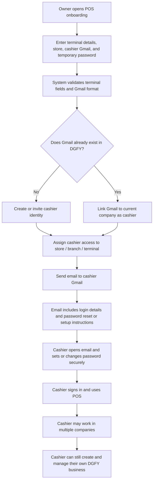

# Implementation Steps: Copying dgfy-platform/develop to origin/develop

## Executed Git Commands

### 1. Fetch develop Branch from dgfy-platform
```bash
git fetch dgfy-platform develop:dgfy-develop-temp
```
Fetched the `develop` branch from the `dgfy-platform` remote and created local temporary branch `dgfy-develop-temp`. [Status: Completed]

### 2. Push to User's develop Branch
```bash
git push origin dgfy-develop-temp:develop
```
Pushed the fetched `develop` code to a new branch called `develop` on your own GitHub repository (`origin`). [Status: Completed]

### 3. Cleanup Temporary Local Branch
```bash
git branch -D dgfy-develop-temp
git branch -D pr-3-temp
```
Deleted the temporary local branches to clean up. [Status: Completed]

---

# Approved Code Edit Log

Use this section to record each approved code edit with its date, problem, confirmed cause, implemented solution, affected files, and verification results.

## 2026-07-04 — Silence nonessential standalone POS popups

### Error or problem

The standalone POS displayed frequent success and informational toast popups, including:

> POS unlocked and cashier shift opened successfully.

These notifications obstructed the cashier interface even when no action was required.

### Confirmed cause

The standalone POS used the default Sonner notification renderer. All normal, success, informational, warning, and error notifications were therefore displayed without a POS-specific visibility policy.

### Implemented solution

Added a standalone POS notification renderer that:

- Hides normal, success, and informational toast notifications.
- Preserves warning, error, and loading notifications.
- Applies only to the standalone POS and does not change SKUpervisor notifications.

### Files changed

- `frontend/apps/pos/src/components/PosToaster.jsx`
- `frontend/apps/pos/src/main.jsx`
- `frontend/apps/pos/src/app/PosApp.jsx`
- `frontend/src/features/pos/__tests__/posToastPolicy.contract.test.js`

### Verification

- POS toast policy and terminal contract tests: **45 passed**.
- Standalone POS production build: **passed**.
- Git whitespace validation (`git diff --check`): **passed**.

## 2026-07-06 — Fix POS reports backend date normalization after Joi query parsing

### Error or problem

The POS report request still returned `400` with `Report dates must use YYYY-MM-DD format` even after the frontend was confirmed to send `date_from=2026-07-06&date_to=2026-07-06`.

### Confirmed cause

The browser request proved the frontend query string was already correct. The remaining failure was inside the backend report use case:

- the POS reports query validator accepts ISO dates with Joi
- Joi can hydrate those query values into JavaScript `Date` objects
- the report use case converted `filters.date_from` and `filters.date_to` with `String(...).slice(0, 10)`
- for `Date` objects that produced values like `Mon Jul 06`, which then failed the `YYYY-MM-DD` regex and triggered the 400 response

### Implemented solution

- Added backend business-date normalization in the POS reports use case.
- The reports use case now accepts either ISO strings or valid `Date` objects and canonicalizes both to `YYYY-MM-DD` before validation and repository access.

### Files changed

- `backend/src/modules/pos/usecases/posUseCases.js`

### Verification

- POS use case module import check: **passed**.
- Architecture guardrails: **passed**.
- Controller boundary check: **passed**.
- Git whitespace validation (`git diff --check`): **passed**.

## 2026-07-06 — Restore POS report tabs, keep summary cards on one row, and normalize report dates

### Error or problem

The POS report workspace had regressed to a dropdown report selector, the top summary cards no longer stayed on one desktop row, and the report request could fail with `Report dates must use YYYY-MM-DD format`.

### Confirmed cause

- The report section switcher had been rendered as a `<select>` instead of the prior button-tab control.
- The summary cards grid was capped at four desktop columns while rendering five cards, which forced the last card onto a new row.
- The backend validator only accepts ISO `YYYY-MM-DD` dates, while the frontend request path did not defensively normalize report date strings before calling the POS report endpoints.

### Implemented solution

- Replaced the report-section dropdown with horizontal button tabs again.
- Changed the summary card grid to five desktop columns so the full report card set stays on one row.
- Added frontend date normalization before overview and export requests so report calls always send `YYYY-MM-DD`.
- Added a second defensive normalization layer in the POS report service so any slash-formatted runtime date values are converted before the API request is sent.

### Files changed

- `frontend/src/features/pos/components/PosReportsAnalyticsWorkspace.jsx`
- `frontend/src/features/pos/services/posService.js`

### Verification

- Frontend production build: **passed**.
- Git whitespace validation (`git diff --check`): **passed**.
- Note: broad POS terminal view-mode contract run still has unrelated pre-existing failures outside this report change.

## 2026-07-06 — Restore POS Sell catalog scrolling after wrapper and pagination regression

### Error or problem

The POS Sell catalog was no longer scrollable again in the rendered terminal even though the earlier catalog-scroll fix was already documented. Cashiers could see the card grid, but the dedicated Sell scroll region did not consistently own the overflow behavior.

### Confirmed cause

The documented July 4 catalog fix had partially regressed in code:

- the checkout workspace wrapper in `TerminalPageLayout.jsx` no longer enforced `h-full min-h-0`
- the checkout view wrapper in `POSCheckoutTerminal.jsx` no longer enforced `h-full min-h-0`
- dynamic catalog page sizing returned through `catalogAutoPageSize` and `ResizeObserver`
- pagination still triggered `scrollIntoView` on the surrounding section instead of resetting only the catalog viewport

This broke the intended dedicated catalog scroll container and allowed the surrounding fixed shell layout to interfere with Sell overflow again.

### Implemented solution

- Restored `h-full min-h-0` on both immediate checkout wrappers.
- Removed dynamic catalog page-size measurement and restored a fixed 12-item catalog page.
- Removed section-level `scrollIntoView` from catalog pagination.
- Kept the actual `pos-catalog-scroll` viewport as the only Sell catalog vertical scroll region.

### Files changed

- `frontend/src/features/pos/components/TerminalPageLayout.jsx`
- `frontend/src/features/pos/components/POSCheckoutTerminal.jsx`
- `frontend/src/features/pos/__tests__/terminalResponsiveScroll.contract.test.js`

### Verification

- POS responsive scroll contract test: pending local run after patch.
- Git whitespace validation (`git diff --check`): pending local run after patch.

## 2026-07-04 — Correct clipped POS catalog overflow and use 12-item pages

### Error or problem

The catalog still could not scroll in the rendered POS, and its pagination footer was clipped below the application viewport. The required page size was changed to 12 items.

### Confirmed cause

Two immediate wrappers between the terminal workspace and checkout grid did not carry `h-full min-h-0`. The checkout content therefore expanded beyond the fixed POS shell, where the shell's hidden overflow clipped the catalog and footer instead of bounding the dedicated catalog scroll region.

### Implemented solution

- Added the missing full-height and minimum-height constraints to both checkout workspace wrappers.
- Set catalog pagination to exactly 12 items per page.
- Kept the catalog card container as the dedicated vertical wheel, touch, and scrollbar region.
- Kept the search/filter controls and catalog footer outside the scrolling card region.
- Preserved equal card heights, hover-only scrollbars, and selected-item highlighting.

### Files changed

- `frontend/src/features/pos/components/TerminalPageLayout.jsx`
- `frontend/src/features/pos/components/POSCheckoutTerminal.jsx`
- `frontend/src/features/pos/__tests__/terminalResponsiveScroll.contract.test.js`

### Verification

- POS responsive-scroll and terminal contract tests: **58 passed**.
- Standalone POS production build: **passed**.
- Browser layout probe at 1280×720: catalog region bounded to 456 px and footer visible at 687 px within the 720 px viewport.
- Git whitespace validation (`git diff --check`): **passed**.

## 2026-07-04 — Repair POS catalog scrolling and eight-item pagination

### Error or problem

The cashier could not scroll the POS catalog reliably. The catalog dynamically changed its page size, page changes scrolled the surrounding section, and the intended catalog scroll region was not the element being reset. Item selection also had no persistent visual highlight.

### Confirmed cause

The catalog used viewport measurement and `ResizeObserver` logic to calculate a variable page size. On pagination it called `scrollIntoView` on the catalog section and reset a non-scrollable viewport wrapper instead of the actual catalog card container.

### Implemented solution

- Set catalog pagination to exactly eight items per page.
- Keep the existing fixed card row heights and the footer outside the card scroll region.
- Reset only the actual catalog scroll container when changing pages.
- Removed dynamic page-size measurement and surrounding-page `scrollIntoView` behavior.
- Keep catalog and Current Sale scrollbars transparent until their section is hovered.
- Highlight items already in Current Sale with a light-blue background, blue border, and accessible `aria-pressed` state while preserving images and labels.

### Files changed

- `frontend/src/features/pos/components/POSCheckoutTerminal.jsx`
- `frontend/src/index.css`
- `frontend/src/features/pos/__tests__/terminalResponsiveScroll.contract.test.js`

### Verification

- POS responsive-scroll and terminal contract tests: **58 passed**.
- Standalone POS production build: **passed**.
- Production preview rendered successfully; the existing development server remains affected by an unrelated stale module-export mismatch.
- Git whitespace validation (`git diff --check`): **passed**.

## 2026-07-04 — Inform admin about an existing cashier shift

### Error or problem

When an admin entered the POS while a cashier already had an open shift on the terminal, the admin could be shown the new-shift workflow without being told who owned the existing shift or when it started.

### Confirmed cause

The current-shift backend lookup always filtered by the authenticated user ID. An admin therefore could not discover a shift owned by another cashier on the requested terminal. The POS also had no dedicated acknowledgment modal for this state.

### Implemented solution

- Allow an admin or company master admin to inspect the open shift on the requested terminal without changing its owner.
- Include the shift cashier's username and email in the current-shift response.
- Show an acknowledgment-only modal containing the cashier, start date/time, terminal, and location.
- Return the admin to the POS catalog after **Okay** without opening or taking over the cashier shift.
- Keep non-admin current-shift reads scoped to the authenticated cashier.

### Files changed

- `backend/src/modules/pos/usecases/posUseCases.js`
- `backend/src/modules/pos/repositories/posRepository.js`
- `backend/tests/posTerminalReadiness.usecase.test.js`
- `frontend/src/features/pos/pages/TerminalPage.jsx`
- `frontend/src/features/pos/__tests__/posDgfyAdminBypass.contract.test.js`

### Verification

- Backend current-shift tests: **3 passed**.
- Frontend admin-shift and location-scope tests: **15 passed**.
- Standalone POS production build: **passed**.
- Git whitespace validation (`git diff --check`): **passed**.

## 2026-07-04 — Add inline POS food-category creation in Add POS Item modal

### Requested change

Add a field in the **Add POS Item** modal that allows the user to create a new food category inline while keeping the existing modal design consistent.

### Confirmed current behavior

- The create modal in `frontend/src/features/pos/components/TerminalOperationsWorkspace.jsx` currently uses a select-only **Food category** field.
- Category assignment is already persisted through `product_folder` and `folder_id` during item create and edit flows.
- POS catalog category filters already read from persisted folder and item category data.
- New categories can already be created programmatically through the existing `ensureFoodCategoryFolder(...)` flow, but there is no inline create/clear UX in the modal.
- The create form currently defaults to `Mains` instead of the earliest created saved category.

### Implemented solution

- Replaced the create-modal category select behavior with a POS-only inline category entry control that supports:
  - selecting an existing category,
  - clearing the current category,
  - typing a new category name inline,
  - creating another category again after clearing.
- Removed forced default POS food-category seeding from the POS workspace so the modal can follow the requested saved-category behavior instead of auto-injecting preset folders.
- Defaulted the **Food category** field to the first saved POS category by creation order when categories already exist.
- Persisted any newly typed category before item creation so it becomes a saved POS category.
- Kept the selected category saved with the item through `product_folder` and `folder_id`.
- Kept category visibility scoped to the POS workspace and POS category filter flow only.
- Updated the POS mobile category filter label rendering so saved category labels display correctly.
- Kept the modal styling aligned with the current POS modal design system.

### Files changed

- `frontend/src/features/pos/components/TerminalOperationsWorkspace.jsx`

### Verification

- Standalone POS production build: **passed**.
- Frontend lint from the frontend workspace reached existing file-wide `TerminalOperationsWorkspace.jsx` warnings/errors unrelated to this POS category change, including a pre-existing `companyName` hook dependency issue.

## 2026-07-04 — Redesign the Storefront promo card discount control

### Error or problem

The storefront settings page used a plain checkbox for the **Promo Card** discount state. It looked weak beside the rest of the rounded POS settings UI and did not clearly show whether the promo fields were active or intentionally inactive.

### Confirmed cause

The promo-card block in `frontend/src/features/pos/components/TerminalOperationsWorkspace.jsx` rendered only a raw checkbox with no pressed-state styling, status label, or muted field treatment when the discount was off.

### Implemented solution

- Replaced the plain checkbox with a responsive pressed-state **Enable Discount** control inside the existing storefront settings card.
- Added a discount icon, active/inactive status pill, and clearer helper text so the promo state is immediately understandable.
- Applied active styling when the promo card is enabled and muted the section when disabled.
- Disabled the promo title, badge, subtitle, and validity inputs while inactive so the state is visually obvious without breaking alignment.
- Kept the **Save Storefront** action aligned with the form and responsive on smaller screens.

### Files changed

- `frontend/src/features/pos/components/TerminalOperationsWorkspace.jsx`
- `frontend/src/features/pos/__tests__/storefrontPromoCard.contract.test.js`

### Verification

- Storefront promo-card contract test: **3 passed**.
- Standalone POS production build: **passed**.
- Git whitespace validation (`git diff --check`): **passed** with existing line-ending warnings only.

## 2026-07-04 — Add POS-managed Storefront promo code limits and checkout enforcement

### Error or problem

The Storefront promo card only supported display content. Buyers could type a promo code in checkout, but it did not validate against POS settings, did not apply a discount, did not enforce a usage limit, and did not persist promo usage after refresh.

### Confirmed cause

- `storefront_promo` only stored presentation fields such as title, badge, subtitle, validity text, and active state.
- Storefront checkout payloads did not send `promo_code`.
- Storefront quote and checkout use cases always saved `discount_amount: 0` and had no promo validation or usage-count update logic.

### Implemented solution

- Extended the POS Storefront Settings promo card to save:
  - promo code,
  - discount value,
  - usage limit,
  - used count,
  - valid time start,
  - valid time end.
- Extended backend settings validation for the new promo fields and time-range rules.
- Passed `promo_code` from Storefront quote and checkout payloads.
- Enforced promo rules on the backend during quote and checkout:
  - promo must be active,
  - entered code must match,
  - usage limit must not be reached,
  - current time must be inside the valid range.
- Returned the requested promo messages:
  - `Promo code applied successfully.`
  - `Promo code has reached its usage limit.`
  - `Promo code is only valid from 5:00 AM to 10:00 AM.`
  - `Invalid or inactive promo code.`

## 2026-07-06 — Restore missing Storefront promo enforcement path in `POS-Development`

### Error or problem

The branch still had the promo-card UI shell, but the real checkout enforcement path was missing again. Buyers could type a promo code, yet the Storefront payload, quote totals, checkout totals, and promo usage persistence were not fully wired on this branch.

### Confirmed cause

- Storefront quote and checkout payloads were still missing `promo_code`.
- The backend Storefront quote/checkout use cases still defaulted promo discount values to zero.
- The Storefront promo settings form only preserved presentation fields and would drop promo enforcement fields on save.
- Promo usage count was not being incremented back into `storefront_promo.used_count` after a successful checkout.

### Implemented solution

- Restored `promo_code` in the shared Storefront checkout payload.
- Restored backend promo validation for:
  - active promo state,
  - exact promo-code match,
  - usage-limit enforcement,
  - valid-time-window enforcement.
- Restored promo discount math in Storefront quote and checkout totals.
- Restored checkout persistence for:
  - `discount_amount`,
  - `discount_label_snapshot`,
  - `discount_rate_snapshot`.
- Incremented `storefront_promo.used_count` only after a successful checkout transaction.
- Updated POS Storefront Settings and shared Settings forms to preserve:
  - promo code,
  - discount percent,
  - usage limit,
  - used count,
  - valid start time,
  - valid end time.
- Updated the Storefront promo panel and order-summary surfaces so the applied discount and promo status are visible to the buyer.

### Verification

- Backend targeted promo tests in `tests/storeUsecases.applicationResult.test.js`:
  - promo success path: **passed**
  - promo usage-limit rejection: **passed**
  - promo used-count increment on successful checkout: **passed**
- Storefront contract test `frontend/apps/store/src/__tests__/fnbStorefront.contract.test.js`: **passed**
- `npm run check:architecture`: **passed**
- `git diff --check`: **passed**

## 2026-07-06 — Fix missing POS report routes causing `Route /api/v1/pos/reports/overview ... not found`

### Error or problem

The POS Report page was failing with a backend route error:

> Route `/api/v1/pos/reports/overview?...` not found

This blocked the Daily/Monthly/Yearly/Comparison/Profit-Loss report screen even though the report UI and backend report use cases already existed.

### Confirmed cause

- The frontend report workspace calls `/api/v1/pos/reports/overview` and `/api/v1/pos/reports/export`.
- The POS backend controller and use cases for `getReportsOverview` and `exportReports` still existed.
- The POS router was missing registration for those report endpoints, so Express returned route-not-found before any report logic could run.

### Implemented solution

- Added a dedicated POS report query validator for:
  - granularity,
  - section,
  - date range,
  - cashier,
  - location,
  - payment type,
  - source,
  - category,
  - terminal ID.
- Re-registered these POS backend routes:
  - `GET /api/v1/pos/reports/overview`
  - `GET /api/v1/pos/reports/export`
- Kept the existing report controller/use-case path unchanged so the fix stays minimal and restores the existing frontend/backend contract instead of changing report logic.

### Verification

- POS route module import check: **passed**
- `npm run check:architecture`: **passed**
- `git diff --check`: **passed**

## 2026-07-05 — Replace DGFY-only cashier onboarding with Gmail-first cashier provisioning

### Error or problem

Terminal onboarding still blocked the owner with errors such as:

> No active cashier account matches this Gmail.

This prevented saving a terminal unless the cashier already existed as an accepted DGFY cashier account first.

### Confirmed cause

- The POS onboarding modal still enforced an old DGFY-only validation path before saving terminal setup.
- Terminal save expected an already active cashier membership instead of provisioning or attaching the cashier from the entered Gmail address.
- The previously built frontend bundle in `frontend/dist` still contained the stale DGFY-only error string, which could keep showing the old behavior until rebuilt.

### Implemented solution

- Replaced the terminal onboarding cashier save flow with a Gmail-first provisioning flow.
- Added backend cashier provisioning that:
  - accepts a valid Gmail address,
  - creates or reuses the DGFY account,
  - attaches the cashier to the current company,
  - applies the terminal store assignment,
  - sets the temporary cashier password,
  - sends cashier credential email when email delivery is configured.
- Replaced frontend terminal save calls so onboarding now provisions cashier access through the new backend endpoint instead of requiring a pre-existing accepted cashier.
- Updated onboarding copy to explain that entering a Gmail address can create or attach the cashier during save.
- Kept the existing **Invite DGFY Cashier** flow available.

### Files changed

- `backend/src/services/userService.js`
- `backend/src/validators/userValidator.js`
- `backend/src/modules/users/usecases/userUseCases.js`
- `backend/src/modules/users/index.js`
- `backend/src/modules/users/controllers/userHandlers.js`
- `backend/src/controllers/userController.js`
- `backend/src/routes/users.js`
- `frontend/src/services/userService.js`
- `frontend/src/features/pos/components/PosTenantSetupModal.jsx`
- `frontend/src/features/pos/__tests__/posSettingsCashier.contract.test.js`

### This is the error and this is the solution

- Error: terminal setup rejected a cashier Gmail unless that cashier already existed as an active accepted DGFY cashier.
- Solution: terminal setup now provisions or attaches the cashier directly from the entered Gmail address, then assigns terminal/store access and sends login instructions.

## 2026-07-05 — Fix POS onboarding crash: `activeCashiers is not defined`

### Error or problem

The POS onboarding screen crashed with:

> activeCashiers is not defined

The onboarding modal could not render the POS setup section.

### Confirmed cause

During the Gmail-first cashier refactor, the JSX still rendered `activeCashiers` and `pendingCashiers`, but their `useMemo` declarations had been removed from `PosTenantSetupModal.jsx`.

### Implemented solution

- Restored the derived cashier lists from `tenantUsers`:
  - `cashierUsers`
  - `activeCashiers`
  - `pendingCashiers`
- Kept the Gmail-first provisioning flow unchanged.
- Limited the fix to the missing render-time state so the onboarding screen can load again without changing the save behavior.

### Files changed

- `frontend/src/features/pos/components/PosTenantSetupModal.jsx`
- `Implementation.md`

### This is the error and this is the solution

- Error: the modal referenced `activeCashiers` and `pendingCashiers` after those variables were removed.
- Solution: restore the missing derived state so the JSX can render safely.

## 2026-07-05 — Keep standalone POS signed in after refresh and hard refresh

### Error or problem

The standalone POS sent the admin or cashier back to the login screen after browser refresh or hard refresh, even when the terminal session had just been unlocked.

### Confirmed cause

- The standalone POS browser session stored the access token only in memory.
- A page reload cleared that in-memory token.
- `refreshBrowserSession()` explicitly refused to restore a fresh standalone POS page unless the current page lifecycle had already activated the session.

### Implemented solution

- Added standalone POS session persistence in browser `sessionStorage`.
- Persisted:
  - POS access token
  - current company token
  - POS session activation state
- Restored the standalone POS session during browser-session bootstrap so repeated refreshes can keep the user signed in.
- Kept logout and explicit session clear behavior removing the persisted POS session.

### Files changed

- `frontend/src/services/browserSession.js`
- `frontend/src/services/__tests__/browserSession.posBootstrap.test.js`
- `Implementation.md`

### This is the error and this is the solution

- Error: refreshing the standalone POS cleared the in-memory token and forced login again.
- Solution: persist and restore the standalone POS browser session across refreshes.

## 2026-07-05 — Fix Gmail-first cashier save failure: `Invalid tenant configuration: missing db_name`

### Error or problem

Saving terminal setup with the new Gmail-first cashier flow failed with:

> Invalid tenant configuration: missing db_name

### Confirmed cause

- The Gmail-first cashier provisioning path called DGFY invitation membership logic that needs a full tenant object.
- The backend tenant request context exposed `tenantId`, `tenantToken`, and `tenantName`, but not `tenant.db_name`.
- The provisioning flow therefore passed an incomplete tenant object into `tenantConnector.getConnection(...)`.

### Implemented solution

- Added `tenantDbName` to the tenant middleware request context.
- Passed that value into the Gmail-first cashier provisioning tenant payload as `db_name`.
- Tightened the provisioning guard so it fails early if tenant DB context is missing.

### Files changed

- `backend/src/middleware/tenantHandler.js`
- `backend/src/services/userService.js`
- `Implementation.md`

### This is the error and this is the solution

- Error: Gmail-first cashier provisioning built an incomplete tenant object without `db_name`.
- Solution: include `db_name` in request tenant context and pass it into the DGFY tenant invitation flow.

## 2026-07-05 — Finalize cashier Gmail provisioning without requiring an existing DGFY cashier account

### Error or problem

The cashier onboarding behavior was still too dependent on the old DGFY invitation flow. The required business rule is:

- any valid cashier Gmail can be entered,
- the cashier does not need an existing DGFY account first,
- the system must still accept the Gmail,
- the system must create or attach the cashier automatically,
- the system must email credentials and reset-password guidance.

### Confirmed cause

- The Gmail-first save path still reused the old DGFY invitation acceptance flow.
- That flow was designed around pre-existing or invited tenant membership instead of direct cashier provisioning from the onboarding screen.

### Implemented solution

- Replaced the old invitation-dependent cashier save path with direct cashier provisioning.
- The new flow now:
  - accepts a valid cashier Gmail,
  - creates the DGFY account if it does not exist,
  - updates the DGFY account if it already exists,
  - creates or revives the tenant cashier user directly inside the company tenant,
  - assigns the selected store location grants,
  - mirrors an accepted DGFY tenant membership,
  - emails the cashier login credentials,
  - includes a reset-password link and reset-password instructions in the email.
- Updated onboarding copy to make it explicit that the cashier Gmail is accepted even when the cashier has no account yet.

### Files changed

- `backend/src/services/userService.js`
- `backend/src/services/emailService.js`
- `backend/src/templates/emailTemplates.js`
- `frontend/src/features/pos/components/PosTenantSetupModal.jsx`
- `Implementation.md`

### This is the error and this is the solution

- Error: cashier setup still depended on an old DGFY invitation flow and did not cleanly match the “accept cashier Gmail even without an account” rule.
- Solution: provision the cashier directly from the onboarding Gmail entry, then email credentials and reset-password guidance automatically.
- Applied the discount to Storefront quote totals and checkout totals, showed the discount line in the Storefront order summary, and saved promo discount snapshots into the online transaction.
- Incremented `used_count` only after a successful checkout inside the checkout transaction so refreshes and idempotent replays do not double-count usage.
- Exposed the new promo metadata to the Storefront UI through discovery payload sanitization.

### Files changed

- `backend/src/validators/settingsValidator.js`
- `backend/src/validators/storeValidator.js`
- `backend/src/modules/settings/repositories/settingsRepository.js`
- `backend/src/modules/store/contracts/storeRepository.contract.js`
- `backend/src/modules/store/repositories/storeRepository.js`
- `backend/src/modules/store/usecases/storeUseCases.js`
- `backend/src/modules/storefrontDiscovery/repositories/storefrontDiscoveryRepository.js`
- `backend/src/services/storefrontDiscoveryIndexService.js`
- `backend/tests/storeUsecases.applicationResult.test.js`
- `frontend/src/features/pos/components/TerminalOperationsWorkspace.jsx`
- `frontend/src/features/pos/__tests__/storefrontPromoCard.contract.test.js`
- `frontend/apps/store/src/checkout/buildFnbCheckoutPayload.js`
- `frontend/apps/store/src/checkout/components/PromoCodePanel.jsx`
- `frontend/apps/store/src/StorefrontApp.jsx`
- `frontend/apps/store/src/__tests__/fnbStorefront.contract.test.js`

### Verification

- Promo-specific backend Storefront use-case tests: **3 passed**.
- Frontend promo contract tests: **19 passed** across the two targeted contract files.
- Standalone POS production build: **passed**.
- Storefront production build: **passed**.
- Full backend `storeUsecases.applicationResult.test.js` still contains one unrelated pre-existing failing assertion in the POS-open-status quote block.
- Git whitespace validation (`git diff --check`): **passed** with existing line-ending warnings only.

## 2026-07-05 — Add cashier Gmail and password fields to POS onboarding terminal setup

### Error or problem

The POS onboarding flow let admins invite DGFY cashiers and register terminals, but it did not provide a direct way to enter a cashier Gmail and password under the terminal row before saving and finishing onboarding.

### Confirmed cause

The onboarding modal only saved `pos_terminal_registry` terminal fields and relied on the separate DGFY invitation flow for cashier access. There was no terminal-level cashier credential form, no terminal-to-cashier email persistence, and no onboarding save path that could assign the cashier's branch access and set the cashier password in one step.

### Implemented solution

- Kept the existing **Invite DGFY Cashier** flow unchanged.
- Added per-terminal onboarding fields for:
  - cashier Gmail,
  - cashier password.
- Validated that each entered cashier email belongs to an active accepted cashier account in the current tenant.
- Blocked save when the cashier invitation is still pending or when only one of the two credential fields is entered.
- Used the onboarding save action to:
  - grant the cashier access to the terminal's assigned store location,
  - reset the cashier's POS password through the existing user password API,
  - persist only the cashier email in terminal settings for display and reload.
- Kept raw cashier passwords out of persisted POS settings.
- Extended the terminal registry normalization and validation path so saved cashier email values survive refresh and reopen correctly.

### Files changed

- `frontend/src/features/pos/components/PosTenantSetupModal.jsx`
- `frontend/src/features/pos/utils/terminalIdentity.js`
- `frontend/src/features/pos/__tests__/posSettingsCashier.contract.test.js`
- `backend/src/validators/settingsValidator.js`
- `backend/src/modules/settings/repositories/settingsRepository.js`
- `backend/src/modules/settings/usecases/posTerminalRegistrySecrets.js`

### Verification

- Targeted POS cashier contract tests: pending local run.
- Additional runtime verification: pending local run.

## 2026-07-05 — Make POS onboarding terminal save failures visible inline

### Error or problem

When the admin clicked **Save Terminal Setup** during POS onboarding, the form could appear to do nothing when a required terminal field was missing, especially the store assignment.

### Confirmed cause

The terminal save flow rejected invalid terminal rows through toast-only errors. If toast notifications were easy to miss or muted, the modal gave no inline explanation and the blocking fields were not visually marked.

### Implemented solution

- Added inline terminal save feedback inside the onboarding modal.
- Highlighted blocking terminal fields in red when save validation fails.
- Showed explicit inline messages for:
  - missing store assignment,
  - incomplete cashier Gmail/password pair,
  - pending cashier invitation,
  - unknown cashier Gmail,
  - short cashier password,
  - duplicate terminal ID.
- Kept the toast behavior, but no longer relied on toast visibility alone to explain save failures.

### Files changed

- `frontend/src/features/pos/components/PosTenantSetupModal.jsx`
- `frontend/src/features/pos/__tests__/posSettingsCashier.contract.test.js`

### Verification

- Targeted POS cashier/setup-flow tests: pending local run.
- Standalone POS production build: pending local run.

### Short flow

1. Owner opens POS onboarding.
2. Owner enters terminal details, store assignment, cashier Gmail, and temporary password.
3. System validates the terminal fields and checks that the cashier email is a valid Gmail address.
4. If the Gmail is not yet registered, the system creates or invites the cashier identity for that Gmail.
5. If the Gmail already exists, the system links that Gmail to the current company as a cashier without blocking the user's own business ownership.
6. System assigns the cashier to the selected store, branch, or terminal access.
7. System sends an email to the cashier Gmail with the login details and password reset or password setup instructions.
8. Cashier opens the email, sets or changes the password securely, and signs in.
9. Cashier can work in one or multiple companies, while still being allowed to create and manage their own DGFY business separately.

### Flowchart



## 2026-07-05 — Lock onboarding until Finish Setup and email cashier credentials after terminal save

### Error or problem

The onboarding modal could still be dismissed before completion, and cashier terminal onboarding did not automatically email the cashier their login credentials after the admin saved the terminal setup.

### Confirmed cause

- The onboarding dialog still allowed dismissal through skip and dialog-close behavior.
- The cashier password reset flow updated the cashier password but had no optional credential-email delivery path.
- The terminal onboarding save flow did not receive email-delivery status back from the backend, so it could not confirm whether credentials were actually sent.

### Implemented solution

- Locked the onboarding dialog so it cannot close from outside click, escape, or skip controls.
- Kept onboarding open until the user completes the required steps and explicitly clicks **Finish Setup**.
- Added a dedicated cashier credential email template containing:
  - cashier Gmail,
  - temporary password,
  - login link,
  - password-change instructions after first sign-in.
- Extended the cashier password reset endpoint so onboarding can optionally request credential email delivery.
- Returned credential email delivery status from the backend so onboarding can show whether:
  - the email was sent successfully, or
  - SMTP/Brevo still needs configuration.
- Kept terminal save successful even when email delivery is unavailable, while surfacing the configuration warning clearly in the onboarding UI.

### Files changed

- `frontend/src/features/pos/components/PosTenantSetupModal.jsx`
- `frontend/src/features/pos/__tests__/posSettingsCashier.contract.test.js`
- `frontend/src/services/userService.js`
- `backend/src/validators/userValidator.js`
- `backend/src/modules/users/controllers/userHandlers.js`
- `backend/src/modules/users/usecases/userUseCases.js`
- `backend/src/services/userService.js`
- `backend/src/services/emailService.js`
- `backend/src/templates/emailTemplates.js`

### Verification

- Targeted POS cashier/setup-flow tests: pending local run.
- Standalone POS production build: pending local run.

## 2026-07-05 — Restore the POS Settings button and keep the desktop sidebar locked open

### Error or problem

In the POS left sidebar, the **Settings** section label was visible but the actual **Settings** button was missing. The desktop sidebar could also be collapsed, which made the navigation inconsistent for the cashier/admin workspace.

### Confirmed cause

- The sidebar only rendered the **Settings** navigation button behind an extra advanced-operations condition.
- The desktop POS shell still allowed the sidebar to collapse through the header menu toggle.

### Implemented solution

- Removed the extra conditional hiding the **Settings** navigation entry so the button is rendered consistently in the sidebar.
- Added a deterministic sidebar test hook for the Settings entry.
- Locked the desktop POS shell layout to a fixed two-column sidebar + workspace structure.
- Changed the menu button to stay mobile-only so desktop no longer collapses the sidebar.
- Kept the checkout workspace aligned by forcing the desktop checkout surface to use the fixed-open sidebar layout.

### Files changed

- `frontend/src/features/pos/components/TerminalWorkspaceSidebar.jsx`
- `frontend/src/features/pos/components/TerminalPageLayout.jsx`
- `frontend/src/features/pos/__tests__/terminalViewModeContracts.test.js`
- `frontend/src/features/pos/__tests__/terminalResponsiveScroll.contract.test.js`
- `Implementation.md`

### This is the error and this is the solution

- Error: the sidebar showed the Settings section heading but hid the Settings button, and the desktop sidebar could still collapse.
- Solution: always render the Settings navigation entry and keep the desktop POS sidebar fixed open.

## 2026-07-05 — Restore POS Report navigation without requiring the Settings PIN

### Error or problem

The **Report** button in the POS sidebar was visible but could not be opened in normal POS use when the Settings access PIN was not configured.

### Confirmed cause

- The POS navigation treated **Report** as a PIN-protected tool together with Settings and Items.
- When no POS access PIN was configured, clicking **Report** was blocked before the workspace could open.

### Implemented solution

- Separated shift-exempt navigation from PIN-protected navigation.
- Kept **Report** available without an open shift where appropriate.
- Removed **Report** from the POS access PIN gate.
- Kept **Items** and Settings-related views under the existing PIN-protected flow.
- Updated the Report sidebar caption to reflect normal reporting access instead of PIN protection.

### Files changed

- `frontend/src/features/pos/pages/TerminalPage.jsx`
- `frontend/src/features/pos/components/TerminalWorkspaceSidebar.jsx`
- `frontend/src/features/pos/__tests__/posSettingsCashier.contract.test.js`
- `Implementation.md`

### This is the error and this is the solution

- Error: Report was incorrectly blocked by the POS Settings PIN gate.
- Solution: make Report shift-exempt but not PIN-protected, while keeping Items and Settings under the PIN gate.

## 2026-07-05 — Restore MSME admin Report workspace rendering in POS

### Error or problem

The **Report** button in POS became clickable, but the report screen still did not render for admin accounts running in the MSME POS mode.

### Confirmed cause

- The MSME operations mode list did not include `reports`.
- The operations workspace still treated `reports` as an MSME-restricted mode and redirected it to `shift_controls`.

### Implemented solution

- Added `reports` to the MSME POS operations view list.
- Removed `reports` from the MSME restricted-mode fallback in the operations workspace.
- Kept the remaining MSME restrictions unchanged.

### Files changed

- `frontend/src/features/pos/pages/TerminalPage.jsx`
- `frontend/src/features/pos/components/TerminalOperationsWorkspace.jsx`
- `Implementation.md`

### This is the error and this is the solution

- Error: MSME mode still excluded the Report workspace even after the sidebar click bug was fixed.
- Solution: allow the Report workspace in MSME admin mode and stop redirecting it to Shift Controls.

## 2026-07-06 — Fix local POS onboarding handoff to the wrong localhost port

### Error or problem

Local POS onboarding links opened `http://localhost:5180/terminal?...`, which failed with `ERR_CONNECTION_REFUSED` even though the POS dev server was running.

### Confirmed cause

- The shared DGFY route helpers still used `5180` as the fallback local POS port.
- The Storefront business-registration helper also used the same stale local POS fallback.
- The actual local POS dev server in this project runs on port `5174`.

### Implemented solution

- Replaced the stale `5180` local POS fallback with `5174` in the shared POS handoff helper.
- Updated the Storefront business-registration helper to use the same `5174` local POS fallback.
- Kept the environment override path intact so `VITE_POS_DEV_PORT` still wins when explicitly configured.

### Files changed

- `frontend/src/features/dgfyRouteHelpers.js`
- `frontend/apps/store/src/businessRegistrationUrl.js`
- `Implementation.md`

### This is the error and this is the solution

- Error: local POS onboarding redirected to `localhost:5180`, where no app was listening.
- Solution: change the local fallback POS port to `5174`, which matches the actual local POS dev server.

## 2026-07-06 — Simplify Storefront promo fields and add item-scoped promo discounts

### Error or problem

The Storefront promo section in POS Settings relied on placeholder-only inputs inside a redundant promo card, and promo discounts always applied to the whole order even when the business wanted a promo to affect only selected items.

### Confirmed cause

- The promo settings form saved only generic promo text, code, percent, usage, and time values.
- The backend promo calculator always used the full storefront subtotal as the discount base.
- There was no saved list of promo target items and no POS settings UI for selecting them.

### Implemented solution

- Reworked the promo section into a standard labeled form so the UI matches the rest of the modal/settings layout.
- Added promo item selection in POS Settings with removable selected-item chips.
- Saved selected promo item IDs inside `storefront_promo.target_item_ids`.
- Updated storefront promo validation to accept the new target-item list.
- Changed Storefront promo calculation so:
  - if promo target items are selected, only those ordered items receive the discount
  - if no promo target items are selected, the discount applies to all ordered items
  - if a target-item promo is used on an order without any matching items, the API returns a clear validation error

### Files changed

- `frontend/src/features/pos/components/TerminalOperationsWorkspace.jsx`
- `backend/src/validators/settingsValidator.js`
- `backend/src/modules/store/usecases/storeUseCases.js`
- `backend/tests/storeUsecases.applicationResult.test.js`
- `Implementation.md`

### This is the error and this is the solution

- Error: promo setup was placeholder-driven and storefront promo codes could not target only specific items.
- Solution: convert the promo UI to labeled fields, persist selected promo item IDs, and calculate discounts from matching order lines only, with whole-order fallback when no target items are configured.

## 2026-07-06 — Let storefront promo cards auto-fill and validate promo codes on click

### Error or problem

The storefront promo card only displayed the offer. Customers still had to manually type the promo code into the promo panel, which made the promo card feel passive and easy to miss.

### Confirmed cause

- Promo cards rendered promo content but did not carry click behavior into the existing promo-code checkout state.
- The quote flow only validated promos from `promoCodeDraft`.
- There was no storefront bridge between `storefront_promo.promo_code` and the live quote request.

### Implemented solution

- Added promo code metadata into the storefront promo card model.
- Made promo cards clickable when a saved promo code exists.
- Clicking a promo card now:
  - fills the existing storefront promo code field
  - immediately runs quote validation when the cart already has items
  - otherwise preloads the promo code for the next quote/checkout
- Added storefront contract coverage so promo cards remain wired to the current promo application flow.

### Files changed

- `frontend/apps/store/src/StorefrontApp.jsx`
- `frontend/apps/store/src/Components/storefront/sections/StorefrontPromoSection.jsx`
- `frontend/apps/store/src/__tests__/fnbStorefront.contract.test.js`
- `Implementation.md`

### This is the error and this is the solution

- Error: the storefront promo card showed the offer but did not let customers directly claim it.
- Solution: make promo cards apply the saved promo code into the existing promo-code flow and auto-validate it when the cart is ready.

## 2026-07-06 — Resolve backend linter errors and duplicate code definitions

### Error or problem

The backend command `npm run lint` failed with multiple syntax/linting errors, including duplicate exports in `posController.js`, duplicate keys in `posHandlers.js` and `posRepository.js`, duplicate usecase declarations in `posUseCases.js`, duplicate route registrations in `pos.js`, and duplicate schema declarations/exports in `posValidator.js`. There was also an unused linter warning for `settings` in `storeUseCases.js`.

### Confirmed cause

- Duplicate exports, imports, and default exports for `getReportsOverview` and `exportReports` existed in `posController.js`, `posHandlers.js`, and `pos.js`.
- A duplicate 200-line inline implementation of `getReportsOverview` had been added at the top of the `posRepository` object literal (line 1289) and was shadowing the correct modular implementation at line 2290.
- Duplicate declarations for `buildGetPosReportsOverviewUseCase` and `buildExportPosReportsUseCase` existed at the bottom of `posUseCases.js`. Additionally, the first definition of `buildExportPosReportsUseCase` failed to pass the `user` session context to `buildGetPosReportsOverviewUseCase`.
- `posReportsQuerySchema` and its validator export were declared twice in `posValidator.js`.
- `storeUseCases.js` destructured the `settings` variable in `assertCheckoutLocationOperationalReadiness` but never used it.

### Implemented solution

- Removed all duplicate named exports, imports, default export keys, and route registrations for `getReportsOverview` and `exportReports` across `posController.js`, `posHandlers.js`, and `pos.js`.
- Deleted the redundant inline `getReportsOverview` from `posRepository.js`.
- Unified `buildGetPosReportsOverviewUseCase` to apply both date normalization/validation and authentication/location scope checking via the `buildReadScopedPosReportUseCase` wrapper.
- Fixed the `user` context passing bug in `buildExportPosReportsUseCase` and deleted the duplicate usecase declarations at the bottom of `posUseCases.js`.
- Deleted the dead `posReportsQuerySchema` and duplicate validator export from `posValidator.js`.
- Removed the unused `settings` parameter from `assertCheckoutLocationOperationalReadiness` in `storeUseCases.js`.

### Files changed

- `backend/src/controllers/posController.js`
- `backend/src/modules/pos/controllers/posHandlers.js`
- `backend/src/modules/pos/repositories/posRepository.js`
- `backend/src/modules/pos/usecases/posUseCases.js`
- `backend/src/modules/store/usecases/storeUseCases.js`
- `backend/src/routes/pos.js`
- `backend/src/validators/posValidator.js`
- `Implementation.md`

### This is the error and this is the solution

- Error: duplicate keys, duplicate exports, and unused parameters caused linter failures and runtime shadowing.
- Solution: clean up duplicate exports, delete dead code and schemas, correctly route reports, fix missing context parameter, and resolve unused variables so the linter is fully clean and test suites pass.

## 2026-07-06 — Resolve frontend storefront linter errors and unused variables

### Error or problem

The frontend storefront pages added on this branch caused CI check failures due to linter errors, specifically a redundant `Boolean` cast in `DgfyCustomerAccountSections.jsx` and multiple unused variable and icon warnings in `DgfyCustomerAccountPage.jsx` and `StorefrontHeaderNav.jsx`.

### Confirmed cause

- `DgfyCustomerAccountSections.jsx` used `Boolean(account?.is_email_verified) ? ... : null` which triggered the `no-extra-boolean-cast` rule since coercion is already handled by the conditional operator.
- Props `onRefresh`, `onClearSavedDetails`, and `hasSavedCustomerDetails` were destructured in `DgfyCustomerAccountPage.jsx` but never used. Unused icons (`Clock3`, `RotateCcw`, `Search`, `Ticket`, and `Zap`) were also imported.
- Props `onRegisterBusiness` and `accountEmail` were destructured in `StorefrontHeaderNav.jsx` but never used.

### Implemented solution

- Replaced `Boolean(account?.is_email_verified)` with `account?.is_email_verified` in `DgfyCustomerAccountSections.jsx`.
- Removed unused props from the destructuring signatures of `DgfyCustomerAccountPage.jsx` and `StorefrontHeaderNav.jsx`.
- Removed unused icon imports from `DgfyCustomerAccountPage.jsx`.

### Files changed

- `frontend/apps/store/src/Components/storefront/account/DgfyCustomerAccountSections.jsx`
- `frontend/apps/store/src/Components/storefront/hero/StorefrontHeaderNav.jsx`
- `frontend/apps/store/src/Components/storefront/pages/DgfyCustomerAccountPage.jsx`
- `Implementation.md`

### This is the error and this is the solution

- Error: unused parameters, unused icon imports, and redundant Boolean castings caused frontend linting checks to fail.
- Solution: clean up unused variables, strip unused icon imports, and simplify extra Boolean castings so the frontend linter passes with zero errors.
