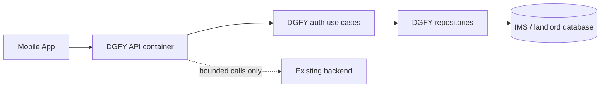

# DGFY Standalone API Plan

Dedicated DGFY API for mobile authentication first, with a future path to become the shared DGFY API for mobile and web.

## Critical Assessment

The standalone API idea is sound, but the first version must stay narrow. Authentication and registration are cross-boundary flows with security, lifecycle, legal-acknowledgement, OTP, and session-cookie implications. A broad "copy the backend" approach would duplicate business rules and create drift.

The safer Phase 1 is to make `apps/dgfy-api` a thin standalone service that exposes a mobile-friendly contract while reusing or sharing the existing DGFY auth domain rules from the current backend. Direct IMS database access should be handled through explicit repository boundaries only, not ad hoc queries from handlers.

## Recommendation

Proceed with a standalone container and API service, but keep the first implementation focused on DGFY account auth and registration:

- account registration preflight
- email OTP request and verification for `dgfy_account_verification`
- account registration with legal acknowledgements
- login
- authenticated `me`
- logout/session invalidation
- password reset request and completion

Defer broader customer, storefront, tenant switching, POS, admin, and web-proxy replacement work until the auth contract is stable and tested from mobile.

## Authoritative Docs Used

These sources govern the plan:

- `docs/START_HERE.md` - authoritative, last reviewed 2026-03-06
- `docs/architecture/ARCHITECTURE_BOUNDARIES.md` - authoritative, last reviewed 2026-03-06
- `docs/architecture/ARCHITECTURE_GOVERNANCE.md` - authoritative, last reviewed 2026-05-21
- `docs/architecture/adr/0001-modular-monolith-boundaries.md` - accepted 2026-03-04
- `docs/architecture/adr/0021-email-otp-verification-for-account-email-ownership.md` - authoritative, last reviewed 2026-06-11
- `docs/architecture/adr/0022-global-dgfy-account-business-registration.md` - authoritative, last reviewed 2026-06-27
- `docs/architecture/adr/0026-browser-session-cookie-authority.md` - authoritative, last reviewed 2026-07-02

ADR impact: cross-boundary. Implementation should either update ADR 0022/0026 or create a new ADR for the standalone DGFY API service boundary before code is shipped.

## Current Baseline

Existing backend auth assets to reuse or port carefully:

- Routes: `backend/src/routes/dgfy.js`
- Transport handlers: `backend/src/modules/dgfy/controllers/dgfyAuthHandlers.js`
- Business logic: `backend/src/modules/dgfy/usecases/dgfyAuthUseCases.js`
- Persistence: `backend/src/modules/dgfy/repositories/dgfyAccountRepository.js`
- OTP service: `backend/src/services/emailOtpService.js`
- DGFY auth middleware: `backend/src/middleware/dgfyAuth.js`
- Docker baseline: `infrastructure/docker/backend/Dockerfile`

`apps/dgfy-api/package.json` exists but is currently empty, so the service has not been scaffolded yet.

## Target Architecture

Phase 1 target:



Boundaries:

- `apps/dgfy-api` owns mobile-facing HTTP transport.
- Auth business rules stay in use cases.
- Persistence stays in repositories.
- Controllers/handlers stay transport-only.
- No controller imports Sequelize models directly.
- Any compatibility calls into the existing backend must be explicit and documented.

## Phase 1 Scope

### 1. Service Scaffold

Create a standalone Node API under `apps/dgfy-api` with:

- `package.json` scripts for `dev`, `start`, `test`, and `lint` if linting is available.
- Express server entrypoint.
- Health endpoint, for example `GET /health` or `GET /api/v1/health`.
- Central error handling compatible with the current backend response style.
- Environment loading aligned with repo conventions.

Expected structure:

```text
apps/dgfy-api/
  package.json
  src/
    server.js
    app.js
    routes/
    modules/
      auth/
        controllers/
        usecases/
        repositories/
```

### 2. Docker Container

Add a dedicated Dockerfile in:

```text
infrastructure/docker/dgfy-api/Dockerfile
```

Then wire a `dgfy-api` service into Docker Compose with:

- its own image name, for example `ghcr.io/sieitzz/dgfy-platform/api:${IMAGE_TAG:-latest}`
- internal port, for example `5100`
- `DB_HOST=mysql`, `DB_PORT=3306`, `DB_DIALECT=mysql`
- `REDIS_URL=redis://redis:6379` if sessions/rate limits need Redis
- healthcheck against the DGFY API health endpoint
- `depends_on` for MySQL and Redis health
- no host port in production; nginx should route `api.dgfy.ph` to the service

### 3. Auth And Registration Endpoints

Initial mobile contract should mirror the current DGFY account flow where possible:

```text
GET  /v1/health
GET  /v1/dgfy/legal-terms/current
POST /v1/dgfy/auth/register/preflight
POST /v1/dgfy/auth/email-verification/request
POST /v1/dgfy/auth/register
POST /v1/dgfy/auth/login
GET  /v1/dgfy/auth/me
POST /v1/dgfy/auth/logout
POST /v1/dgfy/auth/password-reset/request
POST /v1/dgfy/auth/password-reset/complete
```

No `/api` prefix, unlike backend's `/api/v1/...` convention — this service has no sibling frontend sharing its domain the way backend does, so the extra segment is dropped.

Auth rules:

- Public registration requires `dgfy_account_verification` OTP.
- OTPs are purpose-scoped, single-use, expiring, and attempt-limited.
- Registration requires current legal terms acknowledgement versions from the backend-owned legal terms endpoint.
- Login rejects suspended/deleted accounts.
- Password reset uses the `dgfy_password_reset` OTP purpose.
- Phone verification remains deferred and must not be presented as verified.
- Email change remains deferred unless a dedicated verified email-change flow is designed.

### 4. Mobile Session Strategy

Mobile should use bearer tokens stored by the native secure-storage layer, not browser cookies.

Browser session rules from ADR 0026 still matter for future web migration:

- browser authority must remain in HttpOnly cookies
- unsafe browser requests need CSRF protection
- persisted browser-readable access tokens are not allowed

Therefore, the API should keep transport-specific session behavior isolated:

- mobile transport: bearer token response contract
- future browser transport: cookie/CSRF contract

Do not mix these in shared business logic.

## Future Acknowledgement

`apps/dgfy-api` is intended to become the standalone DGFY API, not just a mobile shim.

Future phases may move web clients from their current `/api` proxy paths to `api.dgfy.ph`, but Phase 1 must not require that cutover. The first release proves the standalone API through mobile auth and registration only.

Future expansion candidates:

- company registration from an authenticated DGFY account
- company switching and tenant session exchange
- customer profile/orders/notifications
- storefront account unification
- POS session bootstrap
- web-client proxy retirement

## Implementation Plan

1. Create a service-boundary ADR or update ADR 0022/0026 to define `apps/dgfy-api`, mobile bearer-session behavior, future browser cookie behavior, and allowed backend/database integration paths.
2. Scaffold `apps/dgfy-api` as a standalone Express service with health checks and modular boundaries.
3. Extract/share DGFY auth use cases and repositories without duplicating business rules from `backend/src/modules/dgfy`.
4. Add `infrastructure/docker/dgfy-api/Dockerfile`.
5. Add `dgfy-api` service wiring to `infrastructure/docker/docker-compose.yml` and local compose variants as needed.
6. Add nginx routing for `api.dgfy.ph` after the service healthcheck works internally.
7. Implement the focused auth and registration routes.
8. Add tests for success, validation failures, duplicate conflicts, OTP replay rejection, expired/invalid OTP, suspended/deleted login rejection, legal acknowledgement fail-closed behavior, and password reset.
9. Run architecture and backend checks before marking the phase complete.

## Validation Gates

Required before implementation is considered done:

```bash
npm run check:architecture
npm run lint:docs
npm --prefix backend test -- --runTestsByPath tests/dgfyAuthUseCases.test.js
```

Add app-specific tests once `apps/dgfy-api` has its own test runner, for example:

```bash
npm --prefix apps/dgfy-api test
```

Docker validation:

```bash
docker compose -f infrastructure/docker/docker-compose.yml config
docker build -f infrastructure/docker/dgfy-api/Dockerfile .
```

## Open Risks

- Sharing code from `backend/src/modules/dgfy` into `apps/dgfy-api` may require workspace/package restructuring.
- Direct IMS database writes from the new API increase blast radius unless all writes go through governed repositories and tests.
- Mobile bearer-token storage is outside this repo and must be validated in the mobile app.
- Future browser migration needs a cookie/CSRF route design before web clients move to `api.dgfy.ph`.
