# System Architecture Diagrams & Technical Documentation

## Table of Contents

> **Navigation Tip:** Click a diagram name to jump directly to that section.

### System Overview
- [1. High-Level System Architecture](#1-high-level-system-architecture)
- [2. Database Architecture](#2-database-architecture)
- [3. Request-Response Flow](#3-request-response-flow)

### Data Flows
- [4. Data Flow - Purchase Order to Inventory Update](#4-data-flow---purchase-order-to-inventory-update)
- [5. Data Flow - Job Order Production](#5-data-flow---job-order-production)
- [6. Inventory Tracking - FIFO Batch Management](#6-inventory-tracking---fifo-batch-management)

### System Features
- [7. Alert & Notification System](#7-alert--notification-system)
- [8. User Authentication & Authorization Flow](#8-user-authentication--authorization-flow)
- [9. Deployment Architecture](#9-deployment-architecture)
- [10. Frontend Component Architecture](#10-frontend-component-architecture)

### Operations
- [11. Error Handling & Recovery Flow](#11-error-handling--recovery-flow)
- [12. Scalability & Performance Optimization](#12-scalability--performance-optimization)
- [13. Security Layers](#13-security-layers)

---

# System Architecture Diagrams & Technical Documentation

## 1. High-Level System Architecture

> **Reference Diagram**: See [System Architecture Diagram](./images/system-architecture-diagram.png) for a visual overview of the complete system architecture.

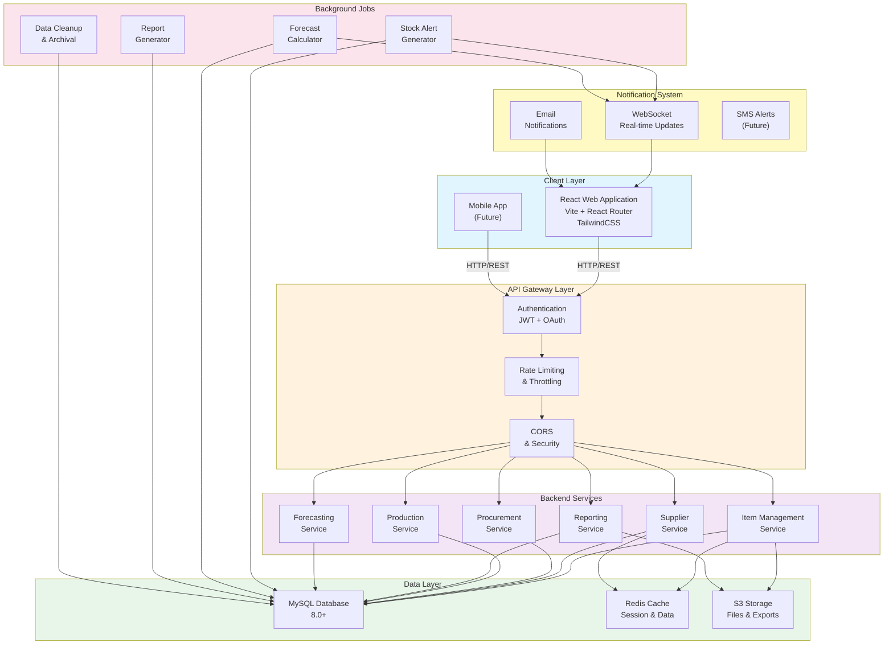

---

## 2. Database Architecture

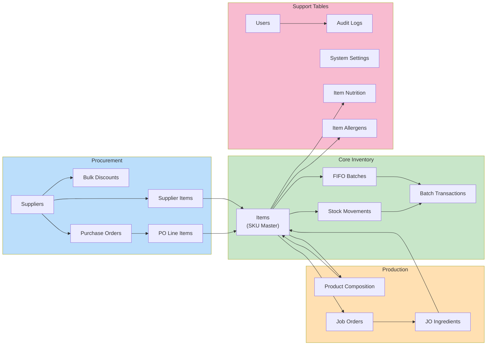

---

## 3. Request-Response Flow

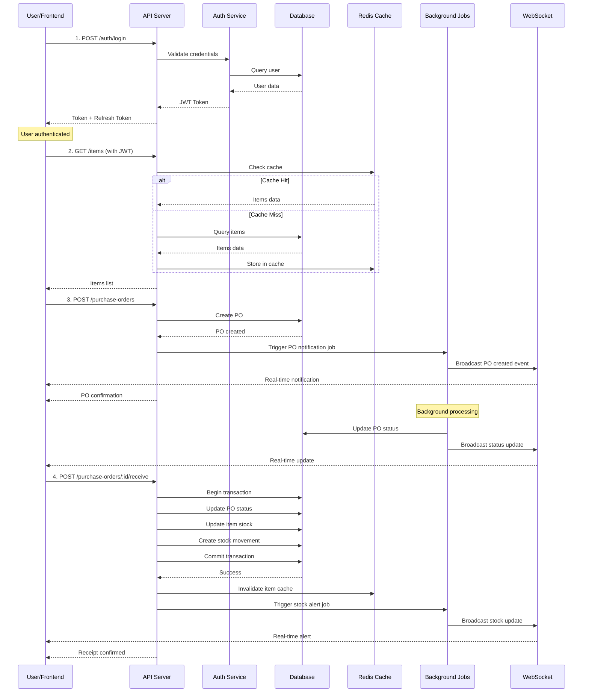

---

## 4. Data Flow - Purchase Order to Inventory Update

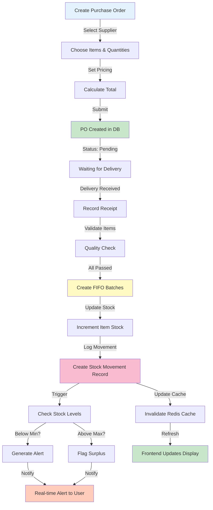

---

## 5. Data Flow - Job Order Production

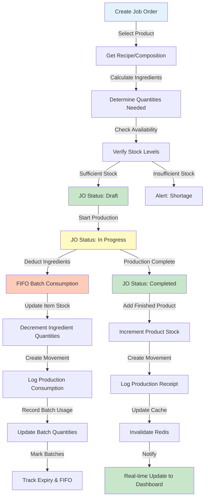

---

## 6. Inventory Tracking - FIFO Batch Management

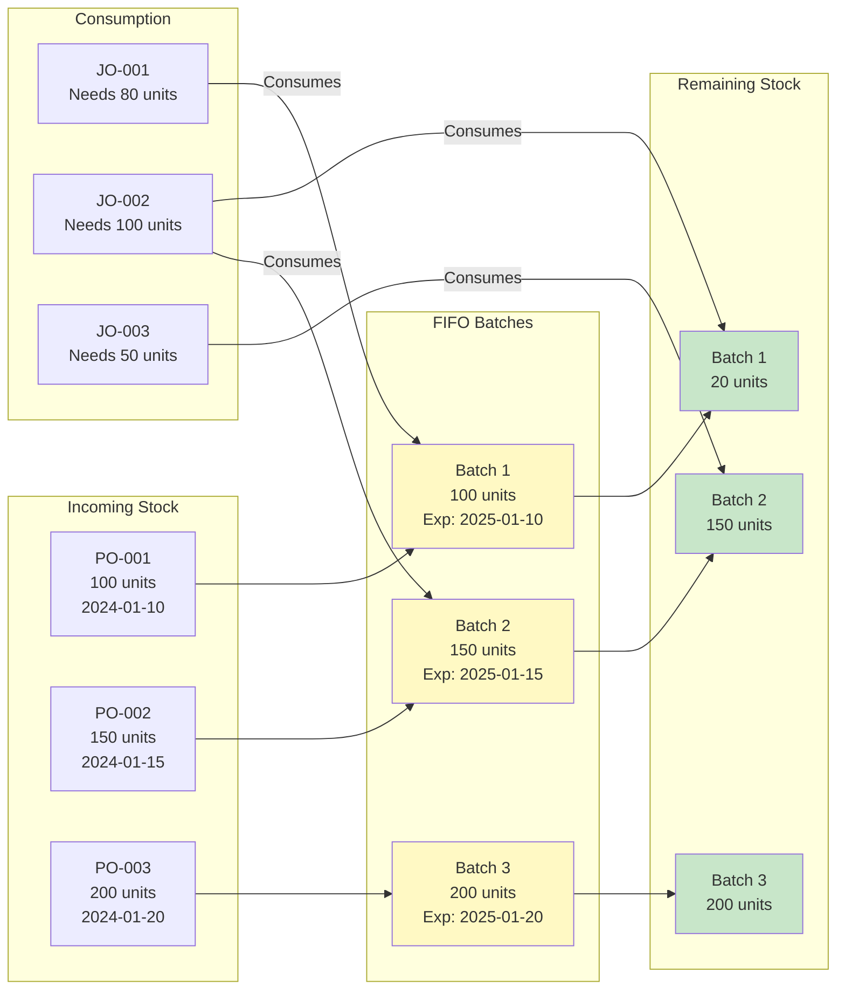

---

## 7. Alert & Notification System

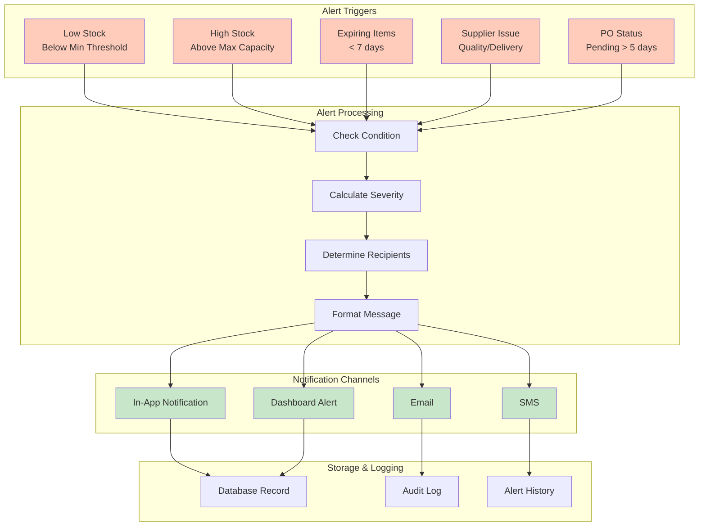

---

## 8. User Authentication & Authorization Flow

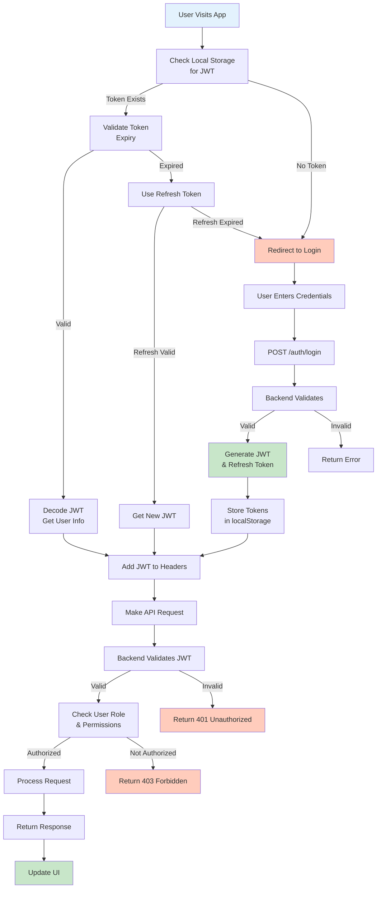

---

## 9. Deployment Architecture

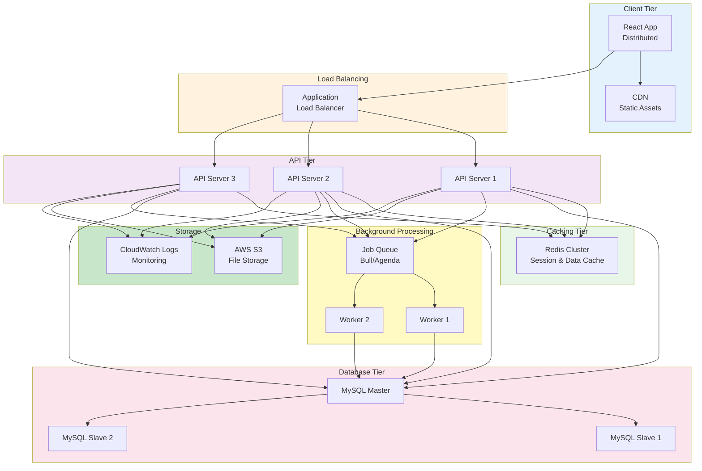

---

## 10. Frontend Component Architecture

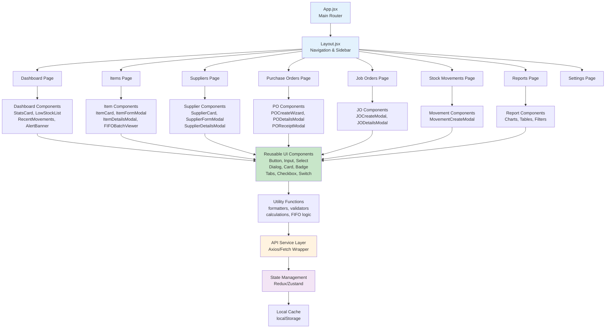

---

## 11. Error Handling & Recovery Flow

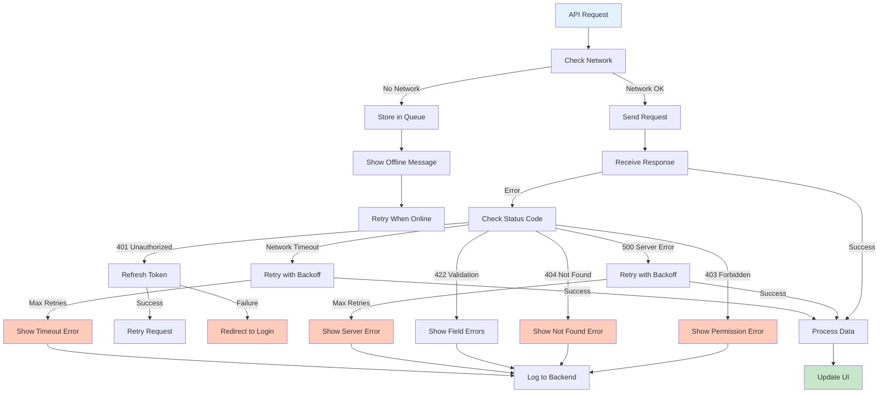

---

## 12. Scalability & Performance Optimization

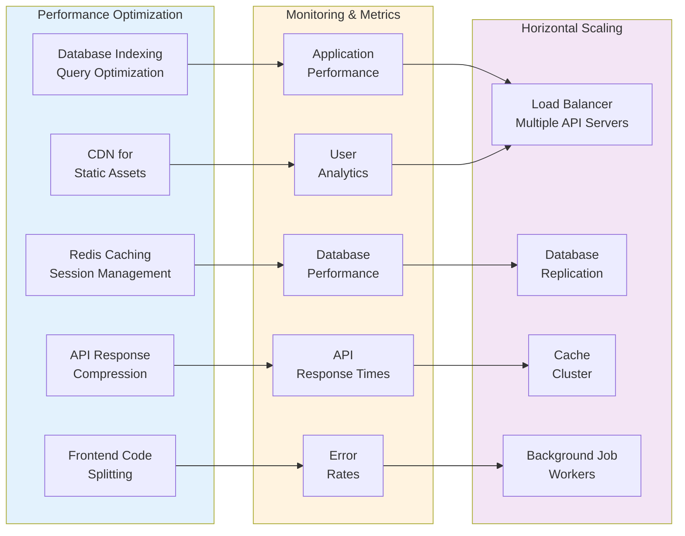

---

## 13. Security Layers

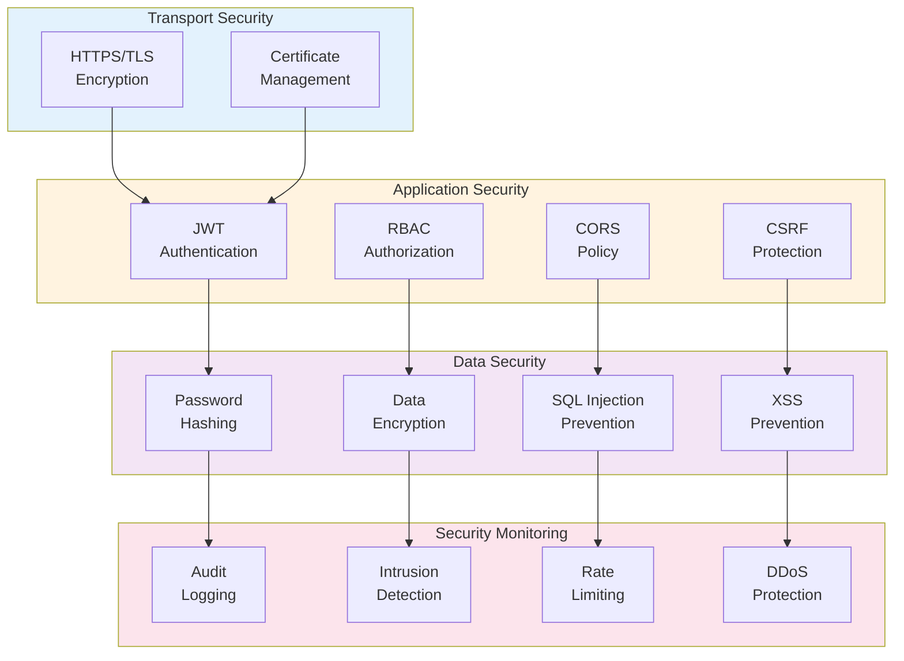

