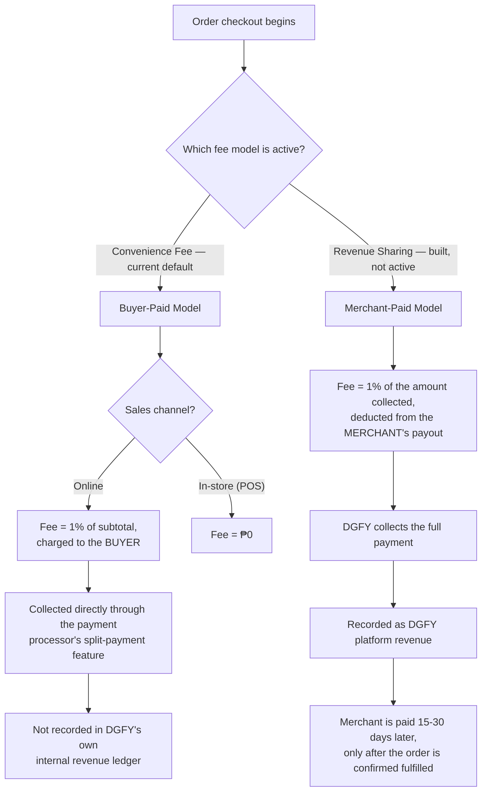
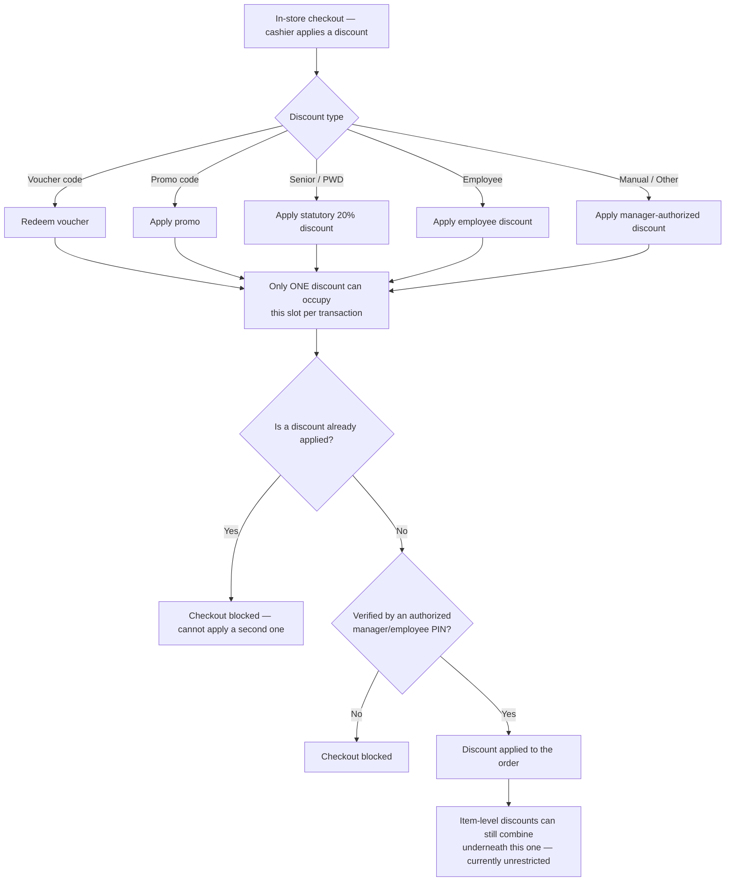
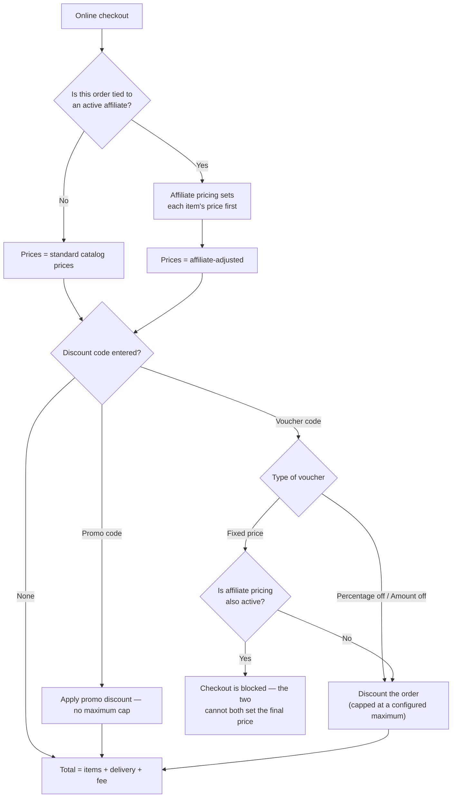

# DGFY Funding & Discount Stacking — Stakeholder Brief

Prepared for internal legal and stakeholder review, 2026-08-24.

This document explains, in plain language, how DGFY earns revenue on a transaction today, and how
discounts, vouchers, and fees interact with one another. It reflects the platform's **actual
behavior as implemented in the system today** — not an aspirational policy or a future plan. Where
something is a known open question rather than settled behavior, that is stated plainly.

---

## 1. How DGFY Earns Money Today

DGFY has two structurally different ways of earning revenue on a sale. **Only one of them is
active today.**

### Model A — Convenience Fee (currently active)

The **buyer** pays DGFY an extra **1% of the cart subtotal** on top of their order, labeled "DGFY
convenience fee" on the receipt. The merchant is paid directly by the payment processor, and this
fee never moves through DGFY's own internal books.

- **In-store (point-of-sale) purchases: this fee is ₱0.** It only applies to online orders.
- The 1% is calculated on the subtotal **before** any discount is subtracted — so even a fully
  discounted order still carries this fee.
- **This fee is not currently recorded in DGFY's own internal financial ledger.** It exists only as
  a line item on the customer's receipt and inside the payment processor's own records.
- The 1% rate is currently fixed in the system — it is not adjustable per business or region today.

### Model B — Revenue Sharing (built, not currently active)

Under this model, the **merchant** — not the buyer — pays DGFY a 1% platform fee, deducted from
what DGFY pays the merchant. The customer is charged nothing extra. DGFY collects the full payment
up front, then pays the merchant on a 15- or 30-day cycle after deducting its own fee and the
payment processor's fee.

- The fee is computed on the actual amount collected, net of any discount, including delivery.

### The Payment Processor's Own Fee

Separately from DGFY's own fee, the payment processor charges its own transaction fee. **By
default, that fee is passed on to the merchant in full** — DGFY does not currently absorb it.

### Fee model — at a glance



## 2. Worked Examples

All figures below are illustrative, using the rates the system actually applies today, shown the
way they'd appear on a receipt.

**A. Plain online sale, Convenience Fee model (current default):**
```text
  DGFY STOREFRONT — ONLINE ORDER  (current default)
  --------------------------------------------------------
  Cart subtotal                                 ₱ 1,000.00
  + Delivery fee                                  (varies)
  + DGFY convenience fee (1% of subtotal)       ₱    10.00
  --------------------------------------------------------
  TOTAL CHARGED TO BUYER          ₱ 1,010.00  + delivery
  ==========================================================
  DGFY's ₱10.00 fee is not posted to DGFY's own ledger —
  it moves only through the payment processor's split payment.
```

**B. Same sale, in-store at the register:**
```text
  DGFY POS — IN-STORE SALE
  --------------------------------------------------------
  Cart subtotal                                 ₱ 1,000.00
  + DGFY convenience fee (in-store = always ₱0) ₱     0.00
  --------------------------------------------------------
  TOTAL CHARGED TO BUYER                        ₱ 1,000.00
```

**C. Same sale, Revenue Sharing model (built, not currently active):**
```text
  DGFY STOREFRONT — ONLINE ORDER  (Revenue Sharing model)
  --------------------------------------------------------
  Cart subtotal                                 ₱ 1,000.00
  + Delivery fee                                  (varies)
  --------------------------------------------------------
  TOTAL CHARGED TO BUYER          ₱ 1,000.00  + delivery
  ==========================================================
  MERCHANT SETTLEMENT  (15-30 days later, post-fulfillment)
  Gross collected                               ₱ 1,000.00
  − DGFY platform fee (1% of gross)             ₱    10.00
  − Merchant's share of processor fee             (varies)
  --------------------------------------------------------
  MERCHANT RECEIVES                  ₱ 990.00 − processor fee
```

**D. Downpayment order, 20% downpayment, Revenue Sharing model:**
```text
  DGFY — DOWNPAYMENT ORDER
  --------------------------------------------------------
  Order total                                   ₱ 1,000.00
  Downpayment required (20%)                    ₱   200.00
  Balance (collected later, e.g. on delivery)   ₱   800.00
  --------------------------------------------------------
  DGFY fee on downpayment (1% of ₱200)          ₱     2.00
  DGFY fee on the balance leg       ₱     0.00  ← no fee is
                                                    currently
                                                    charged here
  ==========================================================
  DGFY earns ₱2.00 on this ₱1,000 order — about 0.2%,
  not the 1% headline rate. This is currently how the system
  behaves; it has not been the subject of a deliberate policy
  decision (see Section 6).
```

**E. Voucher sale, ₱200 voucher discount, Convenience Fee model:**
```text
  DGFY STOREFRONT — VOUCHER SALE
  --------------------------------------------------------
  Cart subtotal                                 ₱ 1,000.00
  − Voucher discount                            ₱  (200.00)
  --------------------------------------------------------
  Amount buyer pays for the goods                ₱   800.00
  + DGFY convenience fee            ₱    10.00  ← 1% of the ₱1,000
                                                    SUBTOTAL, not the
                                                    ₱800 actually paid
  --------------------------------------------------------
  TOTAL CHARGED TO BUYER                        ₱   810.00
```

**F. PWD/Senior Citizen sale (in-store only — see Section 3), VAT-inclusive item:**
```text
  DGFY POS — SENIOR / PWD DISCOUNT  (in-store only)
  --------------------------------------------------------
  Item price (VAT-inclusive)                    ₱   112.00
  − VAT removed (₱112 ÷ 1.12 → net ₱100)        ₱    12.00
  --------------------------------------------------------
  VAT-exempt base                               ₱   100.00
  − Statutory discount (20% of VAT-exempt base) ₱    20.00
  --------------------------------------------------------
  BUYER PAYS                                    ₱    80.00
```
This matches the standard Philippine PWD/Senior Citizen computation.

## 3. What Discounts Can Combine

This is the core of the legal-clarity question: **what combinations of discounts and fees can occur
on the same order, and does the system actually allow or block each one?**

### How the in-store register decides



### How online checkout decides



| Combination | Online | In-store | How it's enforced |
|---|---|---|---|
| Voucher + a second voucher | ❌ blocked | ❌ blocked | Only one voucher code can be entered on an order at all |
| Voucher + a promo code | ❌ blocked | ❌ blocked | Applying one blocks the other |
| Voucher (% off or ₱ off) + affiliate pricing | ✅ **allowed** | n/a (affiliate pricing is online-only) | They compose: affiliate sets the item's price first, then the voucher discounts the resulting total |
| Voucher (fixed price) + affiliate pricing | ❌ **refused outright**, checkout blocked | n/a | Both would be claiming the right to set the final price |
| Voucher + PWD/Senior Citizen discount | n/a (statutory not available online — see below) | ❌ blocked | Only one discount slot exists per sale |
| PWD/Senior Citizen discount + an item-level discount | n/a | ✅ **allowed, currently unrestricted** | The item discount reduces the price first; the statutory discount is then computed on the already-discounted amount |
| PWD/Senior Citizen discount online | ❌ **not available at all** | ✅ available | There is no statutory-discount feature built into the online storefront today |
| DGFY convenience fee + any discount | ✅ (fee still applies, see example E) | n/a (fee is ₱0 in-store) | The fee is computed before discounts are subtracted |

**The single most important line in this table for legal review: a PWD or Senior Citizen customer
shopping online today cannot receive their statutory discount at all — the feature only exists for
in-store purchases.** This is a compliance-relevant gap worth flagging directly.

**The second: statutory discounts can currently combine with an ordinary commercial discount at
the item level** — nothing in the system stops a cashier from applying both an item-level promo
discount and the Senior/PWD discount on the same item. Whether that's intended is a policy question
this brief surfaces but does not answer.

## 4. What a Merchant Receives, and When

Under the Revenue Sharing model, a merchant's payment is held until the order is confirmed
fulfilled, then becomes eligible for payout after a 15- or 30-day cycle, then goes through a
two-person approval process (a preparer and a separate approver) before money actually moves. Under
the Convenience Fee model (the current default), the merchant is paid directly by the payment
processor at the time of sale, minus the processor's own cut — DGFY is not in that money's path at
all.

## 5. Refunds and Cancellations

- A full refund under the Revenue Sharing model reverses DGFY's platform fee **proportionally** —
  if half the order is refunded, half of DGFY's fee is reversed, and this is computed precisely so
  partial refunds always add up correctly.
- A refund never reopens a merchant payout that's already settled; unresolved refund amounts are
  carried forward to the next payout cycle instead.
- **The Convenience Fee model has no equivalent mechanism for reversing the 1% fee on a refund** —
  because that fee is never posted into DGFY's own ledger in the first place, there is nothing there
  to reverse.

## 6. Known Limitations and Open Questions

**Questions still pending an internal decision** — the current system behavior described above is
what happens today by default, not the result of a deliberate policy call:

- What fee, if any, should apply to the remaining balance on a partial-payment (downpayment) order?
  Today, only the initial downpayment carries a fee.
- Should the 1% online convenience fee remain fixed, or become adjustable?
- Who should fund the affiliate program's discounts — the business itself, or DGFY?
- Should a fixed-price voucher ever be allowed alongside a statutory discount?
- Should more than one voucher ever be allowed to stack on a single order (for example, a
  free-delivery voucher combined with a percentage-off voucher)?

**Technical limitations found during this review** — each of these has been logged internally for
follow-up and is not fixed as of this brief:

- Combining an item-level discount with a voucher in-store can **over-discount** an order.
- Affiliate commission is calculated differently for an online sale versus an in-store sale when a
  voucher is also applied — the same sale could yield a different commission depending on channel.
- In one specific failure scenario, the online checkout page can show two discounts added together
  that the system otherwise never allows to combine.
- The official government-facing discount report can, in one case, print a **customer's phone
  number** in the field meant for their Senior Citizen/PWD ID number.
- An item-level statutory discount doesn't correctly mark the sale as VAT-exempt in official sales
  reports in one specific case, which can cause VAT to be counted twice.
- A setting that appears to let a voucher be explicitly marked "combinable with statutory
  discounts" is not actually enforced anywhere in the system — it looks configurable but isn't.
- A safety check meant to catch conflicting affiliate settlement terms, and a volume-based bonus
  for high-performing affiliates, are not currently evaluated anywhere in the live system.

**Not implemented at all today**, worth stating for completeness: the statutory basic-necessities
discount and the Solo Parent discount are not built as discount types anywhere in the system.

---

*This brief reflects the platform's actual behavior as reviewed on 2026-08-24. A more detailed
technical reference, including exact source citations for every figure above, is maintained
separately for engineering use and is available on request.*
