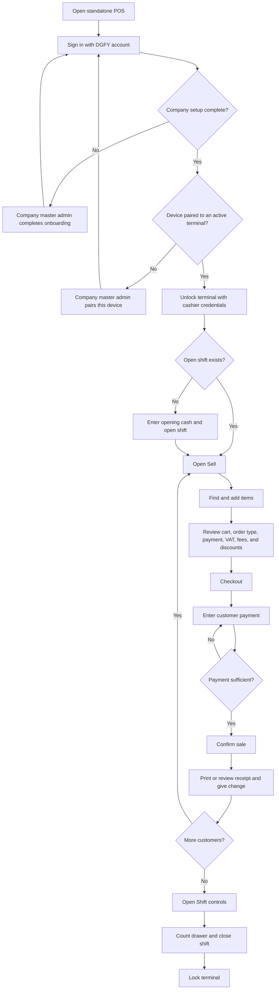

# DGFY POS Cashier Navigation Guide

## Purpose

This guide explains where a cashier should go when using the standalone DGFY POS for the first time, how to complete a sale, and what each cashier-visible control does.

The standalone POS runs from `frontend/apps/pos`. Its `/`, `/terminal`, and `/login` routes all open the same terminal. The `/sales` route opens Sales in SKUpervisor.

## Before the cashier starts

The company master admin must complete these tasks before a cashier can sell:

1. Complete company Profile, Storefront Setup, and POS Setup onboarding.
2. Create or enable the cashier account and grant the required POS permissions.
3. Register an active POS terminal and pair this physical device with it.
4. Configure the branch/location and, when used, the POS access PIN.

If the POS says that onboarding is incomplete or the device is not paired, the cashier cannot correct that from the selling screen. Ask the company master admin to finish POS onboarding or pair the device.

## First-time cashier journey

1. Open the standalone POS.
2. In **Terminal Login Required**, enter the DGFY email and password, then select the accessible company when prompted.
3. Select **Continue to POS**.
4. If the terminal is locked, select **Unlock Terminal**.
5. Confirm the paired terminal, then enter the cashier email and password.
6. Enter the **Opening Cash** amount and an optional opening note.
7. Select **Open Shift**. The **Sell** workspace becomes available after the shift opens.
8. In **Sell**, find products by search, category, barcode, or catalog browsing.
9. Select an item card to add it to **Current Sale**. Review quantities, price, VAT, fees, and total.
10. Select the order type when applicable: **Dine In**, **Takeout**, **Pickup**, **Delivery**, or **Appointment**.
11. Select the available payment type. Cash is always represented by the **Cash** option; other methods depend on company configuration.
12. Apply an authorized discount if required. Senior/PWD, employee, promo, and manual discounts require their displayed verification details; protected discounts can require an admin PIN.
13. Select **Checkout**, review the sale, enter the amount received, and select **Confirm**. Confirmation stays disabled while payment is insufficient.
14. Review or print the receipt. Confirm the cash change shown by the POS before handing it to the customer.
15. Continue selling, or select **Lock Terminal** before leaving the counter.
16. At the end of duty, open **Shift**, count the drawer, enter the closing cash and note, then select **Close Shift**. Use **Close Day / Z-Reading** only under the branch's end-of-day procedure and with the required permission.

## Navigation flowchart

## Main navigation buttons

| Button | Function | Cashier requirements or limits |
|---|---|---|
| **Sell** | Opens the catalog and Current Sale cart. | Requires an unlocked terminal, completed onboarding, and an open shift. |
| **History** | Searches invoices and shows the transaction audit trail. **View** opens a receipt. | Requires POS view permission and normally an open shift. A cashier may not see this without permission. |
| **Items** | Shows POS-visible inventory items, search, category, stock, price, and cost information. | Cashiers have view-only item access. Admin roles can receive editing controls. May require the branch POS access PIN. |
| **Orders (number)** | Opens incoming online orders to accept, reject, and move through fulfillment statuses. | Hidden in MSME mode; requires POS view permission and normally an open shift. |
| **Shift** | Opens shift summary and the Open Shift, Close Shift, and Cash Drawer areas. | Cash drawer adjustment and shift closing depend on permissions. |
| **Report** | Shows daily totals, popular items, and transactions. | Not shown to the cashier role. |
| **Settings** | Opens Profile, POS Setup, and Storefront tools. | Not shown to the cashier role; intended for authorized non-cashier/admin users. |
| **Unlock Terminal** | Opens the authentication/unlock flow. | Required after the terminal is locked. |
| **Lock Terminal** | Secures the POS without completing the active shift. | Use whenever the cashier leaves the terminal unattended. |

## Sell workspace controls

| Control | Function |
|---|---|
| **Search** | Filters POS-visible items by the entered search text. |
| **Backspace search** | Removes the last search character; useful with the on-screen search input. |
| **Filter toggle** | Shows or hides catalog filters. |
| **All Items** | Clears the category selection and displays the complete POS-visible catalog. |
| **Category button** | Filters the catalog by that category. Select the active category again to cancel the filter. |
| **Previous / Next catalog page** | Moves through catalog result pages. |
| **Item card** | Adds the selected item to Current Sale. Out-of-stock or blocked items cannot be sold when inventory rules prevent it. |
| **Minus / Plus** | Decreases or increases the selected cart line quantity. Reducing a line to zero removes it. |
| **Order type** | Records Dine In, Takeout, Pickup, Delivery, or Appointment fulfillment context. Available behavior depends on company mode. |
| **Payment Type** | Selects the configured payment method for the sale. |
| **Apply Discount** | Opens governed discount verification. Required identity, eligible items, reason, amount/rate, and admin PIN fields depend on discount type. |
| **Remove Discount** | Removes the currently applied discount before checkout. |
| **Print Order** | Prints the current order before payment; it does not complete the sale. |
| **Checkout** | Opens final review and payment entry. It does not post the sale until **Confirm** is selected. |
| **Cancel** | Closes checkout confirmation without posting the transaction. |
| **Confirm** | Posts the transaction after the cart is valid and the entered payment covers the total. Avoid selecting it more than once while **Processing** is displayed. |
| **Print Last Receipt** | Reprints the latest completed receipt. It is unavailable when no receipt exists or the transaction is still pending synchronization. |
| **Open Cash Drawer** | Sends a manual drawer-open request and records its reason against the active shift. Requires an active shift and supported/configured hardware. |
| **Close Day / Z-Reading** | Generates the end-of-day close/Z-reading. Use only at the authorized business-day cutoff. |
| **Receipt paper width** | Changes receipt preview/print formatting for the configured paper size. |

## History, returns, voids, and receipts

- Use **History** to filter transactions and select **View** to open a receipt.
- The **Voided** history status is a filter; it does not void a transaction.
- The standalone cashier history currently exposes receipt viewing/printing and the SKUpervisor sales handoff. It does not expose a cashier **Return**, **Refund**, or **Void** action.
- For a return, refund, or void, stop before creating a replacement transaction and follow the company's approval process in SKUpervisor with an authorized manager. Record the original invoice number and reason.
- Never represent a refund by deleting an item record, editing inventory manually, or creating an unapproved negative sale.

## Shift controls

| Control | Function |
|---|---|
| **Open Shift** | Starts cashier operations using the entered opening cash and optional note. Only one applicable open shift should be active for the terminal/session. |
| **Close Shift** | Records closing cash and ends the active shift after validation. Confirm the drawer count before submitting. |
| **Cash Drawer** | Records an authorized cash-in/cash-out drawer event and its reason. This is not a sales transaction. |
| **Open Cash Drawer** | Physically opens supported drawer hardware while recording the event. |

## Messages and blocked navigation

| Message or state | Required action |
|---|---|
| **Finish onboarding in Settings first** | Ask the company master admin to complete Profile, Storefront Setup, and POS Setup. |
| **This physical POS device is not paired** | Ask the company master admin to pair the device with an active terminal. |
| **Unlock terminal to continue** | Select **Unlock Terminal** and authenticate. |
| **Open shift first to continue** | Open **Shift**, enter opening cash, and start the shift. |
| **POS view permission required** | Ask an admin to verify the cashier's role and POS permission. Do not share another user's credentials. |
| **Protected by POS access PIN** | Ask an authorized manager to enter the branch PIN. The PIN unlock lasts only for the current terminal session. |
| **Add at least one item before checkout** | Add a valid item to Current Sale. |
| **Payment must be at least the total** | Correct the amount received; **Confirm** remains disabled until payment is sufficient. |
| **Pending synchronization** | Keep the POS open and online until synchronization completes. Do not recreate the same sale unless the system confirms it failed. |

## Cashier security checklist

- Use only the assigned cashier account; never share passwords or access PINs.
- Verify the company, branch/location, terminal, and cashier identity before opening a shift.
- Count opening and closing cash away from customers and enter exact values.
- Verify item quantities, payment type, amount received, change, and receipt before completing handoff.
- Lock the terminal whenever it is unattended.
- Escalate unauthorized discounts, drawer events, returns, refunds, voids, and Z-readings to a manager.

## Implementation references

- Standalone routes: `frontend/apps/pos/src/main.jsx`
- Terminal orchestration and first-time unlock: `frontend/src/features/pos/pages/TerminalPage.jsx`
- Sidebar navigation: `frontend/src/features/pos/components/TerminalWorkspaceSidebar.jsx`
- Checkout and receipt controls: `frontend/src/features/pos/components/POSCheckoutTerminal.jsx`
- History controls: `frontend/src/features/pos/components/POSTransactionHistoryPanel.jsx`
- Shift and operational controls: `frontend/src/features/pos/components/TerminalOperationsWorkspace.jsx`
- Onboarding order: `frontend/src/features/pos/utils/setupFlow.js`
