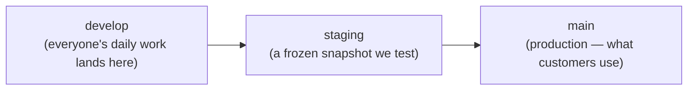
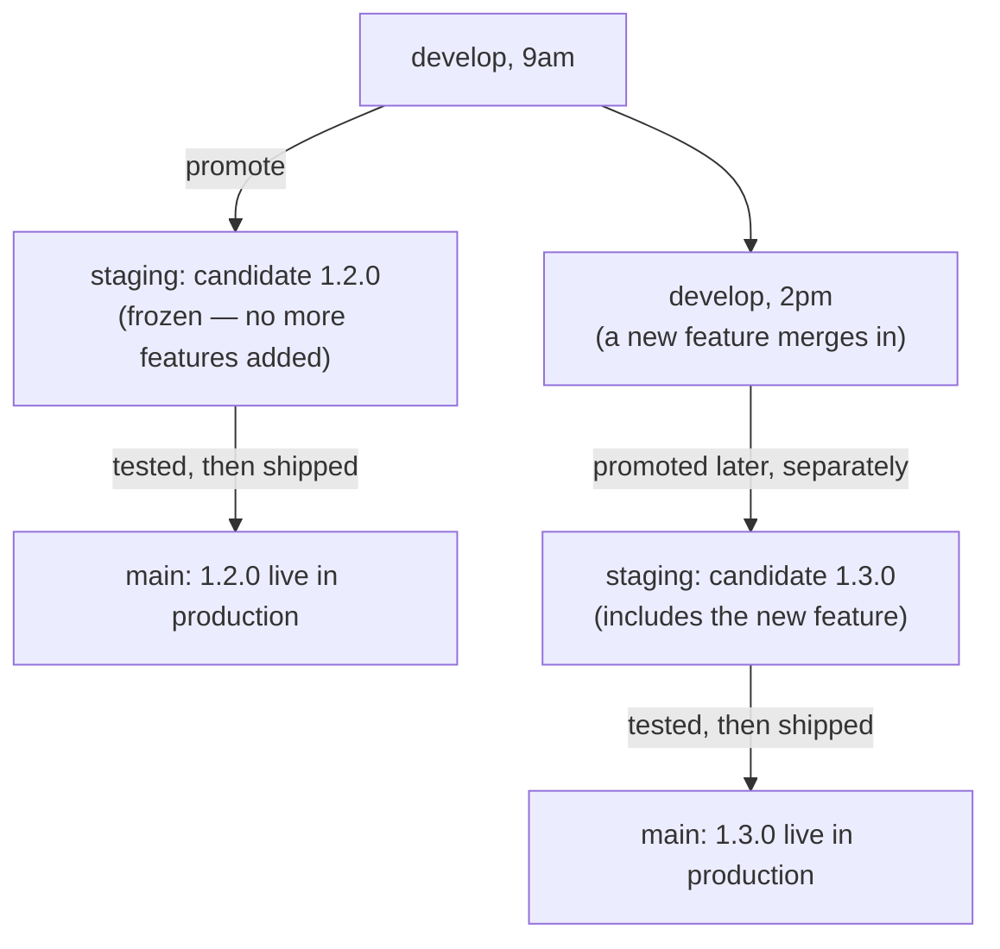
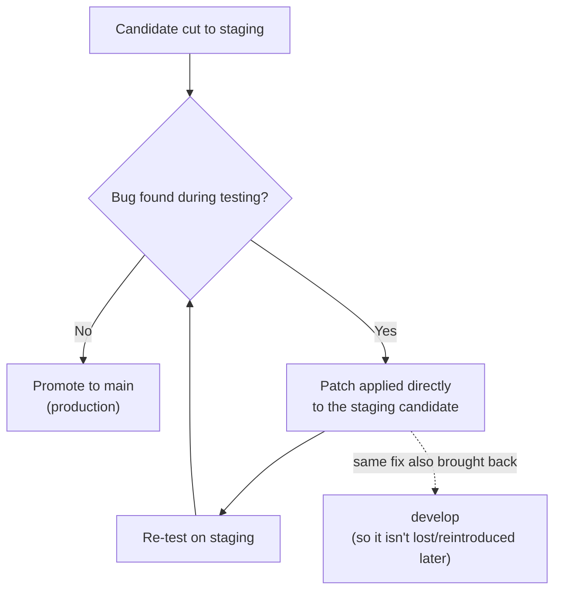

# How Our Release Promotion Works

*A plain-language, team-facing companion to
[`docs/ops/RELEASE_CANDIDATE_POLICY.md`](./RELEASE_CANDIDATE_POLICY.md), which stays the
authoritative source — if the two ever disagree, that policy doc wins and this one needs updating.*

## The short version

Code moves through three places, in one direction, one step at a time:

- **`develop`** — every feature and fix merges here first. It moves fast and changes constantly.
- **`staging`** — a snapshot of `develop`, taken at a specific point in time, that we test before it goes live. Once taken, it does **not** get new features added — only bug fixes if something's wrong with it.
- **`main`** — production. Whatever's here is what real customers are using right now.

We call each snapshot moving through this pipeline a **candidate** (e.g. `2026-09-07-03`). One candidate, one trip through the pipeline.

---

## What "promoting" actually decides: the version number

Each app (POS, IMS, storefront, backend, etc.) has its own version number, bumped independently — a change to POS doesn't force a version bump on the storefront.

When we promote `develop → staging`, that's the moment we decide how big this candidate's changes are:

| Kind of change | Version bump | Example |
|---|---|---|
| Bug fix, no new behavior | **Patch** | `1.1.5 → 1.1.6` |
| New feature, backward-compatible | **Minor** | `1.1.5 → 1.2.0` |
| Breaking change | **Major** | `1.1.5 → 2.0.0` |

So: *"develop gets promoted to staging"* basically means *"we're freezing today's `develop` as candidate X, and here's what version bump it earns."*

---

## The important rule: once a candidate is cut, it's frozen

This is the part that trips people up, so here's the exact scenario:

> You promote `develop` → `staging` this morning. That's candidate **1.2.0**, currently being tested.
> This afternoon, a teammate merges a brand-new feature into `develop`.
>
> **Question: does that new feature sneak into the 1.2.0 candidate that's already being tested?**
>
> **Answer: no.** 1.2.0 ships as-is, once it passes testing. The new feature becomes the seed of the **next** candidate — say, **1.3.0** — which goes through its own full testing cycle later.

**Why we do it this way, not the other way:**

- 1.2.0 has already been tested. Mixing in new, untested code right before it ships means you'd have to re-test the whole thing anyway — so nothing is actually saved by "sneaking it in."
- If we did mix it in, "what's on staging" would stop reliably matching "what we tested," which is the entire point of having a staging step.
- Shipping 1.2.0 now and starting 1.3.0 right after is completely normal — candidates can follow each other back-to-back with no cooldown required.

*(The only exception is a genuine business-urgency call — skipping straight from `develop` to `main` for something that truly can't wait for a staging soak. That's a deliberate, rare, explicitly-authorized exception, not a routine option.)*

---

## What if we find a bug *while* testing on staging?

We don't throw the candidate away and start over. We **patch it in place**:

Two things matter here:
1. The fix goes onto the *candidate that's already being tested* — we don't go back to `develop` and re-cut a new candidate for a bug fix.
2. That same fix always gets copied back into `develop` afterward too. Otherwise `develop` would still carry the bug, and it could quietly resurface in the *next* candidate.

---

## A real example, start to finish

This happened for real, this week:

1. We promoted `develop → staging` as candidate `2026-09-07-03`.
2. The deploy to staging **failed** — a CI script was missing a dependency it needed. Nothing was actually deployed; the old version kept running safely.
3. We patched the candidate directly (added the missing install step), re-tested, and confirmed it worked.
4. That same patch was copied back into `develop`, so future candidates won't hit the same bug.
5. Re-deployed to staging — succeeded, verified healthy.

No wasted work, no re-testing from scratch, and `develop` didn't stay broken. That's the whole system working as designed.

---

## Cheat sheet

| Question | Answer |
|---|---|
| Where does new work land? | `develop`, always |
| When do I get a version number for my change? | When your app's code is promoted `develop → staging` |
| New feature merges to `develop` while staging is being tested — does it get bundled in? | No — it waits for the *next* candidate |
| Bug found on staging — start over? | No — patch the candidate in place, then copy the fix back to `develop` |
| Can candidates ship back-to-back? | Yes, that's normal |
| Can we skip staging entirely? | Only for a genuine emergency, explicitly authorized — never routine |
