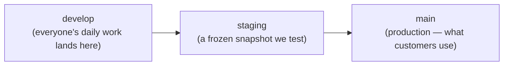
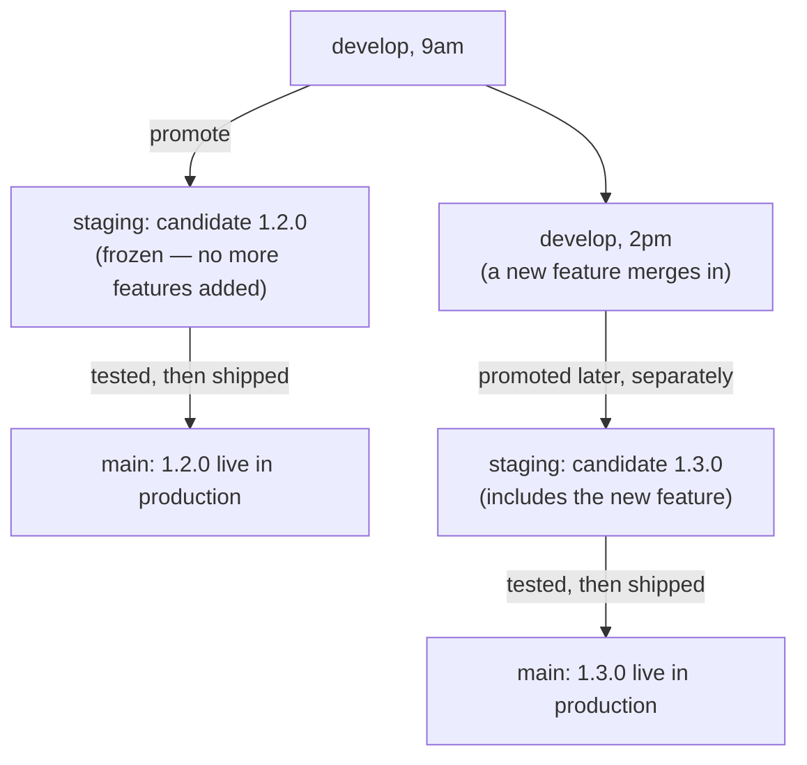
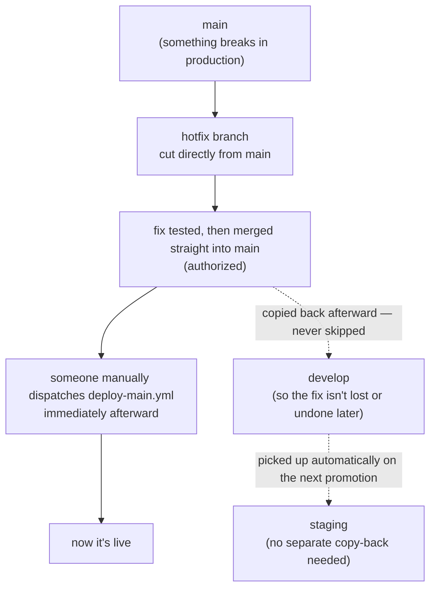
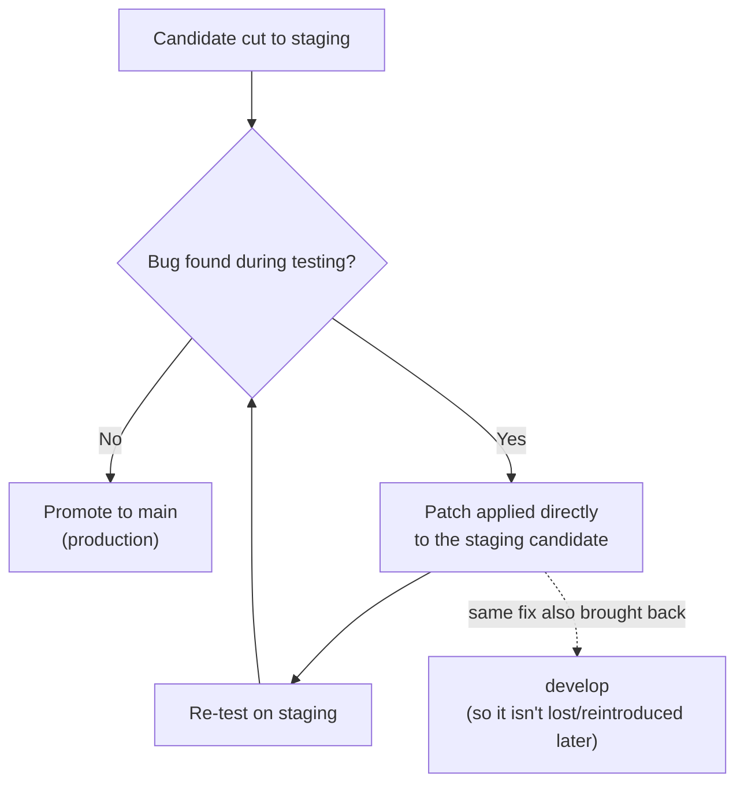

# How Our Release Promotion Works

*A plain-language, team-facing companion to
[`docs/ops/RELEASE_CANDIDATE_POLICY.md`](./RELEASE_CANDIDATE_POLICY.md), which stays the
authoritative source — if the two ever disagree, that policy doc wins and this one needs updating.*

## The short version

Code moves through three places, in one direction, one step at a time:

- **`develop`** — ordinary feature and fix work merges here first. It moves fast and changes
  constantly. (There's one narrow exception, a direct-to-`main` hotfix for a live production
  outage — see below.)
- **`staging`** — a snapshot of `develop`, taken at a specific point in time, that we test before it goes live. Once taken, it does **not** get new features added — only bug fixes if something's wrong with it.
- **`main`** — production. Whatever's here is what real customers are using right now.

We call each snapshot moving through this pipeline a **candidate** (e.g. `2026-09-07-03`). One candidate, one trip through the pipeline.

---

## What "promoting" actually checks: the version number

Each app (POS, IMS, storefront, backend, etc.) has its own version number, bumped independently — a change to POS doesn't force a version bump on the storefront.

**The bump happens where the change happens** — whoever's PR touches an app bumps that app's version, right there in the same PR, by whatever size actually fits the change:

| Kind of change | Version bump | Example |
|---|---|---|
| Bug fix, no new behavior | **Patch** | `1.1.5 → 1.1.6` |
| New feature, backward-compatible | **Minor** | `1.1.5 → 1.2.0` |
| Breaking change | **Major** | `1.1.5 → 2.0.0` |

Promotion doesn't hand out the number — it **checks** it. When we promote `develop → staging`, that's
the moment we enforce a floor: every app that changed since the last promotion needs at least a
minor bump by then. If a contributing PR only bumped patch (or forgot to bump at all), the candidate
doesn't get cut as-is — a top-up bump PR lands on `develop` first to bring that app up to the
required minor floor, and only then does the candidate get cut.

---

## The important rule: once a candidate is cut, it's frozen

This is the part that trips people up, so here's the exact scenario:

> You promote `develop` → `staging` this morning. That's candidate **1.2.0**, currently being tested.
> This afternoon, a teammate merges a brand-new feature into `develop`.
>
> **Question: does that new feature sneak into the 1.2.0 candidate that's already being tested?**
>
> **Answer: no.** 1.2.0 ships as-is, once it passes testing. The new feature becomes the seed of the **next** candidate — say, **1.3.0** — which goes through its own full testing cycle later.

**Why we do it this way, not the other way:**

- 1.2.0 has already been tested. Mixing in new, untested code right before it ships means you'd have to re-test the whole thing anyway — so nothing is actually saved by "sneaking it in."
- If we did mix it in, "what's on staging" would stop reliably matching "what we tested," which is the entire point of having a staging step.
- Shipping 1.2.0 now and starting 1.3.0 right after is completely normal — candidates can follow each other back-to-back with no cooldown required.

*(There's one narrow exception to "always go through staging" — a genuine business-urgency call to
skip the soak for something that's ready but can't wait. That's still built the normal way, just
without the staging stop. It's not the same thing as a hotfix — see below.)*

---

## What about hotfixes to `main`?

There are two different "skip the normal flow" situations, worth telling apart — they're not the
same thing, even though both feel urgent:

1. **"This is ready and needs to ship today, but nothing is actually broken."** That's the exception
   mentioned just above — it still starts from `develop`, just skips the staging stop.
2. **"Production is broken right now, for real customers."** That's a genuine **hotfix**, and it
   works differently on purpose:

- The fix branches directly off **`main`** — not `develop`, not `staging`. Why: `develop` might have
  other half-finished, untested changes sitting on it right now, and pulling those in along with the
  fix would risk shipping more than just the fix during an actual outage.
- It's tested and merged straight into `main` — with explicit sign-off, same as always for a
  `main` merge. **Merging alone doesn't put it in front of customers, though** — that only happens
  once someone manually dispatches the `deploy-main.yml` deploy, which we do immediately right
  after the merge since this is an active outage. No separate approval step exists for that
  dispatch beyond having access to run it.
- Afterward — **always, never skipped** — that same fix is copied back into `develop`. If this step
  were skipped, the next normal promotion could silently undo the fix, since `develop` would still
  have the old, broken code. `staging` doesn't need a separate copy-back: it automatically picks up
  the fix the next time `develop` gets promoted there, since the fix is already on `develop` by then.

This path is deliberately rare and needs explicit sign-off every time — it exists for real outages,
not as a shortcut for "we don't feel like waiting."

---

## What if we find a bug *while* testing on staging?

We don't throw the candidate away and start over. We **patch it in place**:

Two things matter here:
1. The fix goes onto the *candidate that's already being tested* — we don't go back to `develop` and re-cut a new candidate for a bug fix.
2. That same fix always gets copied back into `develop` afterward too. Otherwise `develop` would still carry the bug, and it could quietly resurface in the *next* candidate.

---

## A real example, start to finish

This happened for real, this week:

1. We promoted `develop → staging` as candidate `2026-09-07-03`.
2. The deploy to staging **failed** — a CI script was missing a dependency it needed. Nothing was actually deployed; the old version kept running safely.
3. We patched the candidate directly (added the missing install step), re-tested, and confirmed it worked.
4. That same patch was copied back into `develop`, so future candidates won't hit the same bug.
5. Re-deployed to staging — succeeded, verified healthy.

No wasted work, no re-testing from scratch, and `develop` didn't stay broken. That's the whole system working as designed.

---

## Cheat sheet

| Question | Answer |
|---|---|
| Where does new work land? | `develop`, for ordinary features and fixes (the direct-`main` hotfix below is the one exception) |
| When do I bump my app's version? | In your own PR, right when you make the change — promotion doesn't assign it, it just enforces a minor-bump floor per changed app before cutting the candidate |
| New feature merges to `develop` while staging is being tested — does it get bundled in? | No — it waits for the *next* candidate |
| Bug found on staging — start over? | No — patch the candidate in place, then copy the fix back to `develop` |
| Can candidates ship back-to-back? | Yes, that's normal |
| Can we skip staging for something urgent but not broken? | Yes, rarely, explicitly authorized — still starts from `develop` |
| Production is actually broken right now — what do we do? | A **hotfix**: branch straight from `main`, fix, merge (authorized), then manually dispatch `deploy-main.yml` immediately — merging alone doesn't deploy it. Always copy the fix back to `develop` afterward; `staging` picks it up automatically on the next promotion, no separate copy-back needed |
