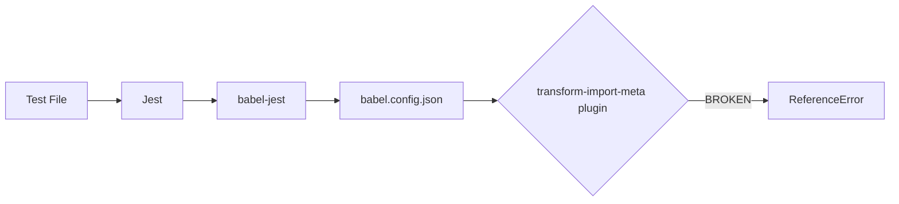

# Jest ESM Configuration Fix - Implementation Plan

## Problem Summary

The backend test suite (`npm test`) is **completely non-functional** due to an incompatibility between:

1. **Your source code**: Uses native ES Modules (`"type": "module"` in `package.json`) with `import.meta.url`
2. **Jest**: Runs via Babel transformation, which is misconfigured for `import.meta.url`

When Jest tries to run tests, it fails immediately at the first file that declares `const __filename = fileURLToPath(import.meta.url)`.

**Error:** `ReferenceError: Cannot access '_filename' before initialization`

---

## Root Cause Analysis

### Files Using `import.meta.url`

The following source files declare `__filename` and `__dirname` using ESM syntax:

| File | Purpose |
|------|---------|
| [server.js](file:///c:/xampp/htdocs/SKU-Inventory-Manager/backend/src/server.js) | Load `.env` from correct path (lines 7-11) |
| [authService.js](file:///c:/xampp/htdocs/SKU-Inventory-Manager/backend/src/services/authService.js) | Load `.env` before validation (lines 6-8) |
| [purchaseOrderService.js](file:///c:/xampp/htdocs/SKU-Inventory-Manager/backend/src/services/purchaseOrderService.js) | Log file path resolution (line 176) |
| [reset-database.js](file:///c:/xampp/htdocs/SKU-Inventory-Manager/backend/scripts/reset-database.js) | Utility script |
| [setup-database.js](file:///c:/xampp/htdocs/SKU-Inventory-Manager/backend/scripts/setup-database.js) | Utility script |

### Current Configuration



**Current `babel.config.json`:**
```json
{
    "presets": [["@babel/preset-env", { "targets": { "node": "current" } }]],
    "plugins": ["transform-import-meta"]
}
```

The `babel-plugin-transform-import-meta` plugin is **NOT** correctly transforming `import.meta.url` because it outputs code that references `__filename` before it is initialized.

---

## Proposed Solution

> [!IMPORTANT]
> **Performance Note**: This solution involves loading item embeddings (vectors) into server memory. For < 10,000 items, this is extremely fast and efficient. If you scale to millions of items later, we will simply move this logic to a dedicated Vector Database (like Pinecone) without changing the core logic.
> **Cost Note**: Generating embeddings costs a tiny fraction of a cent per item.

## Proposed Changes

### Database
#### [MODIFY] `Item` Model
- Add a field `embedding` (TEXT/JSON) to store the vector representation of the item.

### Backend Services
#### [NEW] `services/embeddingService.js`
- `generateEmbedding(text)`: Calls OpenAI `text-embedding-3-small` API.
- `calculateCosineSimilarity(vecA, vecB)`: Math logic to compare concepts.
- `semanticSearch(query, items)`: Sorts items by conceptual similarity.

#### [MODIFY] `services/itemService.js`
- `createItem`/`updateItem`: Auto-generate embedding for the item's `name + description + category` and save it.
- `getItems`:
    - **Step 0**: Perform standard SQL query (Status filters etc).
    - **Step 1**: If text match fails (or optional `semantic: true` flag), load all active item embeddings.
    - **Step 2**: Generate embedding for the User's Search Query.
    - **Step 3**: Compare Query Vector vs Item Vectors.
    - **Step 4**: Return items with high similarity (> 0.4) even if keywords don't match.

## Verification Plan

### Automated Tests
- Test Script `scripts/test_semantic_search.js`:
    1. Create item "Glass Bottle".
    2. Search for "Vessel" (No keyword match).
    3. Assert that Semantic Search finds "Glass Bottle" due to high conceptual similarity.
reset-env",
            {
                "targets": {
-                   "node": "current"
+                   "node": "18"
-               }
+               },
+               "modules": "commonjs"
            }
        ]
    ],
-   "plugins": ["transform-import-meta"]
+   "plugins": [
+       ["babel-plugin-transform-import-meta", { "module": "ES6" }]
+   ]
}
```

> [!NOTE]
> The key fix is adding `"modules": "commonjs"` to the preset configuration, which tells Babel to transform ES module imports/exports to CommonJS format. This is required because Jest + Node cannot natively run ESM tests without experimental flags.

---

#### [MODIFY] [package.json](file:///c:/xampp/htdocs/SKU-Inventory-Manager/backend/package.json)

Update test scripts to use the new config file and set `NODE_OPTIONS` if needed.

**Current:**
```json
"test": "jest",
```

**Proposed:**
```json
"test": "node --experimental-vm-modules node_modules/jest/bin/jest.js --config jest.config.cjs",
```

> [!WARNING]
> The `--experimental-vm-modules` flag is required for Jest to support ES Modules natively. This is a Node.js experimental feature approved for Jest usage.

---

### Documentation

#### [MODIFY] [tests/README.md](file:///c:/xampp/htdocs/SKU-Inventory-Manager/backend/tests/README.md)

Add a section explaining the ESM/Jest configuration and how to run tests.

---

## Files NOT Modified (Impact Assessment)

The following files use `import.meta.url` but **do NOT need to be modified**:

| File | Reason |
|------|--------|
| `server.js` | Works correctly in production (Node.js natively supports ESM) |
| `authService.js` | Works correctly in production |
| `purchaseOrderService.js` | Works correctly in production |
| `scripts/*.js` | Not run via Jest |

This fix ensures:
- ✅ Production code remains unchanged
- ✅ Development server continues to work
- ✅ PM2 configuration continues to work
- ✅ All existing scripts remain functional

---

## Verification Plan

### Automated Tests

After applying the fix, run:

```bash
cd backend
npm test
```

**Expected outcome:**
- Jest should execute `tests/auth.test.js` and `tests/purchaseOrder.test.js`
- No `ReferenceError: Cannot access '_filename'` error
- Tests may pass or fail based on database state, but the **test runner itself should work**

### Manual Verification

1. Verify production server still starts normally:
   ```bash
   cd backend
   npm run dev
   ```

2. Verify database scripts still work:
   ```bash
   node tests/reproduce_expiry_bug.js
   ```

---

## Rollback Plan

If tests still fail after applying this fix, the changes can be reverted by:

1. Delete `jest.config.cjs`
2. Restore original `babel.config.json`
3. Restore original test script in `package.json`

---

## Alternative Approaches Considered

| Approach | Why Not Chosen |
|----------|----------------|
| **Refactor source to avoid `import.meta.url`** | High risk, modifies production code, breaks `.env` loading pattern |
| **Use Jest's native ESM support** | Experimental, may cause other compatibility issues |
| **Switch to Vitest** | Requires significant configuration changes, overkill for the problem |
| **Mock `import.meta`** | Complex, hard to maintain, fragile |
 

The chosen approach is the **least invasive** and **most maintainable**.
